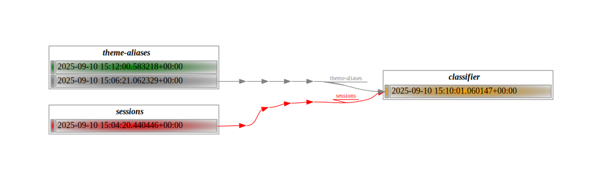

---
author:
- Krisztián Fekete
- Miklós Koren
authors:
- Krisztián Fekete
- Miklós Koren
date: 2025-09-10
subtitle: a provenance tool
title: bead
toc-title: Table of contents
---

### The Editor Gives You One Week

You need to:

1.  Address reviewer concerns about source data
2.  Redo analysis with new data
3.  Recreate Figure 1
4.  Submit within one week

### But the Submission Was Months Ago

-   Research submitted months ago
-   Team has been improving data cleaning since then
    -   Some team members left
-   Different statistical methods now
-   **First question**: How *exactly* was Figure 1 produced?

### Luckily, You Worked Reproducibly

::: center
`Figure 1 = code(data)`
:::

-   Results depend on both algorithms and data
-   Code under version control (Git) ✓
-   Tagged commit at submission ✓
-   **But what about the data?**

### Data is Also a the Result of a Computation

::: center
`data₁ = code₂(data₂)`
:::

-   Data transformed by wrangling/cleaning steps
    -   countries dropped
    -   transformations applied
    -   feature engineering details
-   **Chain of data provenance**

### A Real-World Data Pipeline


## The Data Provenance Problem

### Why It Is Complex:

1.  **Frequent changes**: Code and data both evolve
2.  **Complex pipelines**: Many steps, multiple datasets
3.  **Tool heterogeneity**: Python, R, SQL, DuckDB all in one project
4.  **Team dynamics**: People join, leave, change roles

### Existing Solutions

#### Version Control (Git)

-   Great for code
-   **Not suitable for large binary data**

#### Data Version Control (DVC)

[dvc.org](https://dvc.org)

-   Similar spirit to bead, but delivery/versioning focused\
-   **More complex than needed for provenance tracking**

#### Orchestration Tools

-   Apache Airflow (Python) -
    [airflow.apache.org](https://airflow.apache.org)
-   dbt (SQL) - [getdbt.com](https://www.getdbt.com)
-   KNIME (no-code) - [knime.com](https://knime.com)
-   **Too complex for heterogeneous teams**

## Enter bead

**A command-line tool that captures your data's story, step by step.**

-   Much simpler than alternatives
-   Language agnostic
-   Supports heterogeneous teams

## What bead Does NOT Do

### Not a code runner

-   You run your own code
-   Python, R, Stata, SQL - doesn't matter

### Not a file sharing system

-   File system stores your files
-   Sharing it with others is your responsibility (but can be easily
    automated)

### Only requirement:

-   Works with flat files on file system
-   Files not too big (20GB works fine)

## Core bead Concepts

### The bead

-   Self-contained unit of computation
-   Contains code, *reference* to input data, results
-   Packaged as ZIP file
-   Remembers exact provenance

### Simple Commands

``` bash
bead new my-analysis
bead input add source-data
bead save 
```

# Demo Time

### 📐 Design

-   Integrity
-   Ease of use
-   Reproducibility

### ⚡ Inspiration

-   Human concept of story
    -   Stories are composable
    -   Helps us make sense of the world
-   Project
-   Publishing: ISBN / ISSN

### 🎬 Demo

Conference session classification by title

-   Inputs:

    -   list of sessions
    -   session theme classification rules

-   Output:

    -   list of sessions extended with theme

###  {#section .top}

```{=html}
<div class="top-bottom-layout">
  <div class="top-content">
<div class="terminal"><span class="prompt">/demo $ </span><span class="cursor"></span></div>
  </div>

  <div class="bottom-content">
    <div class="bottom-left">
<pre class="fs-tree">

</pre>
    </div>
    <div class="bottom-right">
<pre class="fs-tree">

</pre>
    </div>
  </div>
</div>
```
###  {#section-1 .top}

```{=html}
<div class="top-bottom-layout">
  <div class="top-content">
<div class="terminal"><span class="prompt">/demo $ </span><span class="command">: ⚙️ Setup</span><span class="cursor"></span></div>
  </div>

  <div class="bottom-content">
    <div class="bottom-left">
<pre class="fs-tree">

</pre>
    </div>
    <div class="bottom-right">
<pre class="fs-tree">

</pre>
    </div>
  </div>
</div>
```
###  {#section-2 .top}

```{=html}
<div class="top-bottom-layout">
  <div class="top-content">
<div class="terminal"><span class="prompt">/demo $ </span><span class="command">: ⚙️ Setup</span>
<span class="prompt">/demo $ </span><span class="cursor"></span></div>
  </div>

  <div class="bottom-content">
    <div class="bottom-left">
<pre class="fs-tree">

</pre>
    </div>
    <div class="bottom-right">
<pre class="fs-tree">

</pre>
    </div>
  </div>
</div>
```
###  {#section-3 .top}

```{=html}
<div class="top-bottom-layout">
  <div class="top-content">
<div class="terminal"><span class="prompt">/demo $ </span><span class="command">: ⚙️ Setup</span>
<span class="prompt">/demo $ </span><span class="command">: prepared files</span><span class="cursor"></span></div>
  </div>

  <div class="bottom-content">
    <div class="bottom-left">
<pre class="fs-tree">

</pre>
    </div>
    <div class="bottom-right">
<pre class="fs-tree">

</pre>
    </div>
  </div>
</div>
```
###  {#section-4 .top}

```{=html}
<div class="top-bottom-layout">
  <div class="top-content">
<div class="terminal"><span class="prompt">/demo $ </span><span class="command">: ⚙️ Setup</span>
<span class="prompt">/demo $ </span><span class="command">: prepared files</span>
<span class="prompt">/demo $ </span><span class="cursor"></span></div>
  </div>

  <div class="bottom-content">
    <div class="bottom-left">
<pre class="fs-tree">

</pre>
    </div>
    <div class="bottom-right">
<pre class="fs-tree">

</pre>
    </div>
  </div>
</div>
```
###  {#section-5 .top}

```{=html}
<div class="top-bottom-layout">
  <div class="top-content">
<div class="terminal"><span class="prompt">/demo $ </span><span class="command">: ⚙️ Setup</span>
<span class="prompt">/demo $ </span><span class="command">: prepared files</span>
<span class="prompt">/demo $ </span><span class="command">tree /demo</span><span class="cursor"></span></div>
  </div>

  <div class="bottom-content">
    <div class="bottom-left">
<pre class="fs-tree">

</pre>
    </div>
    <div class="bottom-right">
<pre class="fs-tree">

</pre>
    </div>
  </div>
</div>
```
###  {#section-6 .top}

```{=html}
<div class="top-bottom-layout">
  <div class="top-content">
<div class="terminal"><span class="prompt">/demo $ </span><span class="command">: ⚙️ Setup</span>
<span class="prompt">/demo $ </span><span class="command">: prepared files</span>
<span class="prompt">/demo $ </span><span class="command">tree /demo</span>
<span class="output">/demo
└── files
    ├── run.sh
    ├── sessions.csv
    └── theme_aliases.csv

2 directories, 3 files

</span><span class="prompt">/demo $ </span><span class="cursor"></span></div>
  </div>

  <div class="bottom-content">
    <div class="bottom-left">
<pre class="fs-tree">

</pre>
    </div>
    <div class="bottom-right">
<pre class="fs-tree">

</pre>
    </div>
  </div>
</div>
```
###  {#section-7 .top}

```{=html}
<div class="top-bottom-layout">
  <div class="top-content">
<div class="terminal"><span class="prompt">/demo $ </span><span class="command">: ⚙️ Setup</span>
<span class="prompt">/demo $ </span><span class="command">: prepared files</span>
<span class="prompt">/demo $ </span><span class="command">tree /demo</span>
<span class="output">/demo
└── files
    ├── run.sh
    ├── sessions.csv
    └── theme_aliases.csv

2 directories, 3 files

</span><span class="prompt">/demo $ </span><span class="command">: working directory</span><span class="cursor"></span></div>
  </div>

  <div class="bottom-content">
    <div class="bottom-left">
<pre class="fs-tree">

</pre>
    </div>
    <div class="bottom-right">
<pre class="fs-tree">

</pre>
    </div>
  </div>
</div>
```
###  {#section-8 .top}

```{=html}
<div class="top-bottom-layout">
  <div class="top-content">
<div class="terminal"><span class="prompt">/demo $ </span><span class="command">: ⚙️ Setup</span>
<span class="prompt">/demo $ </span><span class="command">: prepared files</span>
<span class="prompt">/demo $ </span><span class="command">tree /demo</span>
<span class="output">/demo
└── files
    ├── run.sh
    ├── sessions.csv
    └── theme_aliases.csv

2 directories, 3 files

</span><span class="prompt">/demo $ </span><span class="command">: working directory</span>
<span class="prompt">/demo $ </span><span class="cursor"></span></div>
  </div>

  <div class="bottom-content">
    <div class="bottom-left">
<pre class="fs-tree">

</pre>
    </div>
    <div class="bottom-right">
<pre class="fs-tree">

</pre>
    </div>
  </div>
</div>
```
###  {#section-9 .top}

```{=html}
<div class="top-bottom-layout">
  <div class="top-content">
<div class="terminal"><span class="prompt">/demo $ </span><span class="command">: ⚙️ Setup</span>
<span class="prompt">/demo $ </span><span class="command">: prepared files</span>
<span class="prompt">/demo $ </span><span class="command">tree /demo</span>
<span class="output">/demo
└── files
    ├── run.sh
    ├── sessions.csv
    └── theme_aliases.csv

2 directories, 3 files

</span><span class="prompt">/demo $ </span><span class="command">: working directory</span>
<span class="prompt">/demo $ </span><span class="command">mkdir /demo/projects</span><span class="cursor"></span></div>
  </div>

  <div class="bottom-content">
    <div class="bottom-left">
<pre class="fs-tree">

</pre>
    </div>
    <div class="bottom-right">
<pre class="fs-tree">

</pre>
    </div>
  </div>
</div>
```
###  {#section-10 .top}

```{=html}
<div class="top-bottom-layout">
  <div class="top-content">
<div class="terminal"><span class="prompt">/demo $ </span><span class="command">: ⚙️ Setup</span>
<span class="prompt">/demo $ </span><span class="command">: prepared files</span>
<span class="prompt">/demo $ </span><span class="command">tree /demo</span>
<span class="output">/demo
└── files
    ├── run.sh
    ├── sessions.csv
    └── theme_aliases.csv

2 directories, 3 files

</span><span class="prompt">/demo $ </span><span class="command">: working directory</span>
<span class="prompt">/demo $ </span><span class="command">mkdir /demo/projects</span>
<span class="prompt">/demo $ </span><span class="cursor"></span></div>
  </div>

  <div class="bottom-content">
    <div class="bottom-left">
<pre class="fs-tree">
/demo/projects
</pre>
    </div>
    <div class="bottom-right">
<pre class="fs-tree">

</pre>
    </div>
  </div>
</div>
```
###  {#section-11 .top}

```{=html}
<div class="top-bottom-layout">
  <div class="top-content">
<div class="terminal"><span class="prompt">/demo $ </span><span class="command">: ⚙️ Setup</span>
<span class="prompt">/demo $ </span><span class="command">: prepared files</span>
<span class="prompt">/demo $ </span><span class="command">tree /demo</span>
<span class="output">/demo
└── files
    ├── run.sh
    ├── sessions.csv
    └── theme_aliases.csv

2 directories, 3 files

</span><span class="prompt">/demo $ </span><span class="command">: working directory</span>
<span class="prompt">/demo $ </span><span class="command">mkdir /demo/projects</span>
<span class="prompt">/demo $ </span><span class="command">cd /demo/projects</span><span class="cursor"></span></div>
  </div>

  <div class="bottom-content">
    <div class="bottom-left">
<pre class="fs-tree">
/demo/projects
</pre>
    </div>
    <div class="bottom-right">
<pre class="fs-tree">

</pre>
    </div>
  </div>
</div>
```
###  {#section-12 .top}

```{=html}
<div class="top-bottom-layout">
  <div class="top-content">
<div class="terminal"><span class="prompt">/demo $ </span><span class="command">: ⚙️ Setup</span>
<span class="prompt">/demo $ </span><span class="command">: prepared files</span>
<span class="prompt">/demo $ </span><span class="command">tree /demo</span>
<span class="output">/demo
└── files
    ├── run.sh
    ├── sessions.csv
    └── theme_aliases.csv

2 directories, 3 files

</span><span class="prompt">/demo $ </span><span class="command">: working directory</span>
<span class="prompt">/demo $ </span><span class="command">mkdir /demo/projects</span>
<span class="prompt">/demo $ </span><span class="command">cd /demo/projects</span>
<span class="prompt">/demo/projects $ </span><span class="cursor"></span></div>
  </div>

  <div class="bottom-content">
    <div class="bottom-left">
<pre class="fs-tree">
/demo/projects
</pre>
    </div>
    <div class="bottom-right">
<pre class="fs-tree">

</pre>
    </div>
  </div>
</div>
```
###  {#section-13 .top}

```{=html}
<div class="top-bottom-layout">
  <div class="top-content">
<div class="terminal"><span class="prompt">/demo $ </span><span class="command">: ⚙️ Setup</span>
<span class="prompt">/demo $ </span><span class="command">: prepared files</span>
<span class="prompt">/demo $ </span><span class="command">tree /demo</span>
<span class="output">/demo
└── files
    ├── run.sh
    ├── sessions.csv
    └── theme_aliases.csv

2 directories, 3 files

</span><span class="prompt">/demo $ </span><span class="command">: working directory</span>
<span class="prompt">/demo $ </span><span class="command">mkdir /demo/projects</span>
<span class="prompt">/demo $ </span><span class="command">cd /demo/projects</span>
<span class="prompt">/demo/projects $ </span><span class="command">: box = storage for beads</span><span class="cursor"></span></div>
  </div>

  <div class="bottom-content">
    <div class="bottom-left">
<pre class="fs-tree">
/demo/projects
</pre>
    </div>
    <div class="bottom-right">
<pre class="fs-tree">

</pre>
    </div>
  </div>
</div>
```
###  {#section-14 .top}

```{=html}
<div class="top-bottom-layout">
  <div class="top-content">
<div class="terminal"><span class="prompt">/demo $ </span><span class="command">: ⚙️ Setup</span>
<span class="prompt">/demo $ </span><span class="command">: prepared files</span>
<span class="prompt">/demo $ </span><span class="command">tree /demo</span>
<span class="output">/demo
└── files
    ├── run.sh
    ├── sessions.csv
    └── theme_aliases.csv

2 directories, 3 files

</span><span class="prompt">/demo $ </span><span class="command">: working directory</span>
<span class="prompt">/demo $ </span><span class="command">mkdir /demo/projects</span>
<span class="prompt">/demo $ </span><span class="command">cd /demo/projects</span>
<span class="prompt">/demo/projects $ </span><span class="command">: box = storage for beads</span>
<span class="prompt">/demo/projects $ </span><span class="cursor"></span></div>
  </div>

  <div class="bottom-content">
    <div class="bottom-left">
<pre class="fs-tree">
/demo/projects
</pre>
    </div>
    <div class="bottom-right">
<pre class="fs-tree">

</pre>
    </div>
  </div>
</div>
```
###  {#section-15 .top}

```{=html}
<div class="top-bottom-layout">
  <div class="top-content">
<div class="terminal"><span class="prompt">/demo $ </span><span class="command">: ⚙️ Setup</span>
<span class="prompt">/demo $ </span><span class="command">: prepared files</span>
<span class="prompt">/demo $ </span><span class="command">tree /demo</span>
<span class="output">/demo
└── files
    ├── run.sh
    ├── sessions.csv
    └── theme_aliases.csv

2 directories, 3 files

</span><span class="prompt">/demo $ </span><span class="command">: working directory</span>
<span class="prompt">/demo $ </span><span class="command">mkdir /demo/projects</span>
<span class="prompt">/demo $ </span><span class="command">cd /demo/projects</span>
<span class="prompt">/demo/projects $ </span><span class="command">: box = storage for beads</span>
<span class="prompt">/demo/projects $ </span><span class="command">mkdir /demo/bead-box</span><span class="cursor"></span></div>
  </div>

  <div class="bottom-content">
    <div class="bottom-left">
<pre class="fs-tree">
/demo/projects
</pre>
    </div>
    <div class="bottom-right">
<pre class="fs-tree">

</pre>
    </div>
  </div>
</div>
```
###  {#section-16 .top}

```{=html}
<div class="top-bottom-layout">
  <div class="top-content">
<div class="terminal"><span class="prompt">/demo $ </span><span class="command">: ⚙️ Setup</span>
<span class="prompt">/demo $ </span><span class="command">: prepared files</span>
<span class="prompt">/demo $ </span><span class="command">tree /demo</span>
<span class="output">/demo
└── files
    ├── run.sh
    ├── sessions.csv
    └── theme_aliases.csv

2 directories, 3 files

</span><span class="prompt">/demo $ </span><span class="command">: working directory</span>
<span class="prompt">/demo $ </span><span class="command">mkdir /demo/projects</span>
<span class="prompt">/demo $ </span><span class="command">cd /demo/projects</span>
<span class="prompt">/demo/projects $ </span><span class="command">: box = storage for beads</span>
<span class="prompt">/demo/projects $ </span><span class="command">mkdir /demo/bead-box</span>
<span class="prompt">/demo/projects $ </span><span class="cursor"></span></div>
  </div>

  <div class="bottom-content">
    <div class="bottom-left">
<pre class="fs-tree">
/demo/projects
</pre>
    </div>
    <div class="bottom-right">
<pre class="fs-tree">
/demo/bead-box
</pre>
    </div>
  </div>
</div>
```
###  {#section-17 .top}

```{=html}
<div class="top-bottom-layout">
  <div class="top-content">
<div class="terminal"><span class="prompt">/demo $ </span><span class="command">: ⚙️ Setup</span>
<span class="prompt">/demo $ </span><span class="command">: prepared files</span>
<span class="prompt">/demo $ </span><span class="command">tree /demo</span>
<span class="output">/demo
└── files
    ├── run.sh
    ├── sessions.csv
    └── theme_aliases.csv

2 directories, 3 files

</span><span class="prompt">/demo $ </span><span class="command">: working directory</span>
<span class="prompt">/demo $ </span><span class="command">mkdir /demo/projects</span>
<span class="prompt">/demo $ </span><span class="command">cd /demo/projects</span>
<span class="prompt">/demo/projects $ </span><span class="command">: box = storage for beads</span>
<span class="prompt">/demo/projects $ </span><span class="command">mkdir /demo/bead-box</span>
<span class="prompt">/demo/projects $ </span><span class="command">bead box add demo /demo/bead-box</span><span class="cursor"></span></div>
  </div>

  <div class="bottom-content">
    <div class="bottom-left">
<pre class="fs-tree">
/demo/projects
</pre>
    </div>
    <div class="bottom-right">
<pre class="fs-tree">
/demo/bead-box
</pre>
    </div>
  </div>
</div>
```
###  {#section-18 .top}

```{=html}
<div class="top-bottom-layout">
  <div class="top-content">
<div class="terminal"><span class="prompt">/demo $ </span><span class="command">: ⚙️ Setup</span>
<span class="prompt">/demo $ </span><span class="command">: prepared files</span>
<span class="prompt">/demo $ </span><span class="command">tree /demo</span>
<span class="output">/demo
└── files
    ├── run.sh
    ├── sessions.csv
    └── theme_aliases.csv

2 directories, 3 files

</span><span class="prompt">/demo $ </span><span class="command">: working directory</span>
<span class="prompt">/demo $ </span><span class="command">mkdir /demo/projects</span>
<span class="prompt">/demo $ </span><span class="command">cd /demo/projects</span>
<span class="prompt">/demo/projects $ </span><span class="command">: box = storage for beads</span>
<span class="prompt">/demo/projects $ </span><span class="command">mkdir /demo/bead-box</span>
<span class="prompt">/demo/projects $ </span><span class="command">bead box add demo /demo/bead-box</span>
<span class="output">Will remember box demo

</span><span class="prompt">/demo/projects $ </span><span class="cursor"></span></div>
  </div>

  <div class="bottom-content">
    <div class="bottom-left">
<pre class="fs-tree">
/demo/projects
</pre>
    </div>
    <div class="bottom-right">
<pre class="fs-tree">
/demo/bead-box
</pre>
    </div>
  </div>
</div>
```
###  {#section-19 .top}

```{=html}
<div class="top-bottom-layout">
  <div class="top-content">
<div class="terminal"><span class="prompt">/demo $ </span><span class="command">: ⚙️ Setup</span>
<span class="prompt">/demo $ </span><span class="command">: prepared files</span>
<span class="prompt">/demo $ </span><span class="command">tree /demo</span>
<span class="output">/demo
└── files
    ├── run.sh
    ├── sessions.csv
    └── theme_aliases.csv

2 directories, 3 files

</span><span class="prompt">/demo $ </span><span class="command">: working directory</span>
<span class="prompt">/demo $ </span><span class="command">mkdir /demo/projects</span>
<span class="prompt">/demo $ </span><span class="command">cd /demo/projects</span>
<span class="prompt">/demo/projects $ </span><span class="command">: box = storage for beads</span>
<span class="prompt">/demo/projects $ </span><span class="command">mkdir /demo/bead-box</span>
<span class="prompt">/demo/projects $ </span><span class="command">bead box add demo /demo/bead-box</span>
<span class="output">Will remember box demo

</span><span class="prompt">/demo/projects $ </span><span class="command">bead box list</span><span class="cursor"></span></div>
  </div>

  <div class="bottom-content">
    <div class="bottom-left">
<pre class="fs-tree">
/demo/projects
</pre>
    </div>
    <div class="bottom-right">
<pre class="fs-tree">
/demo/bead-box
</pre>
    </div>
  </div>
</div>
```
###  {#section-20 .top}

```{=html}
<div class="top-bottom-layout">
  <div class="top-content">
<div class="terminal"><span class="prompt">/demo $ </span><span class="command">: ⚙️ Setup</span>
<span class="prompt">/demo $ </span><span class="command">: prepared files</span>
<span class="prompt">/demo $ </span><span class="command">tree /demo</span>
<span class="output">/demo
└── files
    ├── run.sh
    ├── sessions.csv
    └── theme_aliases.csv

2 directories, 3 files

</span><span class="prompt">/demo $ </span><span class="command">: working directory</span>
<span class="prompt">/demo $ </span><span class="command">mkdir /demo/projects</span>
<span class="prompt">/demo $ </span><span class="command">cd /demo/projects</span>
<span class="prompt">/demo/projects $ </span><span class="command">: box = storage for beads</span>
<span class="prompt">/demo/projects $ </span><span class="command">mkdir /demo/bead-box</span>
<span class="prompt">/demo/projects $ </span><span class="command">bead box add demo /demo/bead-box</span>
<span class="output">Will remember box demo

</span><span class="prompt">/demo/projects $ </span><span class="command">bead box list</span>
<span class="output">Boxes:
-------------
demo: /demo/bead-box

</span><span class="prompt">/demo/projects $ </span><span class="cursor"></span></div>
  </div>

  <div class="bottom-content">
    <div class="bottom-left">
<pre class="fs-tree">
/demo/projects
</pre>
    </div>
    <div class="bottom-right">
<pre class="fs-tree">
/demo/bead-box
</pre>
    </div>
  </div>
</div>
```
###  {#section-21 .top}

```{=html}
<div class="top-bottom-layout">
  <div class="top-content">
<div class="terminal"><span class="prompt">/demo $ </span><span class="command">: ⚙️ Setup</span>
<span class="prompt">/demo $ </span><span class="command">: prepared files</span>
<span class="prompt">/demo $ </span><span class="command">tree /demo</span>
<span class="output">/demo
└── files
    ├── run.sh
    ├── sessions.csv
    └── theme_aliases.csv

2 directories, 3 files

</span><span class="prompt">/demo $ </span><span class="command">: working directory</span>
<span class="prompt">/demo $ </span><span class="command">mkdir /demo/projects</span>
<span class="prompt">/demo $ </span><span class="command">cd /demo/projects</span>
<span class="prompt">/demo/projects $ </span><span class="command">: box = storage for beads</span>
<span class="prompt">/demo/projects $ </span><span class="command">mkdir /demo/bead-box</span>
<span class="prompt">/demo/projects $ </span><span class="command">bead box add demo /demo/bead-box</span>
<span class="output">Will remember box demo

</span><span class="prompt">/demo/projects $ </span><span class="command">bead box list</span>
<span class="output">Boxes:
-------------
demo: /demo/bead-box

</span><span class="prompt">/demo/projects $ </span><span class="command">clear</span><span class="cursor"></span></div>
  </div>

  <div class="bottom-content">
    <div class="bottom-left">
<pre class="fs-tree">
/demo/projects
</pre>
    </div>
    <div class="bottom-right">
<pre class="fs-tree">
/demo/bead-box
</pre>
    </div>
  </div>
</div>
```
###  {#section-22 .top}

```{=html}
<div class="top-bottom-layout">
  <div class="top-content">
<div class="terminal"><span class="prompt">/demo/projects $ </span><span class="cursor"></span></div>
  </div>

  <div class="bottom-content">
    <div class="bottom-left">
<pre class="fs-tree">
/demo/projects
</pre>
    </div>
    <div class="bottom-right">
<pre class="fs-tree">
/demo/bead-box
</pre>
    </div>
  </div>
</div>
```
###  {#section-23 .top}

```{=html}
<div class="top-bottom-layout">
  <div class="top-content">
<div class="terminal"><span class="prompt">/demo/projects $ </span><span class="command">: 📁 First bead</span><span class="cursor"></span></div>
  </div>

  <div class="bottom-content">
    <div class="bottom-left">
<pre class="fs-tree">
/demo/projects
</pre>
    </div>
    <div class="bottom-right">
<pre class="fs-tree">
/demo/bead-box
</pre>
    </div>
  </div>
</div>
```
###  {#section-24 .top}

```{=html}
<div class="top-bottom-layout">
  <div class="top-content">
<div class="terminal"><span class="prompt">/demo/projects $ </span><span class="command">: 📁 First bead</span>
<span class="prompt">/demo/projects $ </span><span class="cursor"></span></div>
  </div>

  <div class="bottom-content">
    <div class="bottom-left">
<pre class="fs-tree">
/demo/projects
</pre>
    </div>
    <div class="bottom-right">
<pre class="fs-tree">
/demo/bead-box
</pre>
    </div>
  </div>
</div>
```
###  {#section-25 .top}

```{=html}
<div class="top-bottom-layout">
  <div class="top-content">
<div class="terminal"><span class="prompt">/demo/projects $ </span><span class="command">: 📁 First bead</span>
<span class="prompt">/demo/projects $ </span><span class="command">bead new sessions</span><span class="cursor"></span></div>
  </div>

  <div class="bottom-content">
    <div class="bottom-left">
<pre class="fs-tree">
/demo/projects
</pre>
    </div>
    <div class="bottom-right">
<pre class="fs-tree">
/demo/bead-box
</pre>
    </div>
  </div>
</div>
```
###  {#section-26 .top}

```{=html}
<div class="top-bottom-layout">
  <div class="top-content">
<div class="terminal"><span class="prompt">/demo/projects $ </span><span class="command">: 📁 First bead</span>
<span class="prompt">/demo/projects $ </span><span class="command">bead new sessions</span>
<span class="output">Created workspace &quot;sessions&quot;

</span><span class="prompt">/demo/projects $ </span><span class="cursor"></span></div>
  </div>

  <div class="bottom-content">
    <div class="bottom-left">
<pre class="fs-tree">
/demo/projects
└── sessions
    ├── input
    ├── output
    └── temp
</pre>
    </div>
    <div class="bottom-right">
<pre class="fs-tree">
/demo/bead-box
</pre>
    </div>
  </div>
</div>
```
###  {#section-27 .top}

```{=html}
<div class="top-bottom-layout">
  <div class="top-content">
<div class="terminal"><span class="prompt">/demo/projects $ </span><span class="command">: 📁 First bead</span>
<span class="prompt">/demo/projects $ </span><span class="command">bead new sessions</span>
<span class="output">Created workspace &quot;sessions&quot;

</span><span class="prompt">/demo/projects $ </span><span class="command">cd sessions</span><span class="cursor"></span></div>
  </div>

  <div class="bottom-content">
    <div class="bottom-left">
<pre class="fs-tree">
/demo/projects
└── sessions
    ├── input
    ├── output
    └── temp
</pre>
    </div>
    <div class="bottom-right">
<pre class="fs-tree">
/demo/bead-box
</pre>
    </div>
  </div>
</div>
```
###  {#section-28 .top}

```{=html}
<div class="top-bottom-layout">
  <div class="top-content">
<div class="terminal"><span class="prompt">/demo/projects $ </span><span class="command">: 📁 First bead</span>
<span class="prompt">/demo/projects $ </span><span class="command">bead new sessions</span>
<span class="output">Created workspace &quot;sessions&quot;

</span><span class="prompt">/demo/projects $ </span><span class="command">cd sessions</span>
<span class="prompt">/demo/projects/sessions $ </span><span class="cursor"></span></div>
  </div>

  <div class="bottom-content">
    <div class="bottom-left">
<pre class="fs-tree">
/demo/projects
└── sessions
    ├── input
    ├── output
    └── temp
</pre>
    </div>
    <div class="bottom-right">
<pre class="fs-tree">
/demo/bead-box
</pre>
    </div>
  </div>
</div>
```
###  {#section-29 .top}

```{=html}
<div class="top-bottom-layout">
  <div class="top-content">
<div class="terminal"><span class="prompt">/demo/projects $ </span><span class="command">: 📁 First bead</span>
<span class="prompt">/demo/projects $ </span><span class="command">bead new sessions</span>
<span class="output">Created workspace &quot;sessions&quot;

</span><span class="prompt">/demo/projects $ </span><span class="command">cd sessions</span>
<span class="prompt">/demo/projects/sessions $ </span><span class="command">cp -v /demo/files/sessions.csv output</span><span class="cursor"></span></div>
  </div>

  <div class="bottom-content">
    <div class="bottom-left">
<pre class="fs-tree">
/demo/projects
└── sessions
    ├── input
    ├── output
    └── temp
</pre>
    </div>
    <div class="bottom-right">
<pre class="fs-tree">
/demo/bead-box
</pre>
    </div>
  </div>
</div>
```
###  {#section-30 .top}

```{=html}
<div class="top-bottom-layout">
  <div class="top-content">
<div class="terminal"><span class="prompt">/demo/projects $ </span><span class="command">: 📁 First bead</span>
<span class="prompt">/demo/projects $ </span><span class="command">bead new sessions</span>
<span class="output">Created workspace &quot;sessions&quot;

</span><span class="prompt">/demo/projects $ </span><span class="command">cd sessions</span>
<span class="prompt">/demo/projects/sessions $ </span><span class="command">cp -v /demo/files/sessions.csv output</span>
<span class="output">&#x27;/demo/files/sessions.csv&#x27; -&gt; &#x27;output/sessions.csv&#x27;

</span><span class="prompt">/demo/projects/sessions $ </span><span class="cursor"></span></div>
  </div>

  <div class="bottom-content">
    <div class="bottom-left">
<pre class="fs-tree">
/demo/projects
└── sessions
    ├── input
    ├── output
    │   └── sessions.csv
    └── temp
</pre>
    </div>
    <div class="bottom-right">
<pre class="fs-tree">
/demo/bead-box
</pre>
    </div>
  </div>
</div>
```
###  {#section-31 .top}

```{=html}
<div class="top-bottom-layout">
  <div class="top-content">
<div class="terminal"><span class="prompt">/demo/projects $ </span><span class="command">: 📁 First bead</span>
<span class="prompt">/demo/projects $ </span><span class="command">bead new sessions</span>
<span class="output">Created workspace &quot;sessions&quot;

</span><span class="prompt">/demo/projects $ </span><span class="command">cd sessions</span>
<span class="prompt">/demo/projects/sessions $ </span><span class="command">cp -v /demo/files/sessions.csv output</span>
<span class="output">&#x27;/demo/files/sessions.csv&#x27; -&gt; &#x27;output/sessions.csv&#x27;

</span><span class="prompt">/demo/projects/sessions $ </span><span class="command">csvlook output/sessions.csv</span><span class="cursor"></span></div>
  </div>

  <div class="bottom-content">
    <div class="bottom-left">
<pre class="fs-tree">
/demo/projects
└── sessions
    ├── input
    ├── output
    │   └── sessions.csv
    └── temp
</pre>
    </div>
    <div class="bottom-right">
<pre class="fs-tree">
/demo/bead-box
</pre>
    </div>
  </div>
</div>
```
###  {#section-32 .top}

```{=html}
<div class="top-bottom-layout">
  <div class="top-content">
<div class="terminal"><span class="prompt">/demo/projects $ </span><span class="command">: 📁 First bead</span>
<span class="prompt">/demo/projects $ </span><span class="command">bead new sessions</span>
<span class="output">Created workspace &quot;sessions&quot;

</span><span class="prompt">/demo/projects $ </span><span class="command">cd sessions</span>
<span class="prompt">/demo/projects/sessions $ </span><span class="command">cp -v /demo/files/sessions.csv output</span>
<span class="output">&#x27;/demo/files/sessions.csv&#x27; -&gt; &#x27;output/sessions.csv&#x27;

</span><span class="prompt">/demo/projects/sessions $ </span><span class="command">csvlook output/sessions.csv</span>
<span class="output">| title                  | speaker |
| ---------------------- | ------- |
| AI in Healthcare       | Alice   |
| Blockchain for Banking | Bob     |
| Solar Panel Efficiency | Charlie |
| Team Building Workshop | Diana   |

</span><span class="prompt">/demo/projects/sessions $ </span><span class="cursor"></span></div>
  </div>

  <div class="bottom-content">
    <div class="bottom-left">
<pre class="fs-tree">
/demo/projects
└── sessions
    ├── input
    ├── output
    │   └── sessions.csv
    └── temp
</pre>
    </div>
    <div class="bottom-right">
<pre class="fs-tree">
/demo/bead-box
</pre>
    </div>
  </div>
</div>
```
###  {#section-33 .top}

```{=html}
<div class="top-bottom-layout">
  <div class="top-content">
<div class="terminal"><span class="prompt">/demo/projects $ </span><span class="command">: 📁 First bead</span>
<span class="prompt">/demo/projects $ </span><span class="command">bead new sessions</span>
<span class="output">Created workspace &quot;sessions&quot;

</span><span class="prompt">/demo/projects $ </span><span class="command">cd sessions</span>
<span class="prompt">/demo/projects/sessions $ </span><span class="command">cp -v /demo/files/sessions.csv output</span>
<span class="output">&#x27;/demo/files/sessions.csv&#x27; -&gt; &#x27;output/sessions.csv&#x27;

</span><span class="prompt">/demo/projects/sessions $ </span><span class="command">csvlook output/sessions.csv</span>
<span class="output">| title                  | speaker |
| ---------------------- | ------- |
| AI in Healthcare       | Alice   |
| Blockchain for Banking | Bob     |
| Solar Panel Efficiency | Charlie |
| Team Building Workshop | Diana   |

</span><span class="prompt">/demo/projects/sessions $ </span><span class="command">bead save</span><span class="cursor"></span></div>
  </div>

  <div class="bottom-content">
    <div class="bottom-left">
<pre class="fs-tree">
/demo/projects
└── sessions
    ├── input
    ├── output
    │   └── sessions.csv
    └── temp
</pre>
    </div>
    <div class="bottom-right">
<pre class="fs-tree">
/demo/bead-box
</pre>
    </div>
  </div>
</div>
```
###  {#section-34 .top}

```{=html}
<div class="top-bottom-layout">
  <div class="top-content">
<div class="terminal"><span class="prompt">/demo/projects $ </span><span class="command">: 📁 First bead</span>
<span class="prompt">/demo/projects $ </span><span class="command">bead new sessions</span>
<span class="output">Created workspace &quot;sessions&quot;

</span><span class="prompt">/demo/projects $ </span><span class="command">cd sessions</span>
<span class="prompt">/demo/projects/sessions $ </span><span class="command">cp -v /demo/files/sessions.csv output</span>
<span class="output">&#x27;/demo/files/sessions.csv&#x27; -&gt; &#x27;output/sessions.csv&#x27;

</span><span class="prompt">/demo/projects/sessions $ </span><span class="command">csvlook output/sessions.csv</span>
<span class="output">| title                  | speaker |
| ---------------------- | ------- |
| AI in Healthcare       | Alice   |
| Blockchain for Banking | Bob     |
| Solar Panel Efficiency | Charlie |
| Team Building Workshop | Diana   |

</span><span class="prompt">/demo/projects/sessions $ </span><span class="command">bead save</span>
<span class="output">Successfully stored bead at /demo/bead-box/sessions_20250910T150420886649+0000.zip.

</span><span class="prompt">/demo/projects/sessions $ </span><span class="cursor"></span></div>
  </div>

  <div class="bottom-content">
    <div class="bottom-left">
<pre class="fs-tree">
/demo/projects
└── sessions
    ├── input
    ├── output
    │   └── sessions.csv
    └── temp
</pre>
    </div>
    <div class="bottom-right">
<pre class="fs-tree">
/demo/bead-box
└── sessions_20250910T150420886649+0000.zip
</pre>
    </div>
  </div>
</div>
```
###  {#section-35 .top}

```{=html}
<div class="top-bottom-layout">
  <div class="top-content">
<div class="terminal"><span class="prompt">/demo/projects $ </span><span class="command">: 📁 First bead</span>
<span class="prompt">/demo/projects $ </span><span class="command">bead new sessions</span>
<span class="output">Created workspace &quot;sessions&quot;

</span><span class="prompt">/demo/projects $ </span><span class="command">cd sessions</span>
<span class="prompt">/demo/projects/sessions $ </span><span class="command">cp -v /demo/files/sessions.csv output</span>
<span class="output">&#x27;/demo/files/sessions.csv&#x27; -&gt; &#x27;output/sessions.csv&#x27;

</span><span class="prompt">/demo/projects/sessions $ </span><span class="command">csvlook output/sessions.csv</span>
<span class="output">| title                  | speaker |
| ---------------------- | ------- |
| AI in Healthcare       | Alice   |
| Blockchain for Banking | Bob     |
| Solar Panel Efficiency | Charlie |
| Team Building Workshop | Diana   |

</span><span class="prompt">/demo/projects/sessions $ </span><span class="command">bead save</span>
<span class="output">Successfully stored bead at /demo/bead-box/sessions_20250910T150420886649+0000.zip.

</span><span class="prompt">/demo/projects/sessions $ </span><span class="command">bead discard</span><span class="cursor"></span></div>
  </div>

  <div class="bottom-content">
    <div class="bottom-left">
<pre class="fs-tree">
/demo/projects
└── sessions
    ├── input
    ├── output
    │   └── sessions.csv
    └── temp
</pre>
    </div>
    <div class="bottom-right">
<pre class="fs-tree">
/demo/bead-box
└── sessions_20250910T150420886649+0000.zip
</pre>
    </div>
  </div>
</div>
```
###  {#section-36 .top}

```{=html}
<div class="top-bottom-layout">
  <div class="top-content">
<div class="terminal"><span class="prompt">/demo/projects $ </span><span class="command">: 📁 First bead</span>
<span class="prompt">/demo/projects $ </span><span class="command">bead new sessions</span>
<span class="output">Created workspace &quot;sessions&quot;

</span><span class="prompt">/demo/projects $ </span><span class="command">cd sessions</span>
<span class="prompt">/demo/projects/sessions $ </span><span class="command">cp -v /demo/files/sessions.csv output</span>
<span class="output">&#x27;/demo/files/sessions.csv&#x27; -&gt; &#x27;output/sessions.csv&#x27;

</span><span class="prompt">/demo/projects/sessions $ </span><span class="command">csvlook output/sessions.csv</span>
<span class="output">| title                  | speaker |
| ---------------------- | ------- |
| AI in Healthcare       | Alice   |
| Blockchain for Banking | Bob     |
| Solar Panel Efficiency | Charlie |
| Team Building Workshop | Diana   |

</span><span class="prompt">/demo/projects/sessions $ </span><span class="command">bead save</span>
<span class="output">Successfully stored bead at /demo/bead-box/sessions_20250910T150420886649+0000.zip.

</span><span class="prompt">/demo/projects/sessions $ </span><span class="command">bead discard</span>
<span class="output">Deleted workspace /demo/projects/sessions

</span><span class="prompt">/demo/projects/sessions $ </span><span class="cursor"></span></div>
  </div>

  <div class="bottom-content">
    <div class="bottom-left">
<pre class="fs-tree">
/demo/projects
</pre>
    </div>
    <div class="bottom-right">
<pre class="fs-tree">
/demo/bead-box
└── sessions_20250910T150420886649+0000.zip
</pre>
    </div>
  </div>
</div>
```
###  {#section-37 .top}

```{=html}
<div class="top-bottom-layout">
  <div class="top-content">
<div class="terminal"><span class="prompt">/demo/projects $ </span><span class="command">: 📁 First bead</span>
<span class="prompt">/demo/projects $ </span><span class="command">bead new sessions</span>
<span class="output">Created workspace &quot;sessions&quot;

</span><span class="prompt">/demo/projects $ </span><span class="command">cd sessions</span>
<span class="prompt">/demo/projects/sessions $ </span><span class="command">cp -v /demo/files/sessions.csv output</span>
<span class="output">&#x27;/demo/files/sessions.csv&#x27; -&gt; &#x27;output/sessions.csv&#x27;

</span><span class="prompt">/demo/projects/sessions $ </span><span class="command">csvlook output/sessions.csv</span>
<span class="output">| title                  | speaker |
| ---------------------- | ------- |
| AI in Healthcare       | Alice   |
| Blockchain for Banking | Bob     |
| Solar Panel Efficiency | Charlie |
| Team Building Workshop | Diana   |

</span><span class="prompt">/demo/projects/sessions $ </span><span class="command">bead save</span>
<span class="output">Successfully stored bead at /demo/bead-box/sessions_20250910T150420886649+0000.zip.

</span><span class="prompt">/demo/projects/sessions $ </span><span class="command">bead discard</span>
<span class="output">Deleted workspace /demo/projects/sessions

</span><span class="prompt">/demo/projects/sessions $ </span><span class="command">cd ..</span><span class="cursor"></span></div>
  </div>

  <div class="bottom-content">
    <div class="bottom-left">
<pre class="fs-tree">
/demo/projects
</pre>
    </div>
    <div class="bottom-right">
<pre class="fs-tree">
/demo/bead-box
└── sessions_20250910T150420886649+0000.zip
</pre>
    </div>
  </div>
</div>
```
###  {#section-38 .top}

```{=html}
<div class="top-bottom-layout">
  <div class="top-content">
<div class="terminal"><span class="prompt">/demo/projects $ </span><span class="command">: 📁 First bead</span>
<span class="prompt">/demo/projects $ </span><span class="command">bead new sessions</span>
<span class="output">Created workspace &quot;sessions&quot;

</span><span class="prompt">/demo/projects $ </span><span class="command">cd sessions</span>
<span class="prompt">/demo/projects/sessions $ </span><span class="command">cp -v /demo/files/sessions.csv output</span>
<span class="output">&#x27;/demo/files/sessions.csv&#x27; -&gt; &#x27;output/sessions.csv&#x27;

</span><span class="prompt">/demo/projects/sessions $ </span><span class="command">csvlook output/sessions.csv</span>
<span class="output">| title                  | speaker |
| ---------------------- | ------- |
| AI in Healthcare       | Alice   |
| Blockchain for Banking | Bob     |
| Solar Panel Efficiency | Charlie |
| Team Building Workshop | Diana   |

</span><span class="prompt">/demo/projects/sessions $ </span><span class="command">bead save</span>
<span class="output">Successfully stored bead at /demo/bead-box/sessions_20250910T150420886649+0000.zip.

</span><span class="prompt">/demo/projects/sessions $ </span><span class="command">bead discard</span>
<span class="output">Deleted workspace /demo/projects/sessions

</span><span class="prompt">/demo/projects/sessions $ </span><span class="command">cd ..</span>
<span class="prompt">/demo/projects $ </span><span class="cursor"></span></div>
  </div>

  <div class="bottom-content">
    <div class="bottom-left">
<pre class="fs-tree">
/demo/projects
</pre>
    </div>
    <div class="bottom-right">
<pre class="fs-tree">
/demo/bead-box
└── sessions_20250910T150420886649+0000.zip
</pre>
    </div>
  </div>
</div>
```
###  {#section-39 .top}

```{=html}
<div class="top-bottom-layout">
  <div class="top-content">
<div class="terminal"><span class="prompt">/demo/projects $ </span><span class="command">: 📁 First bead</span>
<span class="prompt">/demo/projects $ </span><span class="command">bead new sessions</span>
<span class="output">Created workspace &quot;sessions&quot;

</span><span class="prompt">/demo/projects $ </span><span class="command">cd sessions</span>
<span class="prompt">/demo/projects/sessions $ </span><span class="command">cp -v /demo/files/sessions.csv output</span>
<span class="output">&#x27;/demo/files/sessions.csv&#x27; -&gt; &#x27;output/sessions.csv&#x27;

</span><span class="prompt">/demo/projects/sessions $ </span><span class="command">csvlook output/sessions.csv</span>
<span class="output">| title                  | speaker |
| ---------------------- | ------- |
| AI in Healthcare       | Alice   |
| Blockchain for Banking | Bob     |
| Solar Panel Efficiency | Charlie |
| Team Building Workshop | Diana   |

</span><span class="prompt">/demo/projects/sessions $ </span><span class="command">bead save</span>
<span class="output">Successfully stored bead at /demo/bead-box/sessions_20250910T150420886649+0000.zip.

</span><span class="prompt">/demo/projects/sessions $ </span><span class="command">bead discard</span>
<span class="output">Deleted workspace /demo/projects/sessions

</span><span class="prompt">/demo/projects/sessions $ </span><span class="command">cd ..</span>
<span class="prompt">/demo/projects $ </span><span class="command">clear</span><span class="cursor"></span></div>
  </div>

  <div class="bottom-content">
    <div class="bottom-left">
<pre class="fs-tree">
/demo/projects
</pre>
    </div>
    <div class="bottom-right">
<pre class="fs-tree">
/demo/bead-box
└── sessions_20250910T150420886649+0000.zip
</pre>
    </div>
  </div>
</div>
```
###  {#section-40 .top}

```{=html}
<div class="top-bottom-layout">
  <div class="top-content">
<div class="terminal"><span class="prompt">/demo/projects $ </span><span class="cursor"></span></div>
  </div>

  <div class="bottom-content">
    <div class="bottom-left">
<pre class="fs-tree">
/demo/projects
</pre>
    </div>
    <div class="bottom-right">
<pre class="fs-tree">
/demo/bead-box
└── sessions_20250910T150420886649+0000.zip
</pre>
    </div>
  </div>
</div>
```
###  {#section-41 .top}

```{=html}
<div class="top-bottom-layout">
  <div class="top-content">
<div class="terminal"><span class="prompt">/demo/projects $ </span><span class="command">: 📁 Second bead</span><span class="cursor"></span></div>
  </div>

  <div class="bottom-content">
    <div class="bottom-left">
<pre class="fs-tree">
/demo/projects
</pre>
    </div>
    <div class="bottom-right">
<pre class="fs-tree">
/demo/bead-box
└── sessions_20250910T150420886649+0000.zip
</pre>
    </div>
  </div>
</div>
```
###  {#section-42 .top}

```{=html}
<div class="top-bottom-layout">
  <div class="top-content">
<div class="terminal"><span class="prompt">/demo/projects $ </span><span class="command">: 📁 Second bead</span>
<span class="prompt">/demo/projects $ </span><span class="cursor"></span></div>
  </div>

  <div class="bottom-content">
    <div class="bottom-left">
<pre class="fs-tree">
/demo/projects
</pre>
    </div>
    <div class="bottom-right">
<pre class="fs-tree">
/demo/bead-box
└── sessions_20250910T150420886649+0000.zip
</pre>
    </div>
  </div>
</div>
```
###  {#section-43 .top}

```{=html}
<div class="top-bottom-layout">
  <div class="top-content">
<div class="terminal"><span class="prompt">/demo/projects $ </span><span class="command">: 📁 Second bead</span>
<span class="prompt">/demo/projects $ </span><span class="command">bead new theme-aliases</span><span class="cursor"></span></div>
  </div>

  <div class="bottom-content">
    <div class="bottom-left">
<pre class="fs-tree">
/demo/projects
</pre>
    </div>
    <div class="bottom-right">
<pre class="fs-tree">
/demo/bead-box
└── sessions_20250910T150420886649+0000.zip
</pre>
    </div>
  </div>
</div>
```
###  {#section-44 .top}

```{=html}
<div class="top-bottom-layout">
  <div class="top-content">
<div class="terminal"><span class="prompt">/demo/projects $ </span><span class="command">: 📁 Second bead</span>
<span class="prompt">/demo/projects $ </span><span class="command">bead new theme-aliases</span>
<span class="output">Created workspace &quot;theme-aliases&quot;

</span><span class="prompt">/demo/projects $ </span><span class="cursor"></span></div>
  </div>

  <div class="bottom-content">
    <div class="bottom-left">
<pre class="fs-tree">
/demo/projects
└── theme-aliases
    ├── input
    ├── output
    └── temp
</pre>
    </div>
    <div class="bottom-right">
<pre class="fs-tree">
/demo/bead-box
└── sessions_20250910T150420886649+0000.zip
</pre>
    </div>
  </div>
</div>
```
###  {#section-45 .top}

```{=html}
<div class="top-bottom-layout">
  <div class="top-content">
<div class="terminal"><span class="prompt">/demo/projects $ </span><span class="command">: 📁 Second bead</span>
<span class="prompt">/demo/projects $ </span><span class="command">bead new theme-aliases</span>
<span class="output">Created workspace &quot;theme-aliases&quot;

</span><span class="prompt">/demo/projects $ </span><span class="command">cd theme-aliases</span><span class="cursor"></span></div>
  </div>

  <div class="bottom-content">
    <div class="bottom-left">
<pre class="fs-tree">
/demo/projects
└── theme-aliases
    ├── input
    ├── output
    └── temp
</pre>
    </div>
    <div class="bottom-right">
<pre class="fs-tree">
/demo/bead-box
└── sessions_20250910T150420886649+0000.zip
</pre>
    </div>
  </div>
</div>
```
###  {#section-46 .top}

```{=html}
<div class="top-bottom-layout">
  <div class="top-content">
<div class="terminal"><span class="prompt">/demo/projects $ </span><span class="command">: 📁 Second bead</span>
<span class="prompt">/demo/projects $ </span><span class="command">bead new theme-aliases</span>
<span class="output">Created workspace &quot;theme-aliases&quot;

</span><span class="prompt">/demo/projects $ </span><span class="command">cd theme-aliases</span>
<span class="prompt">/demo/projects/theme-aliases $ </span><span class="cursor"></span></div>
  </div>

  <div class="bottom-content">
    <div class="bottom-left">
<pre class="fs-tree">
/demo/projects
└── theme-aliases
    ├── input
    ├── output
    └── temp
</pre>
    </div>
    <div class="bottom-right">
<pre class="fs-tree">
/demo/bead-box
└── sessions_20250910T150420886649+0000.zip
</pre>
    </div>
  </div>
</div>
```
###  {#section-47 .top}

```{=html}
<div class="top-bottom-layout">
  <div class="top-content">
<div class="terminal"><span class="prompt">/demo/projects $ </span><span class="command">: 📁 Second bead</span>
<span class="prompt">/demo/projects $ </span><span class="command">bead new theme-aliases</span>
<span class="output">Created workspace &quot;theme-aliases&quot;

</span><span class="prompt">/demo/projects $ </span><span class="command">cd theme-aliases</span>
<span class="prompt">/demo/projects/theme-aliases $ </span><span class="command">cp -v /demo/files/theme_aliases.csv output</span><span class="cursor"></span></div>
  </div>

  <div class="bottom-content">
    <div class="bottom-left">
<pre class="fs-tree">
/demo/projects
└── theme-aliases
    ├── input
    ├── output
    └── temp
</pre>
    </div>
    <div class="bottom-right">
<pre class="fs-tree">
/demo/bead-box
└── sessions_20250910T150420886649+0000.zip
</pre>
    </div>
  </div>
</div>
```
###  {#section-48 .top}

```{=html}
<div class="top-bottom-layout">
  <div class="top-content">
<div class="terminal"><span class="prompt">/demo/projects $ </span><span class="command">: 📁 Second bead</span>
<span class="prompt">/demo/projects $ </span><span class="command">bead new theme-aliases</span>
<span class="output">Created workspace &quot;theme-aliases&quot;

</span><span class="prompt">/demo/projects $ </span><span class="command">cd theme-aliases</span>
<span class="prompt">/demo/projects/theme-aliases $ </span><span class="command">cp -v /demo/files/theme_aliases.csv output</span>
<span class="output">&#x27;/demo/files/theme_aliases.csv&#x27; -&gt; &#x27;output/theme_aliases.csv&#x27;

</span><span class="prompt">/demo/projects/theme-aliases $ </span><span class="cursor"></span></div>
  </div>

  <div class="bottom-content">
    <div class="bottom-left">
<pre class="fs-tree">
/demo/projects
└── theme-aliases
    ├── input
    ├── output
    │   └── theme_aliases.csv
    └── temp
</pre>
    </div>
    <div class="bottom-right">
<pre class="fs-tree">
/demo/bead-box
└── sessions_20250910T150420886649+0000.zip
</pre>
    </div>
  </div>
</div>
```
###  {#section-49 .top}

```{=html}
<div class="top-bottom-layout">
  <div class="top-content">
<div class="terminal"><span class="prompt">/demo/projects $ </span><span class="command">: 📁 Second bead</span>
<span class="prompt">/demo/projects $ </span><span class="command">bead new theme-aliases</span>
<span class="output">Created workspace &quot;theme-aliases&quot;

</span><span class="prompt">/demo/projects $ </span><span class="command">cd theme-aliases</span>
<span class="prompt">/demo/projects/theme-aliases $ </span><span class="command">cp -v /demo/files/theme_aliases.csv output</span>
<span class="output">&#x27;/demo/files/theme_aliases.csv&#x27; -&gt; &#x27;output/theme_aliases.csv&#x27;

</span><span class="prompt">/demo/projects/theme-aliases $ </span><span class="command">csvlook output/theme_aliases.csv</span><span class="cursor"></span></div>
  </div>

  <div class="bottom-content">
    <div class="bottom-left">
<pre class="fs-tree">
/demo/projects
└── theme-aliases
    ├── input
    ├── output
    │   └── theme_aliases.csv
    └── temp
</pre>
    </div>
    <div class="bottom-right">
<pre class="fs-tree">
/demo/bead-box
└── sessions_20250910T150420886649+0000.zip
</pre>
    </div>
  </div>
</div>
```
###  {#section-50 .top}

```{=html}
<div class="top-bottom-layout">
  <div class="top-content">
<div class="terminal"><span class="prompt">/demo/projects $ </span><span class="command">: 📁 Second bead</span>
<span class="prompt">/demo/projects $ </span><span class="command">bead new theme-aliases</span>
<span class="output">Created workspace &quot;theme-aliases&quot;

</span><span class="prompt">/demo/projects $ </span><span class="command">cd theme-aliases</span>
<span class="prompt">/demo/projects/theme-aliases $ </span><span class="command">cp -v /demo/files/theme_aliases.csv output</span>
<span class="output">&#x27;/demo/files/theme_aliases.csv&#x27; -&gt; &#x27;output/theme_aliases.csv&#x27;

</span><span class="prompt">/demo/projects/theme-aliases $ </span><span class="command">csvlook output/theme_aliases.csv</span>
<span class="output">| alias      | canonical_theme         |
| ---------- | ----------------------- |
| ai         | artificial intelligence |
| blockchain | blockchain              |
| solar      | sustainability          |

</span><span class="prompt">/demo/projects/theme-aliases $ </span><span class="cursor"></span></div>
  </div>

  <div class="bottom-content">
    <div class="bottom-left">
<pre class="fs-tree">
/demo/projects
└── theme-aliases
    ├── input
    ├── output
    │   └── theme_aliases.csv
    └── temp
</pre>
    </div>
    <div class="bottom-right">
<pre class="fs-tree">
/demo/bead-box
└── sessions_20250910T150420886649+0000.zip
</pre>
    </div>
  </div>
</div>
```
###  {#section-51 .top}

```{=html}
<div class="top-bottom-layout">
  <div class="top-content">
<div class="terminal"><span class="prompt">/demo/projects $ </span><span class="command">: 📁 Second bead</span>
<span class="prompt">/demo/projects $ </span><span class="command">bead new theme-aliases</span>
<span class="output">Created workspace &quot;theme-aliases&quot;

</span><span class="prompt">/demo/projects $ </span><span class="command">cd theme-aliases</span>
<span class="prompt">/demo/projects/theme-aliases $ </span><span class="command">cp -v /demo/files/theme_aliases.csv output</span>
<span class="output">&#x27;/demo/files/theme_aliases.csv&#x27; -&gt; &#x27;output/theme_aliases.csv&#x27;

</span><span class="prompt">/demo/projects/theme-aliases $ </span><span class="command">csvlook output/theme_aliases.csv</span>
<span class="output">| alias      | canonical_theme         |
| ---------- | ----------------------- |
| ai         | artificial intelligence |
| blockchain | blockchain              |
| solar      | sustainability          |

</span><span class="prompt">/demo/projects/theme-aliases $ </span><span class="command">bead save</span><span class="cursor"></span></div>
  </div>

  <div class="bottom-content">
    <div class="bottom-left">
<pre class="fs-tree">
/demo/projects
└── theme-aliases
    ├── input
    ├── output
    │   └── theme_aliases.csv
    └── temp
</pre>
    </div>
    <div class="bottom-right">
<pre class="fs-tree">
/demo/bead-box
└── sessions_20250910T150420886649+0000.zip
</pre>
    </div>
  </div>
</div>
```
###  {#section-52 .top}

```{=html}
<div class="top-bottom-layout">
  <div class="top-content">
<div class="terminal"><span class="prompt">/demo/projects $ </span><span class="command">: 📁 Second bead</span>
<span class="prompt">/demo/projects $ </span><span class="command">bead new theme-aliases</span>
<span class="output">Created workspace &quot;theme-aliases&quot;

</span><span class="prompt">/demo/projects $ </span><span class="command">cd theme-aliases</span>
<span class="prompt">/demo/projects/theme-aliases $ </span><span class="command">cp -v /demo/files/theme_aliases.csv output</span>
<span class="output">&#x27;/demo/files/theme_aliases.csv&#x27; -&gt; &#x27;output/theme_aliases.csv&#x27;

</span><span class="prompt">/demo/projects/theme-aliases $ </span><span class="command">csvlook output/theme_aliases.csv</span>
<span class="output">| alias      | canonical_theme         |
| ---------- | ----------------------- |
| ai         | artificial intelligence |
| blockchain | blockchain              |
| solar      | sustainability          |

</span><span class="prompt">/demo/projects/theme-aliases $ </span><span class="command">bead save</span>
<span class="output">Successfully stored bead at /demo/bead-box/theme-aliases_20250910T150620502609+0000.zip.

</span><span class="prompt">/demo/projects/theme-aliases $ </span><span class="cursor"></span></div>
  </div>

  <div class="bottom-content">
    <div class="bottom-left">
<pre class="fs-tree">
/demo/projects
└── theme-aliases
    ├── input
    ├── output
    │   └── theme_aliases.csv
    └── temp
</pre>
    </div>
    <div class="bottom-right">
<pre class="fs-tree">
/demo/bead-box
├── sessions_20250910T150420886649+0000.zip
└── theme-aliases_20250910T150620502609+0000.zip
</pre>
    </div>
  </div>
</div>
```
###  {#section-53 .top}

```{=html}
<div class="top-bottom-layout">
  <div class="top-content">
<div class="terminal"><span class="prompt">/demo/projects $ </span><span class="command">: 📁 Second bead</span>
<span class="prompt">/demo/projects $ </span><span class="command">bead new theme-aliases</span>
<span class="output">Created workspace &quot;theme-aliases&quot;

</span><span class="prompt">/demo/projects $ </span><span class="command">cd theme-aliases</span>
<span class="prompt">/demo/projects/theme-aliases $ </span><span class="command">cp -v /demo/files/theme_aliases.csv output</span>
<span class="output">&#x27;/demo/files/theme_aliases.csv&#x27; -&gt; &#x27;output/theme_aliases.csv&#x27;

</span><span class="prompt">/demo/projects/theme-aliases $ </span><span class="command">csvlook output/theme_aliases.csv</span>
<span class="output">| alias      | canonical_theme         |
| ---------- | ----------------------- |
| ai         | artificial intelligence |
| blockchain | blockchain              |
| solar      | sustainability          |

</span><span class="prompt">/demo/projects/theme-aliases $ </span><span class="command">bead save</span>
<span class="output">Successfully stored bead at /demo/bead-box/theme-aliases_20250910T150620502609+0000.zip.

</span><span class="prompt">/demo/projects/theme-aliases $ </span><span class="command">bead discard</span><span class="cursor"></span></div>
  </div>

  <div class="bottom-content">
    <div class="bottom-left">
<pre class="fs-tree">
/demo/projects
└── theme-aliases
    ├── input
    ├── output
    │   └── theme_aliases.csv
    └── temp
</pre>
    </div>
    <div class="bottom-right">
<pre class="fs-tree">
/demo/bead-box
├── sessions_20250910T150420886649+0000.zip
└── theme-aliases_20250910T150620502609+0000.zip
</pre>
    </div>
  </div>
</div>
```
###  {#section-54 .top}

```{=html}
<div class="top-bottom-layout">
  <div class="top-content">
<div class="terminal"><span class="prompt">/demo/projects $ </span><span class="command">: 📁 Second bead</span>
<span class="prompt">/demo/projects $ </span><span class="command">bead new theme-aliases</span>
<span class="output">Created workspace &quot;theme-aliases&quot;

</span><span class="prompt">/demo/projects $ </span><span class="command">cd theme-aliases</span>
<span class="prompt">/demo/projects/theme-aliases $ </span><span class="command">cp -v /demo/files/theme_aliases.csv output</span>
<span class="output">&#x27;/demo/files/theme_aliases.csv&#x27; -&gt; &#x27;output/theme_aliases.csv&#x27;

</span><span class="prompt">/demo/projects/theme-aliases $ </span><span class="command">csvlook output/theme_aliases.csv</span>
<span class="output">| alias      | canonical_theme         |
| ---------- | ----------------------- |
| ai         | artificial intelligence |
| blockchain | blockchain              |
| solar      | sustainability          |

</span><span class="prompt">/demo/projects/theme-aliases $ </span><span class="command">bead save</span>
<span class="output">Successfully stored bead at /demo/bead-box/theme-aliases_20250910T150620502609+0000.zip.

</span><span class="prompt">/demo/projects/theme-aliases $ </span><span class="command">bead discard</span>
<span class="output">Deleted workspace /demo/projects/theme-aliases

</span><span class="prompt">/demo/projects/theme-aliases $ </span><span class="cursor"></span></div>
  </div>

  <div class="bottom-content">
    <div class="bottom-left">
<pre class="fs-tree">
/demo/projects
</pre>
    </div>
    <div class="bottom-right">
<pre class="fs-tree">
/demo/bead-box
├── sessions_20250910T150420886649+0000.zip
└── theme-aliases_20250910T150620502609+0000.zip
</pre>
    </div>
  </div>
</div>
```
###  {#section-55 .top}

```{=html}
<div class="top-bottom-layout">
  <div class="top-content">
<div class="terminal"><span class="prompt">/demo/projects $ </span><span class="command">: 📁 Second bead</span>
<span class="prompt">/demo/projects $ </span><span class="command">bead new theme-aliases</span>
<span class="output">Created workspace &quot;theme-aliases&quot;

</span><span class="prompt">/demo/projects $ </span><span class="command">cd theme-aliases</span>
<span class="prompt">/demo/projects/theme-aliases $ </span><span class="command">cp -v /demo/files/theme_aliases.csv output</span>
<span class="output">&#x27;/demo/files/theme_aliases.csv&#x27; -&gt; &#x27;output/theme_aliases.csv&#x27;

</span><span class="prompt">/demo/projects/theme-aliases $ </span><span class="command">csvlook output/theme_aliases.csv</span>
<span class="output">| alias      | canonical_theme         |
| ---------- | ----------------------- |
| ai         | artificial intelligence |
| blockchain | blockchain              |
| solar      | sustainability          |

</span><span class="prompt">/demo/projects/theme-aliases $ </span><span class="command">bead save</span>
<span class="output">Successfully stored bead at /demo/bead-box/theme-aliases_20250910T150620502609+0000.zip.

</span><span class="prompt">/demo/projects/theme-aliases $ </span><span class="command">bead discard</span>
<span class="output">Deleted workspace /demo/projects/theme-aliases

</span><span class="prompt">/demo/projects/theme-aliases $ </span><span class="command">cd ..</span><span class="cursor"></span></div>
  </div>

  <div class="bottom-content">
    <div class="bottom-left">
<pre class="fs-tree">
/demo/projects
</pre>
    </div>
    <div class="bottom-right">
<pre class="fs-tree">
/demo/bead-box
├── sessions_20250910T150420886649+0000.zip
└── theme-aliases_20250910T150620502609+0000.zip
</pre>
    </div>
  </div>
</div>
```
###  {#section-56 .top}

```{=html}
<div class="top-bottom-layout">
  <div class="top-content">
<div class="terminal"><span class="prompt">/demo/projects $ </span><span class="command">: 📁 Second bead</span>
<span class="prompt">/demo/projects $ </span><span class="command">bead new theme-aliases</span>
<span class="output">Created workspace &quot;theme-aliases&quot;

</span><span class="prompt">/demo/projects $ </span><span class="command">cd theme-aliases</span>
<span class="prompt">/demo/projects/theme-aliases $ </span><span class="command">cp -v /demo/files/theme_aliases.csv output</span>
<span class="output">&#x27;/demo/files/theme_aliases.csv&#x27; -&gt; &#x27;output/theme_aliases.csv&#x27;

</span><span class="prompt">/demo/projects/theme-aliases $ </span><span class="command">csvlook output/theme_aliases.csv</span>
<span class="output">| alias      | canonical_theme         |
| ---------- | ----------------------- |
| ai         | artificial intelligence |
| blockchain | blockchain              |
| solar      | sustainability          |

</span><span class="prompt">/demo/projects/theme-aliases $ </span><span class="command">bead save</span>
<span class="output">Successfully stored bead at /demo/bead-box/theme-aliases_20250910T150620502609+0000.zip.

</span><span class="prompt">/demo/projects/theme-aliases $ </span><span class="command">bead discard</span>
<span class="output">Deleted workspace /demo/projects/theme-aliases

</span><span class="prompt">/demo/projects/theme-aliases $ </span><span class="command">cd ..</span>
<span class="prompt">/demo/projects $ </span><span class="cursor"></span></div>
  </div>

  <div class="bottom-content">
    <div class="bottom-left">
<pre class="fs-tree">
/demo/projects
</pre>
    </div>
    <div class="bottom-right">
<pre class="fs-tree">
/demo/bead-box
├── sessions_20250910T150420886649+0000.zip
└── theme-aliases_20250910T150620502609+0000.zip
</pre>
    </div>
  </div>
</div>
```
###  {#section-57 .top}

```{=html}
<div class="top-bottom-layout">
  <div class="top-content">
<div class="terminal"><span class="prompt">/demo/projects $ </span><span class="command">: 📁 Second bead</span>
<span class="prompt">/demo/projects $ </span><span class="command">bead new theme-aliases</span>
<span class="output">Created workspace &quot;theme-aliases&quot;

</span><span class="prompt">/demo/projects $ </span><span class="command">cd theme-aliases</span>
<span class="prompt">/demo/projects/theme-aliases $ </span><span class="command">cp -v /demo/files/theme_aliases.csv output</span>
<span class="output">&#x27;/demo/files/theme_aliases.csv&#x27; -&gt; &#x27;output/theme_aliases.csv&#x27;

</span><span class="prompt">/demo/projects/theme-aliases $ </span><span class="command">csvlook output/theme_aliases.csv</span>
<span class="output">| alias      | canonical_theme         |
| ---------- | ----------------------- |
| ai         | artificial intelligence |
| blockchain | blockchain              |
| solar      | sustainability          |

</span><span class="prompt">/demo/projects/theme-aliases $ </span><span class="command">bead save</span>
<span class="output">Successfully stored bead at /demo/bead-box/theme-aliases_20250910T150620502609+0000.zip.

</span><span class="prompt">/demo/projects/theme-aliases $ </span><span class="command">bead discard</span>
<span class="output">Deleted workspace /demo/projects/theme-aliases

</span><span class="prompt">/demo/projects/theme-aliases $ </span><span class="command">cd ..</span>
<span class="prompt">/demo/projects $ </span><span class="command">clear</span><span class="cursor"></span></div>
  </div>

  <div class="bottom-content">
    <div class="bottom-left">
<pre class="fs-tree">
/demo/projects
</pre>
    </div>
    <div class="bottom-right">
<pre class="fs-tree">
/demo/bead-box
├── sessions_20250910T150420886649+0000.zip
└── theme-aliases_20250910T150620502609+0000.zip
</pre>
    </div>
  </div>
</div>
```
###  {#section-58 .top}

```{=html}
<div class="top-bottom-layout">
  <div class="top-content">
<div class="terminal"><span class="prompt">/demo/projects $ </span><span class="cursor"></span></div>
  </div>

  <div class="bottom-content">
    <div class="bottom-left">
<pre class="fs-tree">
/demo/projects
</pre>
    </div>
    <div class="bottom-right">
<pre class="fs-tree">
/demo/bead-box
├── sessions_20250910T150420886649+0000.zip
└── theme-aliases_20250910T150620502609+0000.zip
</pre>
    </div>
  </div>
</div>
```
###  {#section-59 .top}

```{=html}
<div class="top-bottom-layout">
  <div class="top-content">
<div class="terminal"><span class="prompt">/demo/projects $ </span><span class="command">: 🔗 Computation</span><span class="cursor"></span></div>
  </div>

  <div class="bottom-content">
    <div class="bottom-left">
<pre class="fs-tree">
/demo/projects
</pre>
    </div>
    <div class="bottom-right">
<pre class="fs-tree">
/demo/bead-box
├── sessions_20250910T150420886649+0000.zip
└── theme-aliases_20250910T150620502609+0000.zip
</pre>
    </div>
  </div>
</div>
```
###  {#section-60 .top}

```{=html}
<div class="top-bottom-layout">
  <div class="top-content">
<div class="terminal"><span class="prompt">/demo/projects $ </span><span class="command">: 🔗 Computation</span>
<span class="prompt">/demo/projects $ </span><span class="cursor"></span></div>
  </div>

  <div class="bottom-content">
    <div class="bottom-left">
<pre class="fs-tree">
/demo/projects
</pre>
    </div>
    <div class="bottom-right">
<pre class="fs-tree">
/demo/bead-box
├── sessions_20250910T150420886649+0000.zip
└── theme-aliases_20250910T150620502609+0000.zip
</pre>
    </div>
  </div>
</div>
```
###  {#section-61 .top}

```{=html}
<div class="top-bottom-layout">
  <div class="top-content">
<div class="terminal"><span class="prompt">/demo/projects $ </span><span class="command">: 🔗 Computation</span>
<span class="prompt">/demo/projects $ </span><span class="command">bead new possible-tracks</span><span class="cursor"></span></div>
  </div>

  <div class="bottom-content">
    <div class="bottom-left">
<pre class="fs-tree">
/demo/projects
</pre>
    </div>
    <div class="bottom-right">
<pre class="fs-tree">
/demo/bead-box
├── sessions_20250910T150420886649+0000.zip
└── theme-aliases_20250910T150620502609+0000.zip
</pre>
    </div>
  </div>
</div>
```
###  {#section-62 .top}

```{=html}
<div class="top-bottom-layout">
  <div class="top-content">
<div class="terminal"><span class="prompt">/demo/projects $ </span><span class="command">: 🔗 Computation</span>
<span class="prompt">/demo/projects $ </span><span class="command">bead new possible-tracks</span>
<span class="output">Created workspace &quot;possible-tracks&quot;

</span><span class="prompt">/demo/projects $ </span><span class="cursor"></span></div>
  </div>

  <div class="bottom-content">
    <div class="bottom-left">
<pre class="fs-tree">
/demo/projects
└── possible-tracks
    ├── input
    ├── output
    └── temp
</pre>
    </div>
    <div class="bottom-right">
<pre class="fs-tree">
/demo/bead-box
├── sessions_20250910T150420886649+0000.zip
└── theme-aliases_20250910T150620502609+0000.zip
</pre>
    </div>
  </div>
</div>
```
###  {#section-63 .top}

```{=html}
<div class="top-bottom-layout">
  <div class="top-content">
<div class="terminal"><span class="prompt">/demo/projects $ </span><span class="command">: 🔗 Computation</span>
<span class="prompt">/demo/projects $ </span><span class="command">bead new possible-tracks</span>
<span class="output">Created workspace &quot;possible-tracks&quot;

</span><span class="prompt">/demo/projects $ </span><span class="command">cd possible-tracks</span><span class="cursor"></span></div>
  </div>

  <div class="bottom-content">
    <div class="bottom-left">
<pre class="fs-tree">
/demo/projects
└── possible-tracks
    ├── input
    ├── output
    └── temp
</pre>
    </div>
    <div class="bottom-right">
<pre class="fs-tree">
/demo/bead-box
├── sessions_20250910T150420886649+0000.zip
└── theme-aliases_20250910T150620502609+0000.zip
</pre>
    </div>
  </div>
</div>
```
###  {#section-64 .top}

```{=html}
<div class="top-bottom-layout">
  <div class="top-content">
<div class="terminal"><span class="prompt">/demo/projects $ </span><span class="command">: 🔗 Computation</span>
<span class="prompt">/demo/projects $ </span><span class="command">bead new possible-tracks</span>
<span class="output">Created workspace &quot;possible-tracks&quot;

</span><span class="prompt">/demo/projects $ </span><span class="command">cd possible-tracks</span>
<span class="prompt">/demo/projects/possible-tracks $ </span><span class="cursor"></span></div>
  </div>

  <div class="bottom-content">
    <div class="bottom-left">
<pre class="fs-tree">
/demo/projects
└── possible-tracks
    ├── input
    ├── output
    └── temp
</pre>
    </div>
    <div class="bottom-right">
<pre class="fs-tree">
/demo/bead-box
├── sessions_20250910T150420886649+0000.zip
└── theme-aliases_20250910T150620502609+0000.zip
</pre>
    </div>
  </div>
</div>
```
###  {#section-65 .top}

```{=html}
<div class="top-bottom-layout">
  <div class="top-content">
<div class="terminal"><span class="prompt">/demo/projects $ </span><span class="command">: 🔗 Computation</span>
<span class="prompt">/demo/projects $ </span><span class="command">bead new possible-tracks</span>
<span class="output">Created workspace &quot;possible-tracks&quot;

</span><span class="prompt">/demo/projects $ </span><span class="command">cd possible-tracks</span>
<span class="prompt">/demo/projects/possible-tracks $ </span><span class="command">bead input add sessions</span><span class="cursor"></span></div>
  </div>

  <div class="bottom-content">
    <div class="bottom-left">
<pre class="fs-tree">
/demo/projects
└── possible-tracks
    ├── input
    ├── output
    └── temp
</pre>
    </div>
    <div class="bottom-right">
<pre class="fs-tree">
/demo/bead-box
├── sessions_20250910T150420886649+0000.zip
└── theme-aliases_20250910T150620502609+0000.zip
</pre>
    </div>
  </div>
</div>
```
###  {#section-66 .top}

```{=html}
<div class="top-bottom-layout">
  <div class="top-content">
<div class="terminal"><span class="prompt">/demo/projects $ </span><span class="command">: 🔗 Computation</span>
<span class="prompt">/demo/projects $ </span><span class="command">bead new possible-tracks</span>
<span class="output">Created workspace &quot;possible-tracks&quot;

</span><span class="prompt">/demo/projects $ </span><span class="command">cd possible-tracks</span>
<span class="prompt">/demo/projects/possible-tracks $ </span><span class="command">bead input add sessions</span>
<span class="output">Verifying archive /demo/bead-box/sessions_20250910T150420886649+0000.zip ... OK
Loading new data to sessions ... Done

</span><span class="prompt">/demo/projects/possible-tracks $ </span><span class="cursor"></span></div>
  </div>

  <div class="bottom-content">
    <div class="bottom-left">
<pre class="fs-tree">
/demo/projects
└── possible-tracks
    ├── input
    │   └── sessions
    │       └── sessions.csv
    ├── output
    └── temp
</pre>
    </div>
    <div class="bottom-right">
<pre class="fs-tree">
/demo/bead-box
├── sessions_20250910T150420886649+0000.zip
└── theme-aliases_20250910T150620502609+0000.zip
</pre>
    </div>
  </div>
</div>
```
###  {#section-67 .top}

```{=html}
<div class="top-bottom-layout">
  <div class="top-content">
<div class="terminal"><span class="prompt">/demo/projects $ </span><span class="command">: 🔗 Computation</span>
<span class="prompt">/demo/projects $ </span><span class="command">bead new possible-tracks</span>
<span class="output">Created workspace &quot;possible-tracks&quot;

</span><span class="prompt">/demo/projects $ </span><span class="command">cd possible-tracks</span>
<span class="prompt">/demo/projects/possible-tracks $ </span><span class="command">bead input add sessions</span>
<span class="output">Verifying archive /demo/bead-box/sessions_20250910T150420886649+0000.zip ... OK
Loading new data to sessions ... Done

</span><span class="prompt">/demo/projects/possible-tracks $ </span><span class="command">bead input add theme-aliases</span><span class="cursor"></span></div>
  </div>

  <div class="bottom-content">
    <div class="bottom-left">
<pre class="fs-tree">
/demo/projects
└── possible-tracks
    ├── input
    │   └── sessions
    │       └── sessions.csv
    ├── output
    └── temp
</pre>
    </div>
    <div class="bottom-right">
<pre class="fs-tree">
/demo/bead-box
├── sessions_20250910T150420886649+0000.zip
└── theme-aliases_20250910T150620502609+0000.zip
</pre>
    </div>
  </div>
</div>
```
###  {#section-68 .top}

```{=html}
<div class="top-bottom-layout">
  <div class="top-content">
<div class="terminal"><span class="prompt">/demo/projects $ </span><span class="command">: 🔗 Computation</span>
<span class="prompt">/demo/projects $ </span><span class="command">bead new possible-tracks</span>
<span class="output">Created workspace &quot;possible-tracks&quot;

</span><span class="prompt">/demo/projects $ </span><span class="command">cd possible-tracks</span>
<span class="prompt">/demo/projects/possible-tracks $ </span><span class="command">bead input add sessions</span>
<span class="output">Verifying archive /demo/bead-box/sessions_20250910T150420886649+0000.zip ... OK
Loading new data to sessions ... Done

</span><span class="prompt">/demo/projects/possible-tracks $ </span><span class="command">bead input add theme-aliases</span>
<span class="output">Verifying archive /demo/bead-box/theme-aliases_20250910T150620502609+0000.zip ... OK
Loading new data to theme-aliases ... Done

</span><span class="prompt">/demo/projects/possible-tracks $ </span><span class="cursor"></span></div>
  </div>

  <div class="bottom-content">
    <div class="bottom-left">
<pre class="fs-tree">
/demo/projects
└── possible-tracks
    ├── input
    │   ├── sessions
    │   │   └── sessions.csv
    │   └── theme-aliases
    │       └── theme_aliases.csv
    ├── output
    └── temp
</pre>
    </div>
    <div class="bottom-right">
<pre class="fs-tree">
/demo/bead-box
├── sessions_20250910T150420886649+0000.zip
└── theme-aliases_20250910T150620502609+0000.zip
</pre>
    </div>
  </div>
</div>
```
###  {#section-69 .top}

```{=html}
<div class="top-bottom-layout">
  <div class="top-content">
<div class="terminal"><span class="prompt">/demo/projects $ </span><span class="command">: 🔗 Computation</span>
<span class="prompt">/demo/projects $ </span><span class="command">bead new possible-tracks</span>
<span class="output">Created workspace &quot;possible-tracks&quot;

</span><span class="prompt">/demo/projects $ </span><span class="command">cd possible-tracks</span>
<span class="prompt">/demo/projects/possible-tracks $ </span><span class="command">bead input add sessions</span>
<span class="output">Verifying archive /demo/bead-box/sessions_20250910T150420886649+0000.zip ... OK
Loading new data to sessions ... Done

</span><span class="prompt">/demo/projects/possible-tracks $ </span><span class="command">bead input add theme-aliases</span>
<span class="output">Verifying archive /demo/bead-box/theme-aliases_20250910T150620502609+0000.zip ... OK
Loading new data to theme-aliases ... Done

</span><span class="prompt">/demo/projects/possible-tracks $ </span><span class="command">cp -v /demo/files/run.sh .</span><span class="cursor"></span></div>
  </div>

  <div class="bottom-content">
    <div class="bottom-left">
<pre class="fs-tree">
/demo/projects
└── possible-tracks
    ├── input
    │   ├── sessions
    │   │   └── sessions.csv
    │   └── theme-aliases
    │       └── theme_aliases.csv
    ├── output
    └── temp
</pre>
    </div>
    <div class="bottom-right">
<pre class="fs-tree">
/demo/bead-box
├── sessions_20250910T150420886649+0000.zip
└── theme-aliases_20250910T150620502609+0000.zip
</pre>
    </div>
  </div>
</div>
```
###  {#section-70 .top}

```{=html}
<div class="top-bottom-layout">
  <div class="top-content">
<div class="terminal"><span class="prompt">/demo/projects $ </span><span class="command">: 🔗 Computation</span>
<span class="prompt">/demo/projects $ </span><span class="command">bead new possible-tracks</span>
<span class="output">Created workspace &quot;possible-tracks&quot;

</span><span class="prompt">/demo/projects $ </span><span class="command">cd possible-tracks</span>
<span class="prompt">/demo/projects/possible-tracks $ </span><span class="command">bead input add sessions</span>
<span class="output">Verifying archive /demo/bead-box/sessions_20250910T150420886649+0000.zip ... OK
Loading new data to sessions ... Done

</span><span class="prompt">/demo/projects/possible-tracks $ </span><span class="command">bead input add theme-aliases</span>
<span class="output">Verifying archive /demo/bead-box/theme-aliases_20250910T150620502609+0000.zip ... OK
Loading new data to theme-aliases ... Done

</span><span class="prompt">/demo/projects/possible-tracks $ </span><span class="command">cp -v /demo/files/run.sh .</span>
<span class="output">&#x27;/demo/files/run.sh&#x27; -&gt; &#x27;./run.sh&#x27;

</span><span class="prompt">/demo/projects/possible-tracks $ </span><span class="cursor"></span></div>
  </div>

  <div class="bottom-content">
    <div class="bottom-left">
<pre class="fs-tree">
/demo/projects
└── possible-tracks
    ├── input
    │   ├── sessions
    │   │   └── sessions.csv
    │   └── theme-aliases
    │       └── theme_aliases.csv
    ├── output
    ├── run.sh
    └── temp
</pre>
    </div>
    <div class="bottom-right">
<pre class="fs-tree">
/demo/bead-box
├── sessions_20250910T150420886649+0000.zip
└── theme-aliases_20250910T150620502609+0000.zip
</pre>
    </div>
  </div>
</div>
```
###  {#section-71 .top}

```{=html}
<div class="top-bottom-layout">
  <div class="top-content">
<div class="terminal"><span class="prompt">/demo/projects $ </span><span class="command">: 🔗 Computation</span>
<span class="prompt">/demo/projects $ </span><span class="command">bead new possible-tracks</span>
<span class="output">Created workspace &quot;possible-tracks&quot;

</span><span class="prompt">/demo/projects $ </span><span class="command">cd possible-tracks</span>
<span class="prompt">/demo/projects/possible-tracks $ </span><span class="command">bead input add sessions</span>
<span class="output">Verifying archive /demo/bead-box/sessions_20250910T150420886649+0000.zip ... OK
Loading new data to sessions ... Done

</span><span class="prompt">/demo/projects/possible-tracks $ </span><span class="command">bead input add theme-aliases</span>
<span class="output">Verifying archive /demo/bead-box/theme-aliases_20250910T150620502609+0000.zip ... OK
Loading new data to theme-aliases ... Done

</span><span class="prompt">/demo/projects/possible-tracks $ </span><span class="command">cp -v /demo/files/run.sh .</span>
<span class="output">&#x27;/demo/files/run.sh&#x27; -&gt; &#x27;./run.sh&#x27;

</span><span class="prompt">/demo/projects/possible-tracks $ </span><span class="command">nl run.sh</span><span class="cursor"></span></div>
  </div>

  <div class="bottom-content">
    <div class="bottom-left">
<pre class="fs-tree">
/demo/projects
└── possible-tracks
    ├── input
    │   ├── sessions
    │   │   └── sessions.csv
    │   └── theme-aliases
    │       └── theme_aliases.csv
    ├── output
    ├── run.sh
    └── temp
</pre>
    </div>
    <div class="bottom-right">
<pre class="fs-tree">
/demo/bead-box
├── sessions_20250910T150420886649+0000.zip
└── theme-aliases_20250910T150620502609+0000.zip
</pre>
    </div>
  </div>
</div>
```
###  {#section-72 .top}

```{=html}
<div class="top-bottom-layout">
  <div class="top-content">
<div class="terminal"><span class="prompt">/demo/projects $ </span><span class="command">: 🔗 Computation</span>
<span class="prompt">/demo/projects $ </span><span class="command">bead new possible-tracks</span>
<span class="output">Created workspace &quot;possible-tracks&quot;

</span><span class="prompt">/demo/projects $ </span><span class="command">cd possible-tracks</span>
<span class="prompt">/demo/projects/possible-tracks $ </span><span class="command">bead input add sessions</span>
<span class="output">Verifying archive /demo/bead-box/sessions_20250910T150420886649+0000.zip ... OK
Loading new data to sessions ... Done

</span><span class="prompt">/demo/projects/possible-tracks $ </span><span class="command">bead input add theme-aliases</span>
<span class="output">Verifying archive /demo/bead-box/theme-aliases_20250910T150620502609+0000.zip ... OK
Loading new data to theme-aliases ... Done

</span><span class="prompt">/demo/projects/possible-tracks $ </span><span class="command">cp -v /demo/files/run.sh .</span>
<span class="output">&#x27;/demo/files/run.sh&#x27; -&gt; &#x27;./run.sh&#x27;

</span><span class="prompt">/demo/projects/possible-tracks $ </span><span class="command">nl run.sh</span>
<span class="output">     1 duckdb &lt;&lt;SQL
     2  COPY (
     3    SELECT DISTINCT
     4      s.*,
     5      a.canonical_theme AS theme
     6    FROM
     7         read_csv_auto(&#x27;input/sessions/sessions.csv&#x27;) AS s
     8    LEFT JOIN
     9         read_csv_auto(&#x27;input/theme-aliases/theme_aliases.csv&#x27;) AS a
    10    ON   &#x27; &#x27; || lower(s.title) || &#x27; &#x27; ILIKE &#x27;% &#x27; || lower(a.alias) || &#x27; %&#x27;
    11    ORDER BY speaker, title, theme
    12  ) TO &#x27;output/classified_sessions.csv&#x27;;
    13  SQL

</span><span class="prompt">/demo/projects/possible-tracks $ </span><span class="cursor"></span></div>
  </div>

  <div class="bottom-content">
    <div class="bottom-left">
<pre class="fs-tree">
/demo/projects
└── possible-tracks
    ├── input
    │   ├── sessions
    │   │   └── sessions.csv
    │   └── theme-aliases
    │       └── theme_aliases.csv
    ├── output
    ├── run.sh
    └── temp
</pre>
    </div>
    <div class="bottom-right">
<pre class="fs-tree">
/demo/bead-box
├── sessions_20250910T150420886649+0000.zip
└── theme-aliases_20250910T150620502609+0000.zip
</pre>
    </div>
  </div>
</div>
```
###  {#section-73 .top}

```{=html}
<div class="top-bottom-layout">
  <div class="top-content">
<div class="terminal"><span class="prompt">/demo/projects $ </span><span class="command">: 🔗 Computation</span>
<span class="prompt">/demo/projects $ </span><span class="command">bead new possible-tracks</span>
<span class="output">Created workspace &quot;possible-tracks&quot;

</span><span class="prompt">/demo/projects $ </span><span class="command">cd possible-tracks</span>
<span class="prompt">/demo/projects/possible-tracks $ </span><span class="command">bead input add sessions</span>
<span class="output">Verifying archive /demo/bead-box/sessions_20250910T150420886649+0000.zip ... OK
Loading new data to sessions ... Done

</span><span class="prompt">/demo/projects/possible-tracks $ </span><span class="command">bead input add theme-aliases</span>
<span class="output">Verifying archive /demo/bead-box/theme-aliases_20250910T150620502609+0000.zip ... OK
Loading new data to theme-aliases ... Done

</span><span class="prompt">/demo/projects/possible-tracks $ </span><span class="command">cp -v /demo/files/run.sh .</span>
<span class="output">&#x27;/demo/files/run.sh&#x27; -&gt; &#x27;./run.sh&#x27;

</span><span class="prompt">/demo/projects/possible-tracks $ </span><span class="command">nl run.sh</span>
<span class="output">     1 duckdb &lt;&lt;SQL
     2  COPY (
     3    SELECT DISTINCT
     4      s.*,
     5      a.canonical_theme AS theme
     6    FROM
     7         read_csv_auto(&#x27;input/sessions/sessions.csv&#x27;) AS s
     8    LEFT JOIN
     9         read_csv_auto(&#x27;input/theme-aliases/theme_aliases.csv&#x27;) AS a
    10    ON   &#x27; &#x27; || lower(s.title) || &#x27; &#x27; ILIKE &#x27;% &#x27; || lower(a.alias) || &#x27; %&#x27;
    11    ORDER BY speaker, title, theme
    12  ) TO &#x27;output/classified_sessions.csv&#x27;;
    13  SQL

</span><span class="prompt">/demo/projects/possible-tracks $ </span><span class="command">bash run.sh</span><span class="cursor"></span></div>
  </div>

  <div class="bottom-content">
    <div class="bottom-left">
<pre class="fs-tree">
/demo/projects
└── possible-tracks
    ├── input
    │   ├── sessions
    │   │   └── sessions.csv
    │   └── theme-aliases
    │       └── theme_aliases.csv
    ├── output
    ├── run.sh
    └── temp
</pre>
    </div>
    <div class="bottom-right">
<pre class="fs-tree">
/demo/bead-box
├── sessions_20250910T150420886649+0000.zip
└── theme-aliases_20250910T150620502609+0000.zip
</pre>
    </div>
  </div>
</div>
```
###  {#section-74 .top}

```{=html}
<div class="top-bottom-layout">
  <div class="top-content">
<div class="terminal"><span class="prompt">/demo/projects $ </span><span class="command">: 🔗 Computation</span>
<span class="prompt">/demo/projects $ </span><span class="command">bead new possible-tracks</span>
<span class="output">Created workspace &quot;possible-tracks&quot;

</span><span class="prompt">/demo/projects $ </span><span class="command">cd possible-tracks</span>
<span class="prompt">/demo/projects/possible-tracks $ </span><span class="command">bead input add sessions</span>
<span class="output">Verifying archive /demo/bead-box/sessions_20250910T150420886649+0000.zip ... OK
Loading new data to sessions ... Done

</span><span class="prompt">/demo/projects/possible-tracks $ </span><span class="command">bead input add theme-aliases</span>
<span class="output">Verifying archive /demo/bead-box/theme-aliases_20250910T150620502609+0000.zip ... OK
Loading new data to theme-aliases ... Done

</span><span class="prompt">/demo/projects/possible-tracks $ </span><span class="command">cp -v /demo/files/run.sh .</span>
<span class="output">&#x27;/demo/files/run.sh&#x27; -&gt; &#x27;./run.sh&#x27;

</span><span class="prompt">/demo/projects/possible-tracks $ </span><span class="command">nl run.sh</span>
<span class="output">     1 duckdb &lt;&lt;SQL
     2  COPY (
     3    SELECT DISTINCT
     4      s.*,
     5      a.canonical_theme AS theme
     6    FROM
     7         read_csv_auto(&#x27;input/sessions/sessions.csv&#x27;) AS s
     8    LEFT JOIN
     9         read_csv_auto(&#x27;input/theme-aliases/theme_aliases.csv&#x27;) AS a
    10    ON   &#x27; &#x27; || lower(s.title) || &#x27; &#x27; ILIKE &#x27;% &#x27; || lower(a.alias) || &#x27; %&#x27;
    11    ORDER BY speaker, title, theme
    12  ) TO &#x27;output/classified_sessions.csv&#x27;;
    13  SQL

</span><span class="prompt">/demo/projects/possible-tracks $ </span><span class="command">bash run.sh</span>
<span class="prompt">/demo/projects/possible-tracks $ </span><span class="cursor"></span></div>
  </div>

  <div class="bottom-content">
    <div class="bottom-left">
<pre class="fs-tree">
/demo/projects
└── possible-tracks
    ├── input
    │   ├── sessions
    │   │   └── sessions.csv
    │   └── theme-aliases
    │       └── theme_aliases.csv
    ├── output
    │   └── classified_sessions.csv
    ├── run.sh
    └── temp
</pre>
    </div>
    <div class="bottom-right">
<pre class="fs-tree">
/demo/bead-box
├── sessions_20250910T150420886649+0000.zip
└── theme-aliases_20250910T150620502609+0000.zip
</pre>
    </div>
  </div>
</div>
```
###  {#section-75 .top}

```{=html}
<div class="top-bottom-layout">
  <div class="top-content">
<div class="terminal"><span class="prompt">/demo/projects $ </span><span class="command">: 🔗 Computation</span>
<span class="prompt">/demo/projects $ </span><span class="command">bead new possible-tracks</span>
<span class="output">Created workspace &quot;possible-tracks&quot;

</span><span class="prompt">/demo/projects $ </span><span class="command">cd possible-tracks</span>
<span class="prompt">/demo/projects/possible-tracks $ </span><span class="command">bead input add sessions</span>
<span class="output">Verifying archive /demo/bead-box/sessions_20250910T150420886649+0000.zip ... OK
Loading new data to sessions ... Done

</span><span class="prompt">/demo/projects/possible-tracks $ </span><span class="command">bead input add theme-aliases</span>
<span class="output">Verifying archive /demo/bead-box/theme-aliases_20250910T150620502609+0000.zip ... OK
Loading new data to theme-aliases ... Done

</span><span class="prompt">/demo/projects/possible-tracks $ </span><span class="command">cp -v /demo/files/run.sh .</span>
<span class="output">&#x27;/demo/files/run.sh&#x27; -&gt; &#x27;./run.sh&#x27;

</span><span class="prompt">/demo/projects/possible-tracks $ </span><span class="command">nl run.sh</span>
<span class="output">     1 duckdb &lt;&lt;SQL
     2  COPY (
     3    SELECT DISTINCT
     4      s.*,
     5      a.canonical_theme AS theme
     6    FROM
     7         read_csv_auto(&#x27;input/sessions/sessions.csv&#x27;) AS s
     8    LEFT JOIN
     9         read_csv_auto(&#x27;input/theme-aliases/theme_aliases.csv&#x27;) AS a
    10    ON   &#x27; &#x27; || lower(s.title) || &#x27; &#x27; ILIKE &#x27;% &#x27; || lower(a.alias) || &#x27; %&#x27;
    11    ORDER BY speaker, title, theme
    12  ) TO &#x27;output/classified_sessions.csv&#x27;;
    13  SQL

</span><span class="prompt">/demo/projects/possible-tracks $ </span><span class="command">bash run.sh</span>
<span class="prompt">/demo/projects/possible-tracks $ </span><span class="command">: No arguments: script, not a tool!</span><span class="cursor"></span></div>
  </div>

  <div class="bottom-content">
    <div class="bottom-left">
<pre class="fs-tree">
/demo/projects
└── possible-tracks
    ├── input
    │   ├── sessions
    │   │   └── sessions.csv
    │   └── theme-aliases
    │       └── theme_aliases.csv
    ├── output
    │   └── classified_sessions.csv
    ├── run.sh
    └── temp
</pre>
    </div>
    <div class="bottom-right">
<pre class="fs-tree">
/demo/bead-box
├── sessions_20250910T150420886649+0000.zip
└── theme-aliases_20250910T150620502609+0000.zip
</pre>
    </div>
  </div>
</div>
```
###  {#section-76 .top}

```{=html}
<div class="top-bottom-layout">
  <div class="top-content">
<div class="terminal"><span class="prompt">/demo/projects $ </span><span class="command">: 🔗 Computation</span>
<span class="prompt">/demo/projects $ </span><span class="command">bead new possible-tracks</span>
<span class="output">Created workspace &quot;possible-tracks&quot;

</span><span class="prompt">/demo/projects $ </span><span class="command">cd possible-tracks</span>
<span class="prompt">/demo/projects/possible-tracks $ </span><span class="command">bead input add sessions</span>
<span class="output">Verifying archive /demo/bead-box/sessions_20250910T150420886649+0000.zip ... OK
Loading new data to sessions ... Done

</span><span class="prompt">/demo/projects/possible-tracks $ </span><span class="command">bead input add theme-aliases</span>
<span class="output">Verifying archive /demo/bead-box/theme-aliases_20250910T150620502609+0000.zip ... OK
Loading new data to theme-aliases ... Done

</span><span class="prompt">/demo/projects/possible-tracks $ </span><span class="command">cp -v /demo/files/run.sh .</span>
<span class="output">&#x27;/demo/files/run.sh&#x27; -&gt; &#x27;./run.sh&#x27;

</span><span class="prompt">/demo/projects/possible-tracks $ </span><span class="command">nl run.sh</span>
<span class="output">     1 duckdb &lt;&lt;SQL
     2  COPY (
     3    SELECT DISTINCT
     4      s.*,
     5      a.canonical_theme AS theme
     6    FROM
     7         read_csv_auto(&#x27;input/sessions/sessions.csv&#x27;) AS s
     8    LEFT JOIN
     9         read_csv_auto(&#x27;input/theme-aliases/theme_aliases.csv&#x27;) AS a
    10    ON   &#x27; &#x27; || lower(s.title) || &#x27; &#x27; ILIKE &#x27;% &#x27; || lower(a.alias) || &#x27; %&#x27;
    11    ORDER BY speaker, title, theme
    12  ) TO &#x27;output/classified_sessions.csv&#x27;;
    13  SQL

</span><span class="prompt">/demo/projects/possible-tracks $ </span><span class="command">bash run.sh</span>
<span class="prompt">/demo/projects/possible-tracks $ </span><span class="command">: No arguments: script, not a tool!</span>
<span class="prompt">/demo/projects/possible-tracks $ </span><span class="cursor"></span></div>
  </div>

  <div class="bottom-content">
    <div class="bottom-left">
<pre class="fs-tree">
/demo/projects
└── possible-tracks
    ├── input
    │   ├── sessions
    │   │   └── sessions.csv
    │   └── theme-aliases
    │       └── theme_aliases.csv
    ├── output
    │   └── classified_sessions.csv
    ├── run.sh
    └── temp
</pre>
    </div>
    <div class="bottom-right">
<pre class="fs-tree">
/demo/bead-box
├── sessions_20250910T150420886649+0000.zip
└── theme-aliases_20250910T150620502609+0000.zip
</pre>
    </div>
  </div>
</div>
```
###  {#section-77 .top}

```{=html}
<div class="top-bottom-layout">
  <div class="top-content">
<div class="terminal"><span class="prompt">/demo/projects $ </span><span class="command">: 🔗 Computation</span>
<span class="prompt">/demo/projects $ </span><span class="command">bead new possible-tracks</span>
<span class="output">Created workspace &quot;possible-tracks&quot;

</span><span class="prompt">/demo/projects $ </span><span class="command">cd possible-tracks</span>
<span class="prompt">/demo/projects/possible-tracks $ </span><span class="command">bead input add sessions</span>
<span class="output">Verifying archive /demo/bead-box/sessions_20250910T150420886649+0000.zip ... OK
Loading new data to sessions ... Done

</span><span class="prompt">/demo/projects/possible-tracks $ </span><span class="command">bead input add theme-aliases</span>
<span class="output">Verifying archive /demo/bead-box/theme-aliases_20250910T150620502609+0000.zip ... OK
Loading new data to theme-aliases ... Done

</span><span class="prompt">/demo/projects/possible-tracks $ </span><span class="command">cp -v /demo/files/run.sh .</span>
<span class="output">&#x27;/demo/files/run.sh&#x27; -&gt; &#x27;./run.sh&#x27;

</span><span class="prompt">/demo/projects/possible-tracks $ </span><span class="command">nl run.sh</span>
<span class="output">     1 duckdb &lt;&lt;SQL
     2  COPY (
     3    SELECT DISTINCT
     4      s.*,
     5      a.canonical_theme AS theme
     6    FROM
     7         read_csv_auto(&#x27;input/sessions/sessions.csv&#x27;) AS s
     8    LEFT JOIN
     9         read_csv_auto(&#x27;input/theme-aliases/theme_aliases.csv&#x27;) AS a
    10    ON   &#x27; &#x27; || lower(s.title) || &#x27; &#x27; ILIKE &#x27;% &#x27; || lower(a.alias) || &#x27; %&#x27;
    11    ORDER BY speaker, title, theme
    12  ) TO &#x27;output/classified_sessions.csv&#x27;;
    13  SQL

</span><span class="prompt">/demo/projects/possible-tracks $ </span><span class="command">bash run.sh</span>
<span class="prompt">/demo/projects/possible-tracks $ </span><span class="command">: No arguments: script, not a tool!</span>
<span class="prompt">/demo/projects/possible-tracks $ </span><span class="command">csvlook output/classified_sessions.csv</span><span class="cursor"></span></div>
  </div>

  <div class="bottom-content">
    <div class="bottom-left">
<pre class="fs-tree">
/demo/projects
└── possible-tracks
    ├── input
    │   ├── sessions
    │   │   └── sessions.csv
    │   └── theme-aliases
    │       └── theme_aliases.csv
    ├── output
    │   └── classified_sessions.csv
    ├── run.sh
    └── temp
</pre>
    </div>
    <div class="bottom-right">
<pre class="fs-tree">
/demo/bead-box
├── sessions_20250910T150420886649+0000.zip
└── theme-aliases_20250910T150620502609+0000.zip
</pre>
    </div>
  </div>
</div>
```
###  {#section-78 .top}

```{=html}
<div class="top-bottom-layout">
  <div class="top-content">
<div class="terminal"><span class="prompt">/demo/projects $ </span><span class="command">: 🔗 Computation</span>
<span class="prompt">/demo/projects $ </span><span class="command">bead new possible-tracks</span>
<span class="output">Created workspace &quot;possible-tracks&quot;

</span><span class="prompt">/demo/projects $ </span><span class="command">cd possible-tracks</span>
<span class="prompt">/demo/projects/possible-tracks $ </span><span class="command">bead input add sessions</span>
<span class="output">Verifying archive /demo/bead-box/sessions_20250910T150420886649+0000.zip ... OK
Loading new data to sessions ... Done

</span><span class="prompt">/demo/projects/possible-tracks $ </span><span class="command">bead input add theme-aliases</span>
<span class="output">Verifying archive /demo/bead-box/theme-aliases_20250910T150620502609+0000.zip ... OK
Loading new data to theme-aliases ... Done

</span><span class="prompt">/demo/projects/possible-tracks $ </span><span class="command">cp -v /demo/files/run.sh .</span>
<span class="output">&#x27;/demo/files/run.sh&#x27; -&gt; &#x27;./run.sh&#x27;

</span><span class="prompt">/demo/projects/possible-tracks $ </span><span class="command">nl run.sh</span>
<span class="output">     1 duckdb &lt;&lt;SQL
     2  COPY (
     3    SELECT DISTINCT
     4      s.*,
     5      a.canonical_theme AS theme
     6    FROM
     7         read_csv_auto(&#x27;input/sessions/sessions.csv&#x27;) AS s
     8    LEFT JOIN
     9         read_csv_auto(&#x27;input/theme-aliases/theme_aliases.csv&#x27;) AS a
    10    ON   &#x27; &#x27; || lower(s.title) || &#x27; &#x27; ILIKE &#x27;% &#x27; || lower(a.alias) || &#x27; %&#x27;
    11    ORDER BY speaker, title, theme
    12  ) TO &#x27;output/classified_sessions.csv&#x27;;
    13  SQL

</span><span class="prompt">/demo/projects/possible-tracks $ </span><span class="command">bash run.sh</span>
<span class="prompt">/demo/projects/possible-tracks $ </span><span class="command">: No arguments: script, not a tool!</span>
<span class="prompt">/demo/projects/possible-tracks $ </span><span class="command">csvlook output/classified_sessions.csv</span>
<span class="output">| title                  | speaker | theme                   |
| ---------------------- | ------- | ----------------------- |
| AI in Healthcare       | Alice   | artificial intelligence |
| Blockchain for Banking | Bob     | blockchain              |
| Solar Panel Efficiency | Charlie | sustainability          |
| Team Building Workshop | Diana   |                         |

</span><span class="prompt">/demo/projects/possible-tracks $ </span><span class="cursor"></span></div>
  </div>

  <div class="bottom-content">
    <div class="bottom-left">
<pre class="fs-tree">
/demo/projects
└── possible-tracks
    ├── input
    │   ├── sessions
    │   │   └── sessions.csv
    │   └── theme-aliases
    │       └── theme_aliases.csv
    ├── output
    │   └── classified_sessions.csv
    ├── run.sh
    └── temp
</pre>
    </div>
    <div class="bottom-right">
<pre class="fs-tree">
/demo/bead-box
├── sessions_20250910T150420886649+0000.zip
└── theme-aliases_20250910T150620502609+0000.zip
</pre>
    </div>
  </div>
</div>
```
###  {#section-79 .top}

```{=html}
<div class="top-bottom-layout">
  <div class="top-content">
<div class="terminal"><span class="prompt">/demo/projects $ </span><span class="command">: 🔗 Computation</span>
<span class="prompt">/demo/projects $ </span><span class="command">bead new possible-tracks</span>
<span class="output">Created workspace &quot;possible-tracks&quot;

</span><span class="prompt">/demo/projects $ </span><span class="command">cd possible-tracks</span>
<span class="prompt">/demo/projects/possible-tracks $ </span><span class="command">bead input add sessions</span>
<span class="output">Verifying archive /demo/bead-box/sessions_20250910T150420886649+0000.zip ... OK
Loading new data to sessions ... Done

</span><span class="prompt">/demo/projects/possible-tracks $ </span><span class="command">bead input add theme-aliases</span>
<span class="output">Verifying archive /demo/bead-box/theme-aliases_20250910T150620502609+0000.zip ... OK
Loading new data to theme-aliases ... Done

</span><span class="prompt">/demo/projects/possible-tracks $ </span><span class="command">cp -v /demo/files/run.sh .</span>
<span class="output">&#x27;/demo/files/run.sh&#x27; -&gt; &#x27;./run.sh&#x27;

</span><span class="prompt">/demo/projects/possible-tracks $ </span><span class="command">nl run.sh</span>
<span class="output">     1 duckdb &lt;&lt;SQL
     2  COPY (
     3    SELECT DISTINCT
     4      s.*,
     5      a.canonical_theme AS theme
     6    FROM
     7         read_csv_auto(&#x27;input/sessions/sessions.csv&#x27;) AS s
     8    LEFT JOIN
     9         read_csv_auto(&#x27;input/theme-aliases/theme_aliases.csv&#x27;) AS a
    10    ON   &#x27; &#x27; || lower(s.title) || &#x27; &#x27; ILIKE &#x27;% &#x27; || lower(a.alias) || &#x27; %&#x27;
    11    ORDER BY speaker, title, theme
    12  ) TO &#x27;output/classified_sessions.csv&#x27;;
    13  SQL

</span><span class="prompt">/demo/projects/possible-tracks $ </span><span class="command">bash run.sh</span>
<span class="prompt">/demo/projects/possible-tracks $ </span><span class="command">: No arguments: script, not a tool!</span>
<span class="prompt">/demo/projects/possible-tracks $ </span><span class="command">csvlook output/classified_sessions.csv</span>
<span class="output">| title                  | speaker | theme                   |
| ---------------------- | ------- | ----------------------- |
| AI in Healthcare       | Alice   | artificial intelligence |
| Blockchain for Banking | Bob     | blockchain              |
| Solar Panel Efficiency | Charlie | sustainability          |
| Team Building Workshop | Diana   |                         |

</span><span class="prompt">/demo/projects/possible-tracks $ </span><span class="command">cowsay -f hellokitty &quot;Diana did not get a theme assigned!&quot;</span><span class="cursor"></span></div>
  </div>

  <div class="bottom-content">
    <div class="bottom-left">
<pre class="fs-tree">
/demo/projects
└── possible-tracks
    ├── input
    │   ├── sessions
    │   │   └── sessions.csv
    │   └── theme-aliases
    │       └── theme_aliases.csv
    ├── output
    │   └── classified_sessions.csv
    ├── run.sh
    └── temp
</pre>
    </div>
    <div class="bottom-right">
<pre class="fs-tree">
/demo/bead-box
├── sessions_20250910T150420886649+0000.zip
└── theme-aliases_20250910T150620502609+0000.zip
</pre>
    </div>
  </div>
</div>
```
###  {#section-80 .top}

```{=html}
<div class="top-bottom-layout">
  <div class="top-content">
<div class="terminal"><span class="prompt">/demo/projects $ </span><span class="command">: 🔗 Computation</span>
<span class="prompt">/demo/projects $ </span><span class="command">bead new possible-tracks</span>
<span class="output">Created workspace &quot;possible-tracks&quot;

</span><span class="prompt">/demo/projects $ </span><span class="command">cd possible-tracks</span>
<span class="prompt">/demo/projects/possible-tracks $ </span><span class="command">bead input add sessions</span>
<span class="output">Verifying archive /demo/bead-box/sessions_20250910T150420886649+0000.zip ... OK
Loading new data to sessions ... Done

</span><span class="prompt">/demo/projects/possible-tracks $ </span><span class="command">bead input add theme-aliases</span>
<span class="output">Verifying archive /demo/bead-box/theme-aliases_20250910T150620502609+0000.zip ... OK
Loading new data to theme-aliases ... Done

</span><span class="prompt">/demo/projects/possible-tracks $ </span><span class="command">cp -v /demo/files/run.sh .</span>
<span class="output">&#x27;/demo/files/run.sh&#x27; -&gt; &#x27;./run.sh&#x27;

</span><span class="prompt">/demo/projects/possible-tracks $ </span><span class="command">nl run.sh</span>
<span class="output">     1 duckdb &lt;&lt;SQL
     2  COPY (
     3    SELECT DISTINCT
     4      s.*,
     5      a.canonical_theme AS theme
     6    FROM
     7         read_csv_auto(&#x27;input/sessions/sessions.csv&#x27;) AS s
     8    LEFT JOIN
     9         read_csv_auto(&#x27;input/theme-aliases/theme_aliases.csv&#x27;) AS a
    10    ON   &#x27; &#x27; || lower(s.title) || &#x27; &#x27; ILIKE &#x27;% &#x27; || lower(a.alias) || &#x27; %&#x27;
    11    ORDER BY speaker, title, theme
    12  ) TO &#x27;output/classified_sessions.csv&#x27;;
    13  SQL

</span><span class="prompt">/demo/projects/possible-tracks $ </span><span class="command">bash run.sh</span>
<span class="prompt">/demo/projects/possible-tracks $ </span><span class="command">: No arguments: script, not a tool!</span>
<span class="prompt">/demo/projects/possible-tracks $ </span><span class="command">csvlook output/classified_sessions.csv</span>
<span class="output">| title                  | speaker | theme                   |
| ---------------------- | ------- | ----------------------- |
| AI in Healthcare       | Alice   | artificial intelligence |
| Blockchain for Banking | Bob     | blockchain              |
| Solar Panel Efficiency | Charlie | sustainability          |
| Team Building Workshop | Diana   |                         |

</span><span class="prompt">/demo/projects/possible-tracks $ </span><span class="command">cowsay -f hellokitty &quot;Diana did not get a theme assigned!&quot;</span>
<span class="output"> _____________________________________
&lt; Diana did not get a theme assigned! &gt;
 -------------------------------------
  \
   \
      /\_)o&lt;
     |      \
     | O . O|
      \_____/

</span><span class="prompt">/demo/projects/possible-tracks $ </span><span class="cursor"></span></div>
  </div>

  <div class="bottom-content">
    <div class="bottom-left">
<pre class="fs-tree">
/demo/projects
└── possible-tracks
    ├── input
    │   ├── sessions
    │   │   └── sessions.csv
    │   └── theme-aliases
    │       └── theme_aliases.csv
    ├── output
    │   └── classified_sessions.csv
    ├── run.sh
    └── temp
</pre>
    </div>
    <div class="bottom-right">
<pre class="fs-tree">
/demo/bead-box
├── sessions_20250910T150420886649+0000.zip
└── theme-aliases_20250910T150620502609+0000.zip
</pre>
    </div>
  </div>
</div>
```
###  {#section-81 .top}

```{=html}
<div class="top-bottom-layout">
  <div class="top-content">
<div class="terminal"><span class="prompt">/demo/projects $ </span><span class="command">: 🔗 Computation</span>
<span class="prompt">/demo/projects $ </span><span class="command">bead new possible-tracks</span>
<span class="output">Created workspace &quot;possible-tracks&quot;

</span><span class="prompt">/demo/projects $ </span><span class="command">cd possible-tracks</span>
<span class="prompt">/demo/projects/possible-tracks $ </span><span class="command">bead input add sessions</span>
<span class="output">Verifying archive /demo/bead-box/sessions_20250910T150420886649+0000.zip ... OK
Loading new data to sessions ... Done

</span><span class="prompt">/demo/projects/possible-tracks $ </span><span class="command">bead input add theme-aliases</span>
<span class="output">Verifying archive /demo/bead-box/theme-aliases_20250910T150620502609+0000.zip ... OK
Loading new data to theme-aliases ... Done

</span><span class="prompt">/demo/projects/possible-tracks $ </span><span class="command">cp -v /demo/files/run.sh .</span>
<span class="output">&#x27;/demo/files/run.sh&#x27; -&gt; &#x27;./run.sh&#x27;

</span><span class="prompt">/demo/projects/possible-tracks $ </span><span class="command">nl run.sh</span>
<span class="output">     1 duckdb &lt;&lt;SQL
     2  COPY (
     3    SELECT DISTINCT
     4      s.*,
     5      a.canonical_theme AS theme
     6    FROM
     7         read_csv_auto(&#x27;input/sessions/sessions.csv&#x27;) AS s
     8    LEFT JOIN
     9         read_csv_auto(&#x27;input/theme-aliases/theme_aliases.csv&#x27;) AS a
    10    ON   &#x27; &#x27; || lower(s.title) || &#x27; &#x27; ILIKE &#x27;% &#x27; || lower(a.alias) || &#x27; %&#x27;
    11    ORDER BY speaker, title, theme
    12  ) TO &#x27;output/classified_sessions.csv&#x27;;
    13  SQL

</span><span class="prompt">/demo/projects/possible-tracks $ </span><span class="command">bash run.sh</span>
<span class="prompt">/demo/projects/possible-tracks $ </span><span class="command">: No arguments: script, not a tool!</span>
<span class="prompt">/demo/projects/possible-tracks $ </span><span class="command">csvlook output/classified_sessions.csv</span>
<span class="output">| title                  | speaker | theme                   |
| ---------------------- | ------- | ----------------------- |
| AI in Healthcare       | Alice   | artificial intelligence |
| Blockchain for Banking | Bob     | blockchain              |
| Solar Panel Efficiency | Charlie | sustainability          |
| Team Building Workshop | Diana   |                         |

</span><span class="prompt">/demo/projects/possible-tracks $ </span><span class="command">cowsay -f hellokitty &quot;Diana did not get a theme assigned!&quot;</span>
<span class="output"> _____________________________________
&lt; Diana did not get a theme assigned! &gt;
 -------------------------------------
  \
   \
      /\_)o&lt;
     |      \
     | O . O|
      \_____/

</span><span class="prompt">/demo/projects/possible-tracks $ </span><span class="command">bead save</span><span class="cursor"></span></div>
  </div>

  <div class="bottom-content">
    <div class="bottom-left">
<pre class="fs-tree">
/demo/projects
└── possible-tracks
    ├── input
    │   ├── sessions
    │   │   └── sessions.csv
    │   └── theme-aliases
    │       └── theme_aliases.csv
    ├── output
    │   └── classified_sessions.csv
    ├── run.sh
    └── temp
</pre>
    </div>
    <div class="bottom-right">
<pre class="fs-tree">
/demo/bead-box
├── sessions_20250910T150420886649+0000.zip
└── theme-aliases_20250910T150620502609+0000.zip
</pre>
    </div>
  </div>
</div>
```
###  {#section-82 .top}

```{=html}
<div class="top-bottom-layout">
  <div class="top-content">
<div class="terminal"><span class="prompt">/demo/projects $ </span><span class="command">: 🔗 Computation</span>
<span class="prompt">/demo/projects $ </span><span class="command">bead new possible-tracks</span>
<span class="output">Created workspace &quot;possible-tracks&quot;

</span><span class="prompt">/demo/projects $ </span><span class="command">cd possible-tracks</span>
<span class="prompt">/demo/projects/possible-tracks $ </span><span class="command">bead input add sessions</span>
<span class="output">Verifying archive /demo/bead-box/sessions_20250910T150420886649+0000.zip ... OK
Loading new data to sessions ... Done

</span><span class="prompt">/demo/projects/possible-tracks $ </span><span class="command">bead input add theme-aliases</span>
<span class="output">Verifying archive /demo/bead-box/theme-aliases_20250910T150620502609+0000.zip ... OK
Loading new data to theme-aliases ... Done

</span><span class="prompt">/demo/projects/possible-tracks $ </span><span class="command">cp -v /demo/files/run.sh .</span>
<span class="output">&#x27;/demo/files/run.sh&#x27; -&gt; &#x27;./run.sh&#x27;

</span><span class="prompt">/demo/projects/possible-tracks $ </span><span class="command">nl run.sh</span>
<span class="output">     1 duckdb &lt;&lt;SQL
     2  COPY (
     3    SELECT DISTINCT
     4      s.*,
     5      a.canonical_theme AS theme
     6    FROM
     7         read_csv_auto(&#x27;input/sessions/sessions.csv&#x27;) AS s
     8    LEFT JOIN
     9         read_csv_auto(&#x27;input/theme-aliases/theme_aliases.csv&#x27;) AS a
    10    ON   &#x27; &#x27; || lower(s.title) || &#x27; &#x27; ILIKE &#x27;% &#x27; || lower(a.alias) || &#x27; %&#x27;
    11    ORDER BY speaker, title, theme
    12  ) TO &#x27;output/classified_sessions.csv&#x27;;
    13  SQL

</span><span class="prompt">/demo/projects/possible-tracks $ </span><span class="command">bash run.sh</span>
<span class="prompt">/demo/projects/possible-tracks $ </span><span class="command">: No arguments: script, not a tool!</span>
<span class="prompt">/demo/projects/possible-tracks $ </span><span class="command">csvlook output/classified_sessions.csv</span>
<span class="output">| title                  | speaker | theme                   |
| ---------------------- | ------- | ----------------------- |
| AI in Healthcare       | Alice   | artificial intelligence |
| Blockchain for Banking | Bob     | blockchain              |
| Solar Panel Efficiency | Charlie | sustainability          |
| Team Building Workshop | Diana   |                         |

</span><span class="prompt">/demo/projects/possible-tracks $ </span><span class="command">cowsay -f hellokitty &quot;Diana did not get a theme assigned!&quot;</span>
<span class="output"> _____________________________________
&lt; Diana did not get a theme assigned! &gt;
 -------------------------------------
  \
   \
      /\_)o&lt;
     |      \
     | O . O|
      \_____/

</span><span class="prompt">/demo/projects/possible-tracks $ </span><span class="command">bead save</span>
<span class="output">Successfully stored bead at /demo/bead-box/possible-tracks_20250910T151020490163+0000.zip.

</span><span class="prompt">/demo/projects/possible-tracks $ </span><span class="cursor"></span></div>
  </div>

  <div class="bottom-content">
    <div class="bottom-left">
<pre class="fs-tree">
/demo/projects
└── possible-tracks
    ├── input
    │   ├── sessions
    │   │   └── sessions.csv
    │   └── theme-aliases
    │       └── theme_aliases.csv
    ├── output
    │   └── classified_sessions.csv
    ├── run.sh
    └── temp
</pre>
    </div>
    <div class="bottom-right">
<pre class="fs-tree">
/demo/bead-box
├── possible-tracks_20250910T151020490163+0000.zip
├── sessions_20250910T150420886649+0000.zip
└── theme-aliases_20250910T150620502609+0000.zip
</pre>
    </div>
  </div>
</div>
```
###  {#section-83 .top}

```{=html}
<div class="top-bottom-layout">
  <div class="top-content">
<div class="terminal"><span class="prompt">/demo/projects $ </span><span class="command">: 🔗 Computation</span>
<span class="prompt">/demo/projects $ </span><span class="command">bead new possible-tracks</span>
<span class="output">Created workspace &quot;possible-tracks&quot;

</span><span class="prompt">/demo/projects $ </span><span class="command">cd possible-tracks</span>
<span class="prompt">/demo/projects/possible-tracks $ </span><span class="command">bead input add sessions</span>
<span class="output">Verifying archive /demo/bead-box/sessions_20250910T150420886649+0000.zip ... OK
Loading new data to sessions ... Done

</span><span class="prompt">/demo/projects/possible-tracks $ </span><span class="command">bead input add theme-aliases</span>
<span class="output">Verifying archive /demo/bead-box/theme-aliases_20250910T150620502609+0000.zip ... OK
Loading new data to theme-aliases ... Done

</span><span class="prompt">/demo/projects/possible-tracks $ </span><span class="command">cp -v /demo/files/run.sh .</span>
<span class="output">&#x27;/demo/files/run.sh&#x27; -&gt; &#x27;./run.sh&#x27;

</span><span class="prompt">/demo/projects/possible-tracks $ </span><span class="command">nl run.sh</span>
<span class="output">     1 duckdb &lt;&lt;SQL
     2  COPY (
     3    SELECT DISTINCT
     4      s.*,
     5      a.canonical_theme AS theme
     6    FROM
     7         read_csv_auto(&#x27;input/sessions/sessions.csv&#x27;) AS s
     8    LEFT JOIN
     9         read_csv_auto(&#x27;input/theme-aliases/theme_aliases.csv&#x27;) AS a
    10    ON   &#x27; &#x27; || lower(s.title) || &#x27; &#x27; ILIKE &#x27;% &#x27; || lower(a.alias) || &#x27; %&#x27;
    11    ORDER BY speaker, title, theme
    12  ) TO &#x27;output/classified_sessions.csv&#x27;;
    13  SQL

</span><span class="prompt">/demo/projects/possible-tracks $ </span><span class="command">bash run.sh</span>
<span class="prompt">/demo/projects/possible-tracks $ </span><span class="command">: No arguments: script, not a tool!</span>
<span class="prompt">/demo/projects/possible-tracks $ </span><span class="command">csvlook output/classified_sessions.csv</span>
<span class="output">| title                  | speaker | theme                   |
| ---------------------- | ------- | ----------------------- |
| AI in Healthcare       | Alice   | artificial intelligence |
| Blockchain for Banking | Bob     | blockchain              |
| Solar Panel Efficiency | Charlie | sustainability          |
| Team Building Workshop | Diana   |                         |

</span><span class="prompt">/demo/projects/possible-tracks $ </span><span class="command">cowsay -f hellokitty &quot;Diana did not get a theme assigned!&quot;</span>
<span class="output"> _____________________________________
&lt; Diana did not get a theme assigned! &gt;
 -------------------------------------
  \
   \
      /\_)o&lt;
     |      \
     | O . O|
      \_____/

</span><span class="prompt">/demo/projects/possible-tracks $ </span><span class="command">bead save</span>
<span class="output">Successfully stored bead at /demo/bead-box/possible-tracks_20250910T151020490163+0000.zip.

</span><span class="prompt">/demo/projects/possible-tracks $ </span><span class="command">bead discard</span><span class="cursor"></span></div>
  </div>

  <div class="bottom-content">
    <div class="bottom-left">
<pre class="fs-tree">
/demo/projects
└── possible-tracks
    ├── input
    │   ├── sessions
    │   │   └── sessions.csv
    │   └── theme-aliases
    │       └── theme_aliases.csv
    ├── output
    │   └── classified_sessions.csv
    ├── run.sh
    └── temp
</pre>
    </div>
    <div class="bottom-right">
<pre class="fs-tree">
/demo/bead-box
├── possible-tracks_20250910T151020490163+0000.zip
├── sessions_20250910T150420886649+0000.zip
└── theme-aliases_20250910T150620502609+0000.zip
</pre>
    </div>
  </div>
</div>
```
###  {#section-84 .top}

```{=html}
<div class="top-bottom-layout">
  <div class="top-content">
<div class="terminal"><span class="prompt">/demo/projects $ </span><span class="command">: 🔗 Computation</span>
<span class="prompt">/demo/projects $ </span><span class="command">bead new possible-tracks</span>
<span class="output">Created workspace &quot;possible-tracks&quot;

</span><span class="prompt">/demo/projects $ </span><span class="command">cd possible-tracks</span>
<span class="prompt">/demo/projects/possible-tracks $ </span><span class="command">bead input add sessions</span>
<span class="output">Verifying archive /demo/bead-box/sessions_20250910T150420886649+0000.zip ... OK
Loading new data to sessions ... Done

</span><span class="prompt">/demo/projects/possible-tracks $ </span><span class="command">bead input add theme-aliases</span>
<span class="output">Verifying archive /demo/bead-box/theme-aliases_20250910T150620502609+0000.zip ... OK
Loading new data to theme-aliases ... Done

</span><span class="prompt">/demo/projects/possible-tracks $ </span><span class="command">cp -v /demo/files/run.sh .</span>
<span class="output">&#x27;/demo/files/run.sh&#x27; -&gt; &#x27;./run.sh&#x27;

</span><span class="prompt">/demo/projects/possible-tracks $ </span><span class="command">nl run.sh</span>
<span class="output">     1 duckdb &lt;&lt;SQL
     2  COPY (
     3    SELECT DISTINCT
     4      s.*,
     5      a.canonical_theme AS theme
     6    FROM
     7         read_csv_auto(&#x27;input/sessions/sessions.csv&#x27;) AS s
     8    LEFT JOIN
     9         read_csv_auto(&#x27;input/theme-aliases/theme_aliases.csv&#x27;) AS a
    10    ON   &#x27; &#x27; || lower(s.title) || &#x27; &#x27; ILIKE &#x27;% &#x27; || lower(a.alias) || &#x27; %&#x27;
    11    ORDER BY speaker, title, theme
    12  ) TO &#x27;output/classified_sessions.csv&#x27;;
    13  SQL

</span><span class="prompt">/demo/projects/possible-tracks $ </span><span class="command">bash run.sh</span>
<span class="prompt">/demo/projects/possible-tracks $ </span><span class="command">: No arguments: script, not a tool!</span>
<span class="prompt">/demo/projects/possible-tracks $ </span><span class="command">csvlook output/classified_sessions.csv</span>
<span class="output">| title                  | speaker | theme                   |
| ---------------------- | ------- | ----------------------- |
| AI in Healthcare       | Alice   | artificial intelligence |
| Blockchain for Banking | Bob     | blockchain              |
| Solar Panel Efficiency | Charlie | sustainability          |
| Team Building Workshop | Diana   |                         |

</span><span class="prompt">/demo/projects/possible-tracks $ </span><span class="command">cowsay -f hellokitty &quot;Diana did not get a theme assigned!&quot;</span>
<span class="output"> _____________________________________
&lt; Diana did not get a theme assigned! &gt;
 -------------------------------------
  \
   \
      /\_)o&lt;
     |      \
     | O . O|
      \_____/

</span><span class="prompt">/demo/projects/possible-tracks $ </span><span class="command">bead save</span>
<span class="output">Successfully stored bead at /demo/bead-box/possible-tracks_20250910T151020490163+0000.zip.

</span><span class="prompt">/demo/projects/possible-tracks $ </span><span class="command">bead discard</span>
<span class="output">Deleted workspace /demo/projects/possible-tracks

</span><span class="prompt">/demo/projects/possible-tracks $ </span><span class="cursor"></span></div>
  </div>

  <div class="bottom-content">
    <div class="bottom-left">
<pre class="fs-tree">
/demo/projects
</pre>
    </div>
    <div class="bottom-right">
<pre class="fs-tree">
/demo/bead-box
├── possible-tracks_20250910T151020490163+0000.zip
├── sessions_20250910T150420886649+0000.zip
└── theme-aliases_20250910T150620502609+0000.zip
</pre>
    </div>
  </div>
</div>
```
###  {#section-85 .top}

```{=html}
<div class="top-bottom-layout">
  <div class="top-content">
<div class="terminal"><span class="prompt">/demo/projects $ </span><span class="command">: 🔗 Computation</span>
<span class="prompt">/demo/projects $ </span><span class="command">bead new possible-tracks</span>
<span class="output">Created workspace &quot;possible-tracks&quot;

</span><span class="prompt">/demo/projects $ </span><span class="command">cd possible-tracks</span>
<span class="prompt">/demo/projects/possible-tracks $ </span><span class="command">bead input add sessions</span>
<span class="output">Verifying archive /demo/bead-box/sessions_20250910T150420886649+0000.zip ... OK
Loading new data to sessions ... Done

</span><span class="prompt">/demo/projects/possible-tracks $ </span><span class="command">bead input add theme-aliases</span>
<span class="output">Verifying archive /demo/bead-box/theme-aliases_20250910T150620502609+0000.zip ... OK
Loading new data to theme-aliases ... Done

</span><span class="prompt">/demo/projects/possible-tracks $ </span><span class="command">cp -v /demo/files/run.sh .</span>
<span class="output">&#x27;/demo/files/run.sh&#x27; -&gt; &#x27;./run.sh&#x27;

</span><span class="prompt">/demo/projects/possible-tracks $ </span><span class="command">nl run.sh</span>
<span class="output">     1 duckdb &lt;&lt;SQL
     2  COPY (
     3    SELECT DISTINCT
     4      s.*,
     5      a.canonical_theme AS theme
     6    FROM
     7         read_csv_auto(&#x27;input/sessions/sessions.csv&#x27;) AS s
     8    LEFT JOIN
     9         read_csv_auto(&#x27;input/theme-aliases/theme_aliases.csv&#x27;) AS a
    10    ON   &#x27; &#x27; || lower(s.title) || &#x27; &#x27; ILIKE &#x27;% &#x27; || lower(a.alias) || &#x27; %&#x27;
    11    ORDER BY speaker, title, theme
    12  ) TO &#x27;output/classified_sessions.csv&#x27;;
    13  SQL

</span><span class="prompt">/demo/projects/possible-tracks $ </span><span class="command">bash run.sh</span>
<span class="prompt">/demo/projects/possible-tracks $ </span><span class="command">: No arguments: script, not a tool!</span>
<span class="prompt">/demo/projects/possible-tracks $ </span><span class="command">csvlook output/classified_sessions.csv</span>
<span class="output">| title                  | speaker | theme                   |
| ---------------------- | ------- | ----------------------- |
| AI in Healthcare       | Alice   | artificial intelligence |
| Blockchain for Banking | Bob     | blockchain              |
| Solar Panel Efficiency | Charlie | sustainability          |
| Team Building Workshop | Diana   |                         |

</span><span class="prompt">/demo/projects/possible-tracks $ </span><span class="command">cowsay -f hellokitty &quot;Diana did not get a theme assigned!&quot;</span>
<span class="output"> _____________________________________
&lt; Diana did not get a theme assigned! &gt;
 -------------------------------------
  \
   \
      /\_)o&lt;
     |      \
     | O . O|
      \_____/

</span><span class="prompt">/demo/projects/possible-tracks $ </span><span class="command">bead save</span>
<span class="output">Successfully stored bead at /demo/bead-box/possible-tracks_20250910T151020490163+0000.zip.

</span><span class="prompt">/demo/projects/possible-tracks $ </span><span class="command">bead discard</span>
<span class="output">Deleted workspace /demo/projects/possible-tracks

</span><span class="prompt">/demo/projects/possible-tracks $ </span><span class="command">cd ..</span><span class="cursor"></span></div>
  </div>

  <div class="bottom-content">
    <div class="bottom-left">
<pre class="fs-tree">
/demo/projects
</pre>
    </div>
    <div class="bottom-right">
<pre class="fs-tree">
/demo/bead-box
├── possible-tracks_20250910T151020490163+0000.zip
├── sessions_20250910T150420886649+0000.zip
└── theme-aliases_20250910T150620502609+0000.zip
</pre>
    </div>
  </div>
</div>
```
###  {#section-86 .top}

```{=html}
<div class="top-bottom-layout">
  <div class="top-content">
<div class="terminal"><span class="prompt">/demo/projects $ </span><span class="command">: 🔗 Computation</span>
<span class="prompt">/demo/projects $ </span><span class="command">bead new possible-tracks</span>
<span class="output">Created workspace &quot;possible-tracks&quot;

</span><span class="prompt">/demo/projects $ </span><span class="command">cd possible-tracks</span>
<span class="prompt">/demo/projects/possible-tracks $ </span><span class="command">bead input add sessions</span>
<span class="output">Verifying archive /demo/bead-box/sessions_20250910T150420886649+0000.zip ... OK
Loading new data to sessions ... Done

</span><span class="prompt">/demo/projects/possible-tracks $ </span><span class="command">bead input add theme-aliases</span>
<span class="output">Verifying archive /demo/bead-box/theme-aliases_20250910T150620502609+0000.zip ... OK
Loading new data to theme-aliases ... Done

</span><span class="prompt">/demo/projects/possible-tracks $ </span><span class="command">cp -v /demo/files/run.sh .</span>
<span class="output">&#x27;/demo/files/run.sh&#x27; -&gt; &#x27;./run.sh&#x27;

</span><span class="prompt">/demo/projects/possible-tracks $ </span><span class="command">nl run.sh</span>
<span class="output">     1 duckdb &lt;&lt;SQL
     2  COPY (
     3    SELECT DISTINCT
     4      s.*,
     5      a.canonical_theme AS theme
     6    FROM
     7         read_csv_auto(&#x27;input/sessions/sessions.csv&#x27;) AS s
     8    LEFT JOIN
     9         read_csv_auto(&#x27;input/theme-aliases/theme_aliases.csv&#x27;) AS a
    10    ON   &#x27; &#x27; || lower(s.title) || &#x27; &#x27; ILIKE &#x27;% &#x27; || lower(a.alias) || &#x27; %&#x27;
    11    ORDER BY speaker, title, theme
    12  ) TO &#x27;output/classified_sessions.csv&#x27;;
    13  SQL

</span><span class="prompt">/demo/projects/possible-tracks $ </span><span class="command">bash run.sh</span>
<span class="prompt">/demo/projects/possible-tracks $ </span><span class="command">: No arguments: script, not a tool!</span>
<span class="prompt">/demo/projects/possible-tracks $ </span><span class="command">csvlook output/classified_sessions.csv</span>
<span class="output">| title                  | speaker | theme                   |
| ---------------------- | ------- | ----------------------- |
| AI in Healthcare       | Alice   | artificial intelligence |
| Blockchain for Banking | Bob     | blockchain              |
| Solar Panel Efficiency | Charlie | sustainability          |
| Team Building Workshop | Diana   |                         |

</span><span class="prompt">/demo/projects/possible-tracks $ </span><span class="command">cowsay -f hellokitty &quot;Diana did not get a theme assigned!&quot;</span>
<span class="output"> _____________________________________
&lt; Diana did not get a theme assigned! &gt;
 -------------------------------------
  \
   \
      /\_)o&lt;
     |      \
     | O . O|
      \_____/

</span><span class="prompt">/demo/projects/possible-tracks $ </span><span class="command">bead save</span>
<span class="output">Successfully stored bead at /demo/bead-box/possible-tracks_20250910T151020490163+0000.zip.

</span><span class="prompt">/demo/projects/possible-tracks $ </span><span class="command">bead discard</span>
<span class="output">Deleted workspace /demo/projects/possible-tracks

</span><span class="prompt">/demo/projects/possible-tracks $ </span><span class="command">cd ..</span>
<span class="prompt">/demo/projects $ </span><span class="cursor"></span></div>
  </div>

  <div class="bottom-content">
    <div class="bottom-left">
<pre class="fs-tree">
/demo/projects
</pre>
    </div>
    <div class="bottom-right">
<pre class="fs-tree">
/demo/bead-box
├── possible-tracks_20250910T151020490163+0000.zip
├── sessions_20250910T150420886649+0000.zip
└── theme-aliases_20250910T150620502609+0000.zip
</pre>
    </div>
  </div>
</div>
```
###  {#section-87 .top}

```{=html}
<div class="top-bottom-layout">
  <div class="top-content">
<div class="terminal"><span class="prompt">/demo/projects $ </span><span class="command">: 🔗 Computation</span>
<span class="prompt">/demo/projects $ </span><span class="command">bead new possible-tracks</span>
<span class="output">Created workspace &quot;possible-tracks&quot;

</span><span class="prompt">/demo/projects $ </span><span class="command">cd possible-tracks</span>
<span class="prompt">/demo/projects/possible-tracks $ </span><span class="command">bead input add sessions</span>
<span class="output">Verifying archive /demo/bead-box/sessions_20250910T150420886649+0000.zip ... OK
Loading new data to sessions ... Done

</span><span class="prompt">/demo/projects/possible-tracks $ </span><span class="command">bead input add theme-aliases</span>
<span class="output">Verifying archive /demo/bead-box/theme-aliases_20250910T150620502609+0000.zip ... OK
Loading new data to theme-aliases ... Done

</span><span class="prompt">/demo/projects/possible-tracks $ </span><span class="command">cp -v /demo/files/run.sh .</span>
<span class="output">&#x27;/demo/files/run.sh&#x27; -&gt; &#x27;./run.sh&#x27;

</span><span class="prompt">/demo/projects/possible-tracks $ </span><span class="command">nl run.sh</span>
<span class="output">     1 duckdb &lt;&lt;SQL
     2  COPY (
     3    SELECT DISTINCT
     4      s.*,
     5      a.canonical_theme AS theme
     6    FROM
     7         read_csv_auto(&#x27;input/sessions/sessions.csv&#x27;) AS s
     8    LEFT JOIN
     9         read_csv_auto(&#x27;input/theme-aliases/theme_aliases.csv&#x27;) AS a
    10    ON   &#x27; &#x27; || lower(s.title) || &#x27; &#x27; ILIKE &#x27;% &#x27; || lower(a.alias) || &#x27; %&#x27;
    11    ORDER BY speaker, title, theme
    12  ) TO &#x27;output/classified_sessions.csv&#x27;;
    13  SQL

</span><span class="prompt">/demo/projects/possible-tracks $ </span><span class="command">bash run.sh</span>
<span class="prompt">/demo/projects/possible-tracks $ </span><span class="command">: No arguments: script, not a tool!</span>
<span class="prompt">/demo/projects/possible-tracks $ </span><span class="command">csvlook output/classified_sessions.csv</span>
<span class="output">| title                  | speaker | theme                   |
| ---------------------- | ------- | ----------------------- |
| AI in Healthcare       | Alice   | artificial intelligence |
| Blockchain for Banking | Bob     | blockchain              |
| Solar Panel Efficiency | Charlie | sustainability          |
| Team Building Workshop | Diana   |                         |

</span><span class="prompt">/demo/projects/possible-tracks $ </span><span class="command">cowsay -f hellokitty &quot;Diana did not get a theme assigned!&quot;</span>
<span class="output"> _____________________________________
&lt; Diana did not get a theme assigned! &gt;
 -------------------------------------
  \
   \
      /\_)o&lt;
     |      \
     | O . O|
      \_____/

</span><span class="prompt">/demo/projects/possible-tracks $ </span><span class="command">bead save</span>
<span class="output">Successfully stored bead at /demo/bead-box/possible-tracks_20250910T151020490163+0000.zip.

</span><span class="prompt">/demo/projects/possible-tracks $ </span><span class="command">bead discard</span>
<span class="output">Deleted workspace /demo/projects/possible-tracks

</span><span class="prompt">/demo/projects/possible-tracks $ </span><span class="command">cd ..</span>
<span class="prompt">/demo/projects $ </span><span class="command">clear</span><span class="cursor"></span></div>
  </div>

  <div class="bottom-content">
    <div class="bottom-left">
<pre class="fs-tree">
/demo/projects
</pre>
    </div>
    <div class="bottom-right">
<pre class="fs-tree">
/demo/bead-box
├── possible-tracks_20250910T151020490163+0000.zip
├── sessions_20250910T150420886649+0000.zip
└── theme-aliases_20250910T150620502609+0000.zip
</pre>
    </div>
  </div>
</div>
```
###  {#section-88 .top}

```{=html}
<div class="top-bottom-layout">
  <div class="top-content">
<div class="terminal"><span class="prompt">/demo/projects $ </span><span class="cursor"></span></div>
  </div>

  <div class="bottom-content">
    <div class="bottom-left">
<pre class="fs-tree">
/demo/projects
</pre>
    </div>
    <div class="bottom-right">
<pre class="fs-tree">
/demo/bead-box
├── possible-tracks_20250910T151020490163+0000.zip
├── sessions_20250910T150420886649+0000.zip
└── theme-aliases_20250910T150620502609+0000.zip
</pre>
    </div>
  </div>
</div>
```
###  {#section-89 .top}

```{=html}
<div class="top-bottom-layout">
  <div class="top-content">
<div class="terminal"><span class="prompt">/demo/projects $ </span><span class="command">: New version of theme-aliases bead.</span><span class="cursor"></span></div>
  </div>

  <div class="bottom-content">
    <div class="bottom-left">
<pre class="fs-tree">
/demo/projects
</pre>
    </div>
    <div class="bottom-right">
<pre class="fs-tree">
/demo/bead-box
├── possible-tracks_20250910T151020490163+0000.zip
├── sessions_20250910T150420886649+0000.zip
└── theme-aliases_20250910T150620502609+0000.zip
</pre>
    </div>
  </div>
</div>
```
###  {#section-90 .top}

```{=html}
<div class="top-bottom-layout">
  <div class="top-content">
<div class="terminal"><span class="prompt">/demo/projects $ </span><span class="command">: New version of theme-aliases bead.</span>
<span class="prompt">/demo/projects $ </span><span class="cursor"></span></div>
  </div>

  <div class="bottom-content">
    <div class="bottom-left">
<pre class="fs-tree">
/demo/projects
</pre>
    </div>
    <div class="bottom-right">
<pre class="fs-tree">
/demo/bead-box
├── possible-tracks_20250910T151020490163+0000.zip
├── sessions_20250910T150420886649+0000.zip
└── theme-aliases_20250910T150620502609+0000.zip
</pre>
    </div>
  </div>
</div>
```
###  {#section-91 .top}

```{=html}
<div class="top-bottom-layout">
  <div class="top-content">
<div class="terminal"><span class="prompt">/demo/projects $ </span><span class="command">: New version of theme-aliases bead.</span>
<span class="prompt">/demo/projects $ </span><span class="command">bead edit theme-aliases --review</span><span class="cursor"></span></div>
  </div>

  <div class="bottom-content">
    <div class="bottom-left">
<pre class="fs-tree">
/demo/projects
</pre>
    </div>
    <div class="bottom-right">
<pre class="fs-tree">
/demo/bead-box
├── possible-tracks_20250910T151020490163+0000.zip
├── sessions_20250910T150420886649+0000.zip
└── theme-aliases_20250910T150620502609+0000.zip
</pre>
    </div>
  </div>
</div>
```
###  {#section-92 .top}

```{=html}
<div class="top-bottom-layout">
  <div class="top-content">
<div class="terminal"><span class="prompt">/demo/projects $ </span><span class="command">: New version of theme-aliases bead.</span>
<span class="prompt">/demo/projects $ </span><span class="command">bead edit theme-aliases --review</span>
<span class="output">Verifying archive /demo/bead-box/theme-aliases_20250910T150620502609+0000.zip ... OK
Extracted source into /demo/projects/theme-aliases

</span><span class="prompt">/demo/projects $ </span><span class="cursor"></span></div>
  </div>

  <div class="bottom-content">
    <div class="bottom-left">
<pre class="fs-tree">
/demo/projects
└── theme-aliases
    ├── input
    ├── output
    │   └── theme_aliases.csv
    └── temp
</pre>
    </div>
    <div class="bottom-right">
<pre class="fs-tree">
/demo/bead-box
├── possible-tracks_20250910T151020490163+0000.zip
├── sessions_20250910T150420886649+0000.zip
└── theme-aliases_20250910T150620502609+0000.zip
</pre>
    </div>
  </div>
</div>
```
###  {#section-93 .top}

```{=html}
<div class="top-bottom-layout">
  <div class="top-content">
<div class="terminal"><span class="prompt">/demo/projects $ </span><span class="command">: New version of theme-aliases bead.</span>
<span class="prompt">/demo/projects $ </span><span class="command">bead edit theme-aliases --review</span>
<span class="output">Verifying archive /demo/bead-box/theme-aliases_20250910T150620502609+0000.zip ... OK
Extracted source into /demo/projects/theme-aliases

</span><span class="prompt">/demo/projects $ </span><span class="command">cd theme-aliases</span><span class="cursor"></span></div>
  </div>

  <div class="bottom-content">
    <div class="bottom-left">
<pre class="fs-tree">
/demo/projects
└── theme-aliases
    ├── input
    ├── output
    │   └── theme_aliases.csv
    └── temp
</pre>
    </div>
    <div class="bottom-right">
<pre class="fs-tree">
/demo/bead-box
├── possible-tracks_20250910T151020490163+0000.zip
├── sessions_20250910T150420886649+0000.zip
└── theme-aliases_20250910T150620502609+0000.zip
</pre>
    </div>
  </div>
</div>
```
###  {#section-94 .top}

```{=html}
<div class="top-bottom-layout">
  <div class="top-content">
<div class="terminal"><span class="prompt">/demo/projects $ </span><span class="command">: New version of theme-aliases bead.</span>
<span class="prompt">/demo/projects $ </span><span class="command">bead edit theme-aliases --review</span>
<span class="output">Verifying archive /demo/bead-box/theme-aliases_20250910T150620502609+0000.zip ... OK
Extracted source into /demo/projects/theme-aliases

</span><span class="prompt">/demo/projects $ </span><span class="command">cd theme-aliases</span>
<span class="prompt">/demo/projects/theme-aliases $ </span><span class="cursor"></span></div>
  </div>

  <div class="bottom-content">
    <div class="bottom-left">
<pre class="fs-tree">
/demo/projects
└── theme-aliases
    ├── input
    ├── output
    │   └── theme_aliases.csv
    └── temp
</pre>
    </div>
    <div class="bottom-right">
<pre class="fs-tree">
/demo/bead-box
├── possible-tracks_20250910T151020490163+0000.zip
├── sessions_20250910T150420886649+0000.zip
└── theme-aliases_20250910T150620502609+0000.zip
</pre>
    </div>
  </div>
</div>
```
###  {#section-95 .top}

```{=html}
<div class="top-bottom-layout">
  <div class="top-content">
<div class="terminal"><span class="prompt">/demo/projects $ </span><span class="command">: New version of theme-aliases bead.</span>
<span class="prompt">/demo/projects $ </span><span class="command">bead edit theme-aliases --review</span>
<span class="output">Verifying archive /demo/bead-box/theme-aliases_20250910T150620502609+0000.zip ... OK
Extracted source into /demo/projects/theme-aliases

</span><span class="prompt">/demo/projects $ </span><span class="command">cd theme-aliases</span>
<span class="prompt">/demo/projects/theme-aliases $ </span><span class="command">csvlook output/theme_aliases.csv</span><span class="cursor"></span></div>
  </div>

  <div class="bottom-content">
    <div class="bottom-left">
<pre class="fs-tree">
/demo/projects
└── theme-aliases
    ├── input
    ├── output
    │   └── theme_aliases.csv
    └── temp
</pre>
    </div>
    <div class="bottom-right">
<pre class="fs-tree">
/demo/bead-box
├── possible-tracks_20250910T151020490163+0000.zip
├── sessions_20250910T150420886649+0000.zip
└── theme-aliases_20250910T150620502609+0000.zip
</pre>
    </div>
  </div>
</div>
```
###  {#section-96 .top}

```{=html}
<div class="top-bottom-layout">
  <div class="top-content">
<div class="terminal"><span class="prompt">/demo/projects $ </span><span class="command">: New version of theme-aliases bead.</span>
<span class="prompt">/demo/projects $ </span><span class="command">bead edit theme-aliases --review</span>
<span class="output">Verifying archive /demo/bead-box/theme-aliases_20250910T150620502609+0000.zip ... OK
Extracted source into /demo/projects/theme-aliases

</span><span class="prompt">/demo/projects $ </span><span class="command">cd theme-aliases</span>
<span class="prompt">/demo/projects/theme-aliases $ </span><span class="command">csvlook output/theme_aliases.csv</span>
<span class="output">| alias      | canonical_theme         |
| ---------- | ----------------------- |
| ai         | artificial intelligence |
| blockchain | blockchain              |
| solar      | sustainability          |

</span><span class="prompt">/demo/projects/theme-aliases $ </span><span class="cursor"></span></div>
  </div>

  <div class="bottom-content">
    <div class="bottom-left">
<pre class="fs-tree">
/demo/projects
└── theme-aliases
    ├── input
    ├── output
    │   └── theme_aliases.csv
    └── temp
</pre>
    </div>
    <div class="bottom-right">
<pre class="fs-tree">
/demo/bead-box
├── possible-tracks_20250910T151020490163+0000.zip
├── sessions_20250910T150420886649+0000.zip
└── theme-aliases_20250910T150620502609+0000.zip
</pre>
    </div>
  </div>
</div>
```
###  {#section-97 .top}

```{=html}
<div class="top-bottom-layout">
  <div class="top-content">
<div class="terminal"><span class="prompt">/demo/projects $ </span><span class="command">: New version of theme-aliases bead.</span>
<span class="prompt">/demo/projects $ </span><span class="command">bead edit theme-aliases --review</span>
<span class="output">Verifying archive /demo/bead-box/theme-aliases_20250910T150620502609+0000.zip ... OK
Extracted source into /demo/projects/theme-aliases

</span><span class="prompt">/demo/projects $ </span><span class="command">cd theme-aliases</span>
<span class="prompt">/demo/projects/theme-aliases $ </span><span class="command">csvlook output/theme_aliases.csv</span>
<span class="output">| alias      | canonical_theme         |
| ---------- | ----------------------- |
| ai         | artificial intelligence |
| blockchain | blockchain              |
| solar      | sustainability          |

</span><span class="prompt">/demo/projects/theme-aliases $ </span><span class="command">: Diana - &quot;Team Building Workshop&quot;</span><span class="cursor"></span></div>
  </div>

  <div class="bottom-content">
    <div class="bottom-left">
<pre class="fs-tree">
/demo/projects
└── theme-aliases
    ├── input
    ├── output
    │   └── theme_aliases.csv
    └── temp
</pre>
    </div>
    <div class="bottom-right">
<pre class="fs-tree">
/demo/bead-box
├── possible-tracks_20250910T151020490163+0000.zip
├── sessions_20250910T150420886649+0000.zip
└── theme-aliases_20250910T150620502609+0000.zip
</pre>
    </div>
  </div>
</div>
```
###  {#section-98 .top}

```{=html}
<div class="top-bottom-layout">
  <div class="top-content">
<div class="terminal"><span class="prompt">/demo/projects $ </span><span class="command">: New version of theme-aliases bead.</span>
<span class="prompt">/demo/projects $ </span><span class="command">bead edit theme-aliases --review</span>
<span class="output">Verifying archive /demo/bead-box/theme-aliases_20250910T150620502609+0000.zip ... OK
Extracted source into /demo/projects/theme-aliases

</span><span class="prompt">/demo/projects $ </span><span class="command">cd theme-aliases</span>
<span class="prompt">/demo/projects/theme-aliases $ </span><span class="command">csvlook output/theme_aliases.csv</span>
<span class="output">| alias      | canonical_theme         |
| ---------- | ----------------------- |
| ai         | artificial intelligence |
| blockchain | blockchain              |
| solar      | sustainability          |

</span><span class="prompt">/demo/projects/theme-aliases $ </span><span class="command">: Diana - &quot;Team Building Workshop&quot;</span>
<span class="prompt">/demo/projects/theme-aliases $ </span><span class="cursor"></span></div>
  </div>

  <div class="bottom-content">
    <div class="bottom-left">
<pre class="fs-tree">
/demo/projects
└── theme-aliases
    ├── input
    ├── output
    │   └── theme_aliases.csv
    └── temp
</pre>
    </div>
    <div class="bottom-right">
<pre class="fs-tree">
/demo/bead-box
├── possible-tracks_20250910T151020490163+0000.zip
├── sessions_20250910T150420886649+0000.zip
└── theme-aliases_20250910T150620502609+0000.zip
</pre>
    </div>
  </div>
</div>
```
###  {#section-99 .top}

```{=html}
<div class="top-bottom-layout">
  <div class="top-content">
<div class="terminal"><span class="prompt">/demo/projects $ </span><span class="command">: New version of theme-aliases bead.</span>
<span class="prompt">/demo/projects $ </span><span class="command">bead edit theme-aliases --review</span>
<span class="output">Verifying archive /demo/bead-box/theme-aliases_20250910T150620502609+0000.zip ... OK
Extracted source into /demo/projects/theme-aliases

</span><span class="prompt">/demo/projects $ </span><span class="command">cd theme-aliases</span>
<span class="prompt">/demo/projects/theme-aliases $ </span><span class="command">csvlook output/theme_aliases.csv</span>
<span class="output">| alias      | canonical_theme         |
| ---------- | ----------------------- |
| ai         | artificial intelligence |
| blockchain | blockchain              |
| solar      | sustainability          |

</span><span class="prompt">/demo/projects/theme-aliases $ </span><span class="command">: Diana - &quot;Team Building Workshop&quot;</span>
<span class="prompt">/demo/projects/theme-aliases $ </span><span class="command">cat &gt;&gt; output/theme_aliases.csv &lt;&lt;EOF
team,collaboration
workshop,collaboration
healthcare,healthcare
EOF</span><span class="cursor"></span></div>
  </div>

  <div class="bottom-content">
    <div class="bottom-left">
<pre class="fs-tree">
/demo/projects
└── theme-aliases
    ├── input
    ├── output
    │   └── theme_aliases.csv
    └── temp
</pre>
    </div>
    <div class="bottom-right">
<pre class="fs-tree">
/demo/bead-box
├── possible-tracks_20250910T151020490163+0000.zip
├── sessions_20250910T150420886649+0000.zip
└── theme-aliases_20250910T150620502609+0000.zip
</pre>
    </div>
  </div>
</div>
```
###  {#section-100 .top}

```{=html}
<div class="top-bottom-layout">
  <div class="top-content">
<div class="terminal"><span class="prompt">/demo/projects $ </span><span class="command">: New version of theme-aliases bead.</span>
<span class="prompt">/demo/projects $ </span><span class="command">bead edit theme-aliases --review</span>
<span class="output">Verifying archive /demo/bead-box/theme-aliases_20250910T150620502609+0000.zip ... OK
Extracted source into /demo/projects/theme-aliases

</span><span class="prompt">/demo/projects $ </span><span class="command">cd theme-aliases</span>
<span class="prompt">/demo/projects/theme-aliases $ </span><span class="command">csvlook output/theme_aliases.csv</span>
<span class="output">| alias      | canonical_theme         |
| ---------- | ----------------------- |
| ai         | artificial intelligence |
| blockchain | blockchain              |
| solar      | sustainability          |

</span><span class="prompt">/demo/projects/theme-aliases $ </span><span class="command">: Diana - &quot;Team Building Workshop&quot;</span>
<span class="prompt">/demo/projects/theme-aliases $ </span><span class="command">cat &gt;&gt; output/theme_aliases.csv &lt;&lt;EOF
team,collaboration
workshop,collaboration
healthcare,healthcare
EOF</span>
<span class="prompt">/demo/projects/theme-aliases $ </span><span class="cursor"></span></div>
  </div>

  <div class="bottom-content">
    <div class="bottom-left">
<pre class="fs-tree">
/demo/projects
└── theme-aliases
    ├── input
    ├── output
    │   └── theme_aliases.csv
    └── temp
</pre>
    </div>
    <div class="bottom-right">
<pre class="fs-tree">
/demo/bead-box
├── possible-tracks_20250910T151020490163+0000.zip
├── sessions_20250910T150420886649+0000.zip
└── theme-aliases_20250910T150620502609+0000.zip
</pre>
    </div>
  </div>
</div>
```
###  {#section-101 .top}

```{=html}
<div class="top-bottom-layout">
  <div class="top-content">
<div class="terminal"><span class="prompt">/demo/projects $ </span><span class="command">: New version of theme-aliases bead.</span>
<span class="prompt">/demo/projects $ </span><span class="command">bead edit theme-aliases --review</span>
<span class="output">Verifying archive /demo/bead-box/theme-aliases_20250910T150620502609+0000.zip ... OK
Extracted source into /demo/projects/theme-aliases

</span><span class="prompt">/demo/projects $ </span><span class="command">cd theme-aliases</span>
<span class="prompt">/demo/projects/theme-aliases $ </span><span class="command">csvlook output/theme_aliases.csv</span>
<span class="output">| alias      | canonical_theme         |
| ---------- | ----------------------- |
| ai         | artificial intelligence |
| blockchain | blockchain              |
| solar      | sustainability          |

</span><span class="prompt">/demo/projects/theme-aliases $ </span><span class="command">: Diana - &quot;Team Building Workshop&quot;</span>
<span class="prompt">/demo/projects/theme-aliases $ </span><span class="command">cat &gt;&gt; output/theme_aliases.csv &lt;&lt;EOF
team,collaboration
workshop,collaboration
healthcare,healthcare
EOF</span>
<span class="prompt">/demo/projects/theme-aliases $ </span><span class="command">csvlook output/theme_aliases.csv</span><span class="cursor"></span></div>
  </div>

  <div class="bottom-content">
    <div class="bottom-left">
<pre class="fs-tree">
/demo/projects
└── theme-aliases
    ├── input
    ├── output
    │   └── theme_aliases.csv
    └── temp
</pre>
    </div>
    <div class="bottom-right">
<pre class="fs-tree">
/demo/bead-box
├── possible-tracks_20250910T151020490163+0000.zip
├── sessions_20250910T150420886649+0000.zip
└── theme-aliases_20250910T150620502609+0000.zip
</pre>
    </div>
  </div>
</div>
```
###  {#section-102 .top}

```{=html}
<div class="top-bottom-layout">
  <div class="top-content">
<div class="terminal"><span class="prompt">/demo/projects $ </span><span class="command">: New version of theme-aliases bead.</span>
<span class="prompt">/demo/projects $ </span><span class="command">bead edit theme-aliases --review</span>
<span class="output">Verifying archive /demo/bead-box/theme-aliases_20250910T150620502609+0000.zip ... OK
Extracted source into /demo/projects/theme-aliases

</span><span class="prompt">/demo/projects $ </span><span class="command">cd theme-aliases</span>
<span class="prompt">/demo/projects/theme-aliases $ </span><span class="command">csvlook output/theme_aliases.csv</span>
<span class="output">| alias      | canonical_theme         |
| ---------- | ----------------------- |
| ai         | artificial intelligence |
| blockchain | blockchain              |
| solar      | sustainability          |

</span><span class="prompt">/demo/projects/theme-aliases $ </span><span class="command">: Diana - &quot;Team Building Workshop&quot;</span>
<span class="prompt">/demo/projects/theme-aliases $ </span><span class="command">cat &gt;&gt; output/theme_aliases.csv &lt;&lt;EOF
team,collaboration
workshop,collaboration
healthcare,healthcare
EOF</span>
<span class="prompt">/demo/projects/theme-aliases $ </span><span class="command">csvlook output/theme_aliases.csv</span>
<span class="output">| alias      | canonical_theme         |
| ---------- | ----------------------- |
| ai         | artificial intelligence |
| blockchain | blockchain              |
| solar      | sustainability          |
| team       | collaboration           |
| workshop   | collaboration           |
| healthcare | healthcare              |

</span><span class="prompt">/demo/projects/theme-aliases $ </span><span class="cursor"></span></div>
  </div>

  <div class="bottom-content">
    <div class="bottom-left">
<pre class="fs-tree">
/demo/projects
└── theme-aliases
    ├── input
    ├── output
    │   └── theme_aliases.csv
    └── temp
</pre>
    </div>
    <div class="bottom-right">
<pre class="fs-tree">
/demo/bead-box
├── possible-tracks_20250910T151020490163+0000.zip
├── sessions_20250910T150420886649+0000.zip
└── theme-aliases_20250910T150620502609+0000.zip
</pre>
    </div>
  </div>
</div>
```
###  {#section-103 .top}

```{=html}
<div class="top-bottom-layout">
  <div class="top-content">
<div class="terminal"><span class="prompt">/demo/projects $ </span><span class="command">: New version of theme-aliases bead.</span>
<span class="prompt">/demo/projects $ </span><span class="command">bead edit theme-aliases --review</span>
<span class="output">Verifying archive /demo/bead-box/theme-aliases_20250910T150620502609+0000.zip ... OK
Extracted source into /demo/projects/theme-aliases

</span><span class="prompt">/demo/projects $ </span><span class="command">cd theme-aliases</span>
<span class="prompt">/demo/projects/theme-aliases $ </span><span class="command">csvlook output/theme_aliases.csv</span>
<span class="output">| alias      | canonical_theme         |
| ---------- | ----------------------- |
| ai         | artificial intelligence |
| blockchain | blockchain              |
| solar      | sustainability          |

</span><span class="prompt">/demo/projects/theme-aliases $ </span><span class="command">: Diana - &quot;Team Building Workshop&quot;</span>
<span class="prompt">/demo/projects/theme-aliases $ </span><span class="command">cat &gt;&gt; output/theme_aliases.csv &lt;&lt;EOF
team,collaboration
workshop,collaboration
healthcare,healthcare
EOF</span>
<span class="prompt">/demo/projects/theme-aliases $ </span><span class="command">csvlook output/theme_aliases.csv</span>
<span class="output">| alias      | canonical_theme         |
| ---------- | ----------------------- |
| ai         | artificial intelligence |
| blockchain | blockchain              |
| solar      | sustainability          |
| team       | collaboration           |
| workshop   | collaboration           |
| healthcare | healthcare              |

</span><span class="prompt">/demo/projects/theme-aliases $ </span><span class="command">bead save</span><span class="cursor"></span></div>
  </div>

  <div class="bottom-content">
    <div class="bottom-left">
<pre class="fs-tree">
/demo/projects
└── theme-aliases
    ├── input
    ├── output
    │   └── theme_aliases.csv
    └── temp
</pre>
    </div>
    <div class="bottom-right">
<pre class="fs-tree">
/demo/bead-box
├── possible-tracks_20250910T151020490163+0000.zip
├── sessions_20250910T150420886649+0000.zip
└── theme-aliases_20250910T150620502609+0000.zip
</pre>
    </div>
  </div>
</div>
```
###  {#section-104 .top}

```{=html}
<div class="top-bottom-layout">
  <div class="top-content">
<div class="terminal"><span class="prompt">/demo/projects $ </span><span class="command">: New version of theme-aliases bead.</span>
<span class="prompt">/demo/projects $ </span><span class="command">bead edit theme-aliases --review</span>
<span class="output">Verifying archive /demo/bead-box/theme-aliases_20250910T150620502609+0000.zip ... OK
Extracted source into /demo/projects/theme-aliases

</span><span class="prompt">/demo/projects $ </span><span class="command">cd theme-aliases</span>
<span class="prompt">/demo/projects/theme-aliases $ </span><span class="command">csvlook output/theme_aliases.csv</span>
<span class="output">| alias      | canonical_theme         |
| ---------- | ----------------------- |
| ai         | artificial intelligence |
| blockchain | blockchain              |
| solar      | sustainability          |

</span><span class="prompt">/demo/projects/theme-aliases $ </span><span class="command">: Diana - &quot;Team Building Workshop&quot;</span>
<span class="prompt">/demo/projects/theme-aliases $ </span><span class="command">cat &gt;&gt; output/theme_aliases.csv &lt;&lt;EOF
team,collaboration
workshop,collaboration
healthcare,healthcare
EOF</span>
<span class="prompt">/demo/projects/theme-aliases $ </span><span class="command">csvlook output/theme_aliases.csv</span>
<span class="output">| alias      | canonical_theme         |
| ---------- | ----------------------- |
| ai         | artificial intelligence |
| blockchain | blockchain              |
| solar      | sustainability          |
| team       | collaboration           |
| workshop   | collaboration           |
| healthcare | healthcare              |

</span><span class="prompt">/demo/projects/theme-aliases $ </span><span class="command">bead save</span>
<span class="output">Successfully stored bead at /demo/bead-box/theme-aliases_20250910T151300218788+0000.zip.

</span><span class="prompt">/demo/projects/theme-aliases $ </span><span class="cursor"></span></div>
  </div>

  <div class="bottom-content">
    <div class="bottom-left">
<pre class="fs-tree">
/demo/projects
└── theme-aliases
    ├── input
    ├── output
    │   └── theme_aliases.csv
    └── temp
</pre>
    </div>
    <div class="bottom-right">
<pre class="fs-tree">
/demo/bead-box
├── possible-tracks_20250910T151020490163+0000.zip
├── sessions_20250910T150420886649+0000.zip
├── theme-aliases_20250910T150620502609+0000.zip
└── theme-aliases_20250910T151300218788+0000.zip
</pre>
    </div>
  </div>
</div>
```
###  {#section-105 .top}

```{=html}
<div class="top-bottom-layout">
  <div class="top-content">
<div class="terminal"><span class="prompt">/demo/projects $ </span><span class="command">: New version of theme-aliases bead.</span>
<span class="prompt">/demo/projects $ </span><span class="command">bead edit theme-aliases --review</span>
<span class="output">Verifying archive /demo/bead-box/theme-aliases_20250910T150620502609+0000.zip ... OK
Extracted source into /demo/projects/theme-aliases

</span><span class="prompt">/demo/projects $ </span><span class="command">cd theme-aliases</span>
<span class="prompt">/demo/projects/theme-aliases $ </span><span class="command">csvlook output/theme_aliases.csv</span>
<span class="output">| alias      | canonical_theme         |
| ---------- | ----------------------- |
| ai         | artificial intelligence |
| blockchain | blockchain              |
| solar      | sustainability          |

</span><span class="prompt">/demo/projects/theme-aliases $ </span><span class="command">: Diana - &quot;Team Building Workshop&quot;</span>
<span class="prompt">/demo/projects/theme-aliases $ </span><span class="command">cat &gt;&gt; output/theme_aliases.csv &lt;&lt;EOF
team,collaboration
workshop,collaboration
healthcare,healthcare
EOF</span>
<span class="prompt">/demo/projects/theme-aliases $ </span><span class="command">csvlook output/theme_aliases.csv</span>
<span class="output">| alias      | canonical_theme         |
| ---------- | ----------------------- |
| ai         | artificial intelligence |
| blockchain | blockchain              |
| solar      | sustainability          |
| team       | collaboration           |
| workshop   | collaboration           |
| healthcare | healthcare              |

</span><span class="prompt">/demo/projects/theme-aliases $ </span><span class="command">bead save</span>
<span class="output">Successfully stored bead at /demo/bead-box/theme-aliases_20250910T151300218788+0000.zip.

</span><span class="prompt">/demo/projects/theme-aliases $ </span><span class="command">bead discard</span><span class="cursor"></span></div>
  </div>

  <div class="bottom-content">
    <div class="bottom-left">
<pre class="fs-tree">
/demo/projects
└── theme-aliases
    ├── input
    ├── output
    │   └── theme_aliases.csv
    └── temp
</pre>
    </div>
    <div class="bottom-right">
<pre class="fs-tree">
/demo/bead-box
├── possible-tracks_20250910T151020490163+0000.zip
├── sessions_20250910T150420886649+0000.zip
├── theme-aliases_20250910T150620502609+0000.zip
└── theme-aliases_20250910T151300218788+0000.zip
</pre>
    </div>
  </div>
</div>
```
###  {#section-106 .top}

```{=html}
<div class="top-bottom-layout">
  <div class="top-content">
<div class="terminal"><span class="prompt">/demo/projects $ </span><span class="command">: New version of theme-aliases bead.</span>
<span class="prompt">/demo/projects $ </span><span class="command">bead edit theme-aliases --review</span>
<span class="output">Verifying archive /demo/bead-box/theme-aliases_20250910T150620502609+0000.zip ... OK
Extracted source into /demo/projects/theme-aliases

</span><span class="prompt">/demo/projects $ </span><span class="command">cd theme-aliases</span>
<span class="prompt">/demo/projects/theme-aliases $ </span><span class="command">csvlook output/theme_aliases.csv</span>
<span class="output">| alias      | canonical_theme         |
| ---------- | ----------------------- |
| ai         | artificial intelligence |
| blockchain | blockchain              |
| solar      | sustainability          |

</span><span class="prompt">/demo/projects/theme-aliases $ </span><span class="command">: Diana - &quot;Team Building Workshop&quot;</span>
<span class="prompt">/demo/projects/theme-aliases $ </span><span class="command">cat &gt;&gt; output/theme_aliases.csv &lt;&lt;EOF
team,collaboration
workshop,collaboration
healthcare,healthcare
EOF</span>
<span class="prompt">/demo/projects/theme-aliases $ </span><span class="command">csvlook output/theme_aliases.csv</span>
<span class="output">| alias      | canonical_theme         |
| ---------- | ----------------------- |
| ai         | artificial intelligence |
| blockchain | blockchain              |
| solar      | sustainability          |
| team       | collaboration           |
| workshop   | collaboration           |
| healthcare | healthcare              |

</span><span class="prompt">/demo/projects/theme-aliases $ </span><span class="command">bead save</span>
<span class="output">Successfully stored bead at /demo/bead-box/theme-aliases_20250910T151300218788+0000.zip.

</span><span class="prompt">/demo/projects/theme-aliases $ </span><span class="command">bead discard</span>
<span class="output">Deleted workspace /demo/projects/theme-aliases

</span><span class="prompt">/demo/projects/theme-aliases $ </span><span class="cursor"></span></div>
  </div>

  <div class="bottom-content">
    <div class="bottom-left">
<pre class="fs-tree">
/demo/projects
</pre>
    </div>
    <div class="bottom-right">
<pre class="fs-tree">
/demo/bead-box
├── possible-tracks_20250910T151020490163+0000.zip
├── sessions_20250910T150420886649+0000.zip
├── theme-aliases_20250910T150620502609+0000.zip
└── theme-aliases_20250910T151300218788+0000.zip
</pre>
    </div>
  </div>
</div>
```
###  {#section-107 .top}

```{=html}
<div class="top-bottom-layout">
  <div class="top-content">
<div class="terminal"><span class="prompt">/demo/projects $ </span><span class="command">: New version of theme-aliases bead.</span>
<span class="prompt">/demo/projects $ </span><span class="command">bead edit theme-aliases --review</span>
<span class="output">Verifying archive /demo/bead-box/theme-aliases_20250910T150620502609+0000.zip ... OK
Extracted source into /demo/projects/theme-aliases

</span><span class="prompt">/demo/projects $ </span><span class="command">cd theme-aliases</span>
<span class="prompt">/demo/projects/theme-aliases $ </span><span class="command">csvlook output/theme_aliases.csv</span>
<span class="output">| alias      | canonical_theme         |
| ---------- | ----------------------- |
| ai         | artificial intelligence |
| blockchain | blockchain              |
| solar      | sustainability          |

</span><span class="prompt">/demo/projects/theme-aliases $ </span><span class="command">: Diana - &quot;Team Building Workshop&quot;</span>
<span class="prompt">/demo/projects/theme-aliases $ </span><span class="command">cat &gt;&gt; output/theme_aliases.csv &lt;&lt;EOF
team,collaboration
workshop,collaboration
healthcare,healthcare
EOF</span>
<span class="prompt">/demo/projects/theme-aliases $ </span><span class="command">csvlook output/theme_aliases.csv</span>
<span class="output">| alias      | canonical_theme         |
| ---------- | ----------------------- |
| ai         | artificial intelligence |
| blockchain | blockchain              |
| solar      | sustainability          |
| team       | collaboration           |
| workshop   | collaboration           |
| healthcare | healthcare              |

</span><span class="prompt">/demo/projects/theme-aliases $ </span><span class="command">bead save</span>
<span class="output">Successfully stored bead at /demo/bead-box/theme-aliases_20250910T151300218788+0000.zip.

</span><span class="prompt">/demo/projects/theme-aliases $ </span><span class="command">bead discard</span>
<span class="output">Deleted workspace /demo/projects/theme-aliases

</span><span class="prompt">/demo/projects/theme-aliases $ </span><span class="command">cd ..</span><span class="cursor"></span></div>
  </div>

  <div class="bottom-content">
    <div class="bottom-left">
<pre class="fs-tree">
/demo/projects
</pre>
    </div>
    <div class="bottom-right">
<pre class="fs-tree">
/demo/bead-box
├── possible-tracks_20250910T151020490163+0000.zip
├── sessions_20250910T150420886649+0000.zip
├── theme-aliases_20250910T150620502609+0000.zip
└── theme-aliases_20250910T151300218788+0000.zip
</pre>
    </div>
  </div>
</div>
```
###  {#section-108 .top}

```{=html}
<div class="top-bottom-layout">
  <div class="top-content">
<div class="terminal"><span class="prompt">/demo/projects $ </span><span class="command">: New version of theme-aliases bead.</span>
<span class="prompt">/demo/projects $ </span><span class="command">bead edit theme-aliases --review</span>
<span class="output">Verifying archive /demo/bead-box/theme-aliases_20250910T150620502609+0000.zip ... OK
Extracted source into /demo/projects/theme-aliases

</span><span class="prompt">/demo/projects $ </span><span class="command">cd theme-aliases</span>
<span class="prompt">/demo/projects/theme-aliases $ </span><span class="command">csvlook output/theme_aliases.csv</span>
<span class="output">| alias      | canonical_theme         |
| ---------- | ----------------------- |
| ai         | artificial intelligence |
| blockchain | blockchain              |
| solar      | sustainability          |

</span><span class="prompt">/demo/projects/theme-aliases $ </span><span class="command">: Diana - &quot;Team Building Workshop&quot;</span>
<span class="prompt">/demo/projects/theme-aliases $ </span><span class="command">cat &gt;&gt; output/theme_aliases.csv &lt;&lt;EOF
team,collaboration
workshop,collaboration
healthcare,healthcare
EOF</span>
<span class="prompt">/demo/projects/theme-aliases $ </span><span class="command">csvlook output/theme_aliases.csv</span>
<span class="output">| alias      | canonical_theme         |
| ---------- | ----------------------- |
| ai         | artificial intelligence |
| blockchain | blockchain              |
| solar      | sustainability          |
| team       | collaboration           |
| workshop   | collaboration           |
| healthcare | healthcare              |

</span><span class="prompt">/demo/projects/theme-aliases $ </span><span class="command">bead save</span>
<span class="output">Successfully stored bead at /demo/bead-box/theme-aliases_20250910T151300218788+0000.zip.

</span><span class="prompt">/demo/projects/theme-aliases $ </span><span class="command">bead discard</span>
<span class="output">Deleted workspace /demo/projects/theme-aliases

</span><span class="prompt">/demo/projects/theme-aliases $ </span><span class="command">cd ..</span>
<span class="prompt">/demo/projects $ </span><span class="cursor"></span></div>
  </div>

  <div class="bottom-content">
    <div class="bottom-left">
<pre class="fs-tree">
/demo/projects
</pre>
    </div>
    <div class="bottom-right">
<pre class="fs-tree">
/demo/bead-box
├── possible-tracks_20250910T151020490163+0000.zip
├── sessions_20250910T150420886649+0000.zip
├── theme-aliases_20250910T150620502609+0000.zip
└── theme-aliases_20250910T151300218788+0000.zip
</pre>
    </div>
  </div>
</div>
```
###  {#section-109 .top}

```{=html}
<div class="top-bottom-layout">
  <div class="top-content">
<div class="terminal"><span class="prompt">/demo/projects $ </span><span class="command">: New version of theme-aliases bead.</span>
<span class="prompt">/demo/projects $ </span><span class="command">bead edit theme-aliases --review</span>
<span class="output">Verifying archive /demo/bead-box/theme-aliases_20250910T150620502609+0000.zip ... OK
Extracted source into /demo/projects/theme-aliases

</span><span class="prompt">/demo/projects $ </span><span class="command">cd theme-aliases</span>
<span class="prompt">/demo/projects/theme-aliases $ </span><span class="command">csvlook output/theme_aliases.csv</span>
<span class="output">| alias      | canonical_theme         |
| ---------- | ----------------------- |
| ai         | artificial intelligence |
| blockchain | blockchain              |
| solar      | sustainability          |

</span><span class="prompt">/demo/projects/theme-aliases $ </span><span class="command">: Diana - &quot;Team Building Workshop&quot;</span>
<span class="prompt">/demo/projects/theme-aliases $ </span><span class="command">cat &gt;&gt; output/theme_aliases.csv &lt;&lt;EOF
team,collaboration
workshop,collaboration
healthcare,healthcare
EOF</span>
<span class="prompt">/demo/projects/theme-aliases $ </span><span class="command">csvlook output/theme_aliases.csv</span>
<span class="output">| alias      | canonical_theme         |
| ---------- | ----------------------- |
| ai         | artificial intelligence |
| blockchain | blockchain              |
| solar      | sustainability          |
| team       | collaboration           |
| workshop   | collaboration           |
| healthcare | healthcare              |

</span><span class="prompt">/demo/projects/theme-aliases $ </span><span class="command">bead save</span>
<span class="output">Successfully stored bead at /demo/bead-box/theme-aliases_20250910T151300218788+0000.zip.

</span><span class="prompt">/demo/projects/theme-aliases $ </span><span class="command">bead discard</span>
<span class="output">Deleted workspace /demo/projects/theme-aliases

</span><span class="prompt">/demo/projects/theme-aliases $ </span><span class="command">cd ..</span>
<span class="prompt">/demo/projects $ </span><span class="command">clear</span><span class="cursor"></span></div>
  </div>

  <div class="bottom-content">
    <div class="bottom-left">
<pre class="fs-tree">
/demo/projects
</pre>
    </div>
    <div class="bottom-right">
<pre class="fs-tree">
/demo/bead-box
├── possible-tracks_20250910T151020490163+0000.zip
├── sessions_20250910T150420886649+0000.zip
├── theme-aliases_20250910T150620502609+0000.zip
└── theme-aliases_20250910T151300218788+0000.zip
</pre>
    </div>
  </div>
</div>
```
###  {#section-110 .top}

```{=html}
<div class="top-bottom-layout">
  <div class="top-content">
<div class="terminal"><span class="prompt">/demo/projects $ </span><span class="cursor"></span></div>
  </div>

  <div class="bottom-content">
    <div class="bottom-left">
<pre class="fs-tree">
/demo/projects
</pre>
    </div>
    <div class="bottom-right">
<pre class="fs-tree">
/demo/bead-box
├── possible-tracks_20250910T151020490163+0000.zip
├── sessions_20250910T150420886649+0000.zip
├── theme-aliases_20250910T150620502609+0000.zip
└── theme-aliases_20250910T151300218788+0000.zip
</pre>
    </div>
  </div>
</div>
```
###  {#section-111 .top}

```{=html}
<div class="top-bottom-layout">
  <div class="top-content">
<div class="terminal"><span class="prompt">/demo/projects $ </span><span class="command">: Use the improved input to re-classify sessions</span><span class="cursor"></span></div>
  </div>

  <div class="bottom-content">
    <div class="bottom-left">
<pre class="fs-tree">
/demo/projects
</pre>
    </div>
    <div class="bottom-right">
<pre class="fs-tree">
/demo/bead-box
├── possible-tracks_20250910T151020490163+0000.zip
├── sessions_20250910T150420886649+0000.zip
├── theme-aliases_20250910T150620502609+0000.zip
└── theme-aliases_20250910T151300218788+0000.zip
</pre>
    </div>
  </div>
</div>
```
###  {#section-112 .top}

```{=html}
<div class="top-bottom-layout">
  <div class="top-content">
<div class="terminal"><span class="prompt">/demo/projects $ </span><span class="command">: Use the improved input to re-classify sessions</span>
<span class="prompt">/demo/projects $ </span><span class="cursor"></span></div>
  </div>

  <div class="bottom-content">
    <div class="bottom-left">
<pre class="fs-tree">
/demo/projects
</pre>
    </div>
    <div class="bottom-right">
<pre class="fs-tree">
/demo/bead-box
├── possible-tracks_20250910T151020490163+0000.zip
├── sessions_20250910T150420886649+0000.zip
├── theme-aliases_20250910T150620502609+0000.zip
└── theme-aliases_20250910T151300218788+0000.zip
</pre>
    </div>
  </div>
</div>
```
###  {#section-113 .top}

```{=html}
<div class="top-bottom-layout">
  <div class="top-content">
<div class="terminal"><span class="prompt">/demo/projects $ </span><span class="command">: Use the improved input to re-classify sessions</span>
<span class="prompt">/demo/projects $ </span><span class="command">bead edit possible-tracks</span><span class="cursor"></span></div>
  </div>

  <div class="bottom-content">
    <div class="bottom-left">
<pre class="fs-tree">
/demo/projects
</pre>
    </div>
    <div class="bottom-right">
<pre class="fs-tree">
/demo/bead-box
├── possible-tracks_20250910T151020490163+0000.zip
├── sessions_20250910T150420886649+0000.zip
├── theme-aliases_20250910T150620502609+0000.zip
└── theme-aliases_20250910T151300218788+0000.zip
</pre>
    </div>
  </div>
</div>
```
###  {#section-114 .top}

```{=html}
<div class="top-bottom-layout">
  <div class="top-content">
<div class="terminal"><span class="prompt">/demo/projects $ </span><span class="command">: Use the improved input to re-classify sessions</span>
<span class="prompt">/demo/projects $ </span><span class="command">bead edit possible-tracks</span>
<span class="output">Verifying archive /demo/bead-box/possible-tracks_20250910T151020490163+0000.zip ... OK
Extracted source into /demo/projects/possible-tracks
Input data not loaded, update if needed and load manually

</span><span class="prompt">/demo/projects $ </span><span class="cursor"></span></div>
  </div>

  <div class="bottom-content">
    <div class="bottom-left">
<pre class="fs-tree">
/demo/projects
└── possible-tracks
    ├── input
    ├── output
    ├── run.sh
    └── temp
</pre>
    </div>
    <div class="bottom-right">
<pre class="fs-tree">
/demo/bead-box
├── possible-tracks_20250910T151020490163+0000.zip
├── sessions_20250910T150420886649+0000.zip
├── theme-aliases_20250910T150620502609+0000.zip
└── theme-aliases_20250910T151300218788+0000.zip
</pre>
    </div>
  </div>
</div>
```
###  {#section-115 .top}

```{=html}
<div class="top-bottom-layout">
  <div class="top-content">
<div class="terminal"><span class="prompt">/demo/projects $ </span><span class="command">: Use the improved input to re-classify sessions</span>
<span class="prompt">/demo/projects $ </span><span class="command">bead edit possible-tracks</span>
<span class="output">Verifying archive /demo/bead-box/possible-tracks_20250910T151020490163+0000.zip ... OK
Extracted source into /demo/projects/possible-tracks
Input data not loaded, update if needed and load manually

</span><span class="prompt">/demo/projects $ </span><span class="command">cd possible-tracks</span><span class="cursor"></span></div>
  </div>

  <div class="bottom-content">
    <div class="bottom-left">
<pre class="fs-tree">
/demo/projects
└── possible-tracks
    ├── input
    ├── output
    ├── run.sh
    └── temp
</pre>
    </div>
    <div class="bottom-right">
<pre class="fs-tree">
/demo/bead-box
├── possible-tracks_20250910T151020490163+0000.zip
├── sessions_20250910T150420886649+0000.zip
├── theme-aliases_20250910T150620502609+0000.zip
└── theme-aliases_20250910T151300218788+0000.zip
</pre>
    </div>
  </div>
</div>
```
###  {#section-116 .top}

```{=html}
<div class="top-bottom-layout">
  <div class="top-content">
<div class="terminal"><span class="prompt">/demo/projects $ </span><span class="command">: Use the improved input to re-classify sessions</span>
<span class="prompt">/demo/projects $ </span><span class="command">bead edit possible-tracks</span>
<span class="output">Verifying archive /demo/bead-box/possible-tracks_20250910T151020490163+0000.zip ... OK
Extracted source into /demo/projects/possible-tracks
Input data not loaded, update if needed and load manually

</span><span class="prompt">/demo/projects $ </span><span class="command">cd possible-tracks</span>
<span class="prompt">/demo/projects/possible-tracks $ </span><span class="cursor"></span></div>
  </div>

  <div class="bottom-content">
    <div class="bottom-left">
<pre class="fs-tree">
/demo/projects
└── possible-tracks
    ├── input
    ├── output
    ├── run.sh
    └── temp
</pre>
    </div>
    <div class="bottom-right">
<pre class="fs-tree">
/demo/bead-box
├── possible-tracks_20250910T151020490163+0000.zip
├── sessions_20250910T150420886649+0000.zip
├── theme-aliases_20250910T150620502609+0000.zip
└── theme-aliases_20250910T151300218788+0000.zip
</pre>
    </div>
  </div>
</div>
```
###  {#section-117 .top}

```{=html}
<div class="top-bottom-layout">
  <div class="top-content">
<div class="terminal"><span class="prompt">/demo/projects $ </span><span class="command">: Use the improved input to re-classify sessions</span>
<span class="prompt">/demo/projects $ </span><span class="command">bead edit possible-tracks</span>
<span class="output">Verifying archive /demo/bead-box/possible-tracks_20250910T151020490163+0000.zip ... OK
Extracted source into /demo/projects/possible-tracks
Input data not loaded, update if needed and load manually

</span><span class="prompt">/demo/projects $ </span><span class="command">cd possible-tracks</span>
<span class="prompt">/demo/projects/possible-tracks $ </span><span class="command">nl run.sh</span><span class="cursor"></span></div>
  </div>

  <div class="bottom-content">
    <div class="bottom-left">
<pre class="fs-tree">
/demo/projects
└── possible-tracks
    ├── input
    ├── output
    ├── run.sh
    └── temp
</pre>
    </div>
    <div class="bottom-right">
<pre class="fs-tree">
/demo/bead-box
├── possible-tracks_20250910T151020490163+0000.zip
├── sessions_20250910T150420886649+0000.zip
├── theme-aliases_20250910T150620502609+0000.zip
└── theme-aliases_20250910T151300218788+0000.zip
</pre>
    </div>
  </div>
</div>
```
###  {#section-118 .top}

```{=html}
<div class="top-bottom-layout">
  <div class="top-content">
<div class="terminal"><span class="prompt">/demo/projects $ </span><span class="command">: Use the improved input to re-classify sessions</span>
<span class="prompt">/demo/projects $ </span><span class="command">bead edit possible-tracks</span>
<span class="output">Verifying archive /demo/bead-box/possible-tracks_20250910T151020490163+0000.zip ... OK
Extracted source into /demo/projects/possible-tracks
Input data not loaded, update if needed and load manually

</span><span class="prompt">/demo/projects $ </span><span class="command">cd possible-tracks</span>
<span class="prompt">/demo/projects/possible-tracks $ </span><span class="command">nl run.sh</span>
<span class="output">     1 duckdb &lt;&lt;SQL
     2  COPY (
     3    SELECT DISTINCT
     4      s.*,
     5      a.canonical_theme AS theme
     6    FROM
     7         read_csv_auto(&#x27;input/sessions/sessions.csv&#x27;) AS s
     8    LEFT JOIN
     9         read_csv_auto(&#x27;input/theme-aliases/theme_aliases.csv&#x27;) AS a
    10    ON   &#x27; &#x27; || lower(s.title) || &#x27; &#x27; ILIKE &#x27;% &#x27; || lower(a.alias) || &#x27; %&#x27;
    11    ORDER BY speaker, title, theme
    12  ) TO &#x27;output/classified_sessions.csv&#x27;;
    13  SQL

</span><span class="prompt">/demo/projects/possible-tracks $ </span><span class="cursor"></span></div>
  </div>

  <div class="bottom-content">
    <div class="bottom-left">
<pre class="fs-tree">
/demo/projects
└── possible-tracks
    ├── input
    ├── output
    ├── run.sh
    └── temp
</pre>
    </div>
    <div class="bottom-right">
<pre class="fs-tree">
/demo/bead-box
├── possible-tracks_20250910T151020490163+0000.zip
├── sessions_20250910T150420886649+0000.zip
├── theme-aliases_20250910T150620502609+0000.zip
└── theme-aliases_20250910T151300218788+0000.zip
</pre>
    </div>
  </div>
</div>
```
###  {#section-119 .top}

```{=html}
<div class="top-bottom-layout">
  <div class="top-content">
<div class="terminal"><span class="prompt">/demo/projects $ </span><span class="command">: Use the improved input to re-classify sessions</span>
<span class="prompt">/demo/projects $ </span><span class="command">bead edit possible-tracks</span>
<span class="output">Verifying archive /demo/bead-box/possible-tracks_20250910T151020490163+0000.zip ... OK
Extracted source into /demo/projects/possible-tracks
Input data not loaded, update if needed and load manually

</span><span class="prompt">/demo/projects $ </span><span class="command">cd possible-tracks</span>
<span class="prompt">/demo/projects/possible-tracks $ </span><span class="command">nl run.sh</span>
<span class="output">     1 duckdb &lt;&lt;SQL
     2  COPY (
     3    SELECT DISTINCT
     4      s.*,
     5      a.canonical_theme AS theme
     6    FROM
     7         read_csv_auto(&#x27;input/sessions/sessions.csv&#x27;) AS s
     8    LEFT JOIN
     9         read_csv_auto(&#x27;input/theme-aliases/theme_aliases.csv&#x27;) AS a
    10    ON   &#x27; &#x27; || lower(s.title) || &#x27; &#x27; ILIKE &#x27;% &#x27; || lower(a.alias) || &#x27; %&#x27;
    11    ORDER BY speaker, title, theme
    12  ) TO &#x27;output/classified_sessions.csv&#x27;;
    13  SQL

</span><span class="prompt">/demo/projects/possible-tracks $ </span><span class="command">bead status</span><span class="cursor"></span></div>
  </div>

  <div class="bottom-content">
    <div class="bottom-left">
<pre class="fs-tree">
/demo/projects
└── possible-tracks
    ├── input
    ├── output
    ├── run.sh
    └── temp
</pre>
    </div>
    <div class="bottom-right">
<pre class="fs-tree">
/demo/bead-box
├── possible-tracks_20250910T151020490163+0000.zip
├── sessions_20250910T150420886649+0000.zip
├── theme-aliases_20250910T150620502609+0000.zip
└── theme-aliases_20250910T151300218788+0000.zip
</pre>
    </div>
  </div>
</div>
```
###  {#section-120 .top}

```{=html}
<div class="top-bottom-layout">
  <div class="top-content">
<div class="terminal"><span class="prompt">/demo/projects $ </span><span class="command">: Use the improved input to re-classify sessions</span>
<span class="prompt">/demo/projects $ </span><span class="command">bead edit possible-tracks</span>
<span class="output">Verifying archive /demo/bead-box/possible-tracks_20250910T151020490163+0000.zip ... OK
Extracted source into /demo/projects/possible-tracks
Input data not loaded, update if needed and load manually

</span><span class="prompt">/demo/projects $ </span><span class="command">cd possible-tracks</span>
<span class="prompt">/demo/projects/possible-tracks $ </span><span class="command">nl run.sh</span>
<span class="output">     1 duckdb &lt;&lt;SQL
     2  COPY (
     3    SELECT DISTINCT
     4      s.*,
     5      a.canonical_theme AS theme
     6    FROM
     7         read_csv_auto(&#x27;input/sessions/sessions.csv&#x27;) AS s
     8    LEFT JOIN
     9         read_csv_auto(&#x27;input/theme-aliases/theme_aliases.csv&#x27;) AS a
    10    ON   &#x27; &#x27; || lower(s.title) || &#x27; &#x27; ILIKE &#x27;% &#x27; || lower(a.alias) || &#x27; %&#x27;
    11    ORDER BY speaker, title, theme
    12  ) TO &#x27;output/classified_sessions.csv&#x27;;
    13  SQL

</span><span class="prompt">/demo/projects/possible-tracks $ </span><span class="command">bead status</span>
<span class="output">Bead Name: possible-tracks

Inputs:

input/sessions
    Status:      **NOT LOADED**
    Bead:        sessions # 20250910T150420886649+0000
    Box[es]:
     * -r demo # 20250910T150420886649+0000

input/theme-aliases
    Status:      **NOT LOADED**
    Bead:        theme-aliases # 20250910T150620502609+0000
    Box[es]:
     * -r demo # 20250910T150620502609+0000

Some inputs are currently not loaded.
You can &quot;load&quot; or &quot;update&quot; them manually.

</span><span class="prompt">/demo/projects/possible-tracks $ </span><span class="cursor"></span></div>
  </div>

  <div class="bottom-content">
    <div class="bottom-left">
<pre class="fs-tree">
/demo/projects
└── possible-tracks
    ├── input
    ├── output
    ├── run.sh
    └── temp
</pre>
    </div>
    <div class="bottom-right">
<pre class="fs-tree">
/demo/bead-box
├── possible-tracks_20250910T151020490163+0000.zip
├── sessions_20250910T150420886649+0000.zip
├── theme-aliases_20250910T150620502609+0000.zip
└── theme-aliases_20250910T151300218788+0000.zip
</pre>
    </div>
  </div>
</div>
```
###  {#section-121 .top}

```{=html}
<div class="top-bottom-layout">
  <div class="top-content">
<div class="terminal"><span class="prompt">/demo/projects $ </span><span class="command">: Use the improved input to re-classify sessions</span>
<span class="prompt">/demo/projects $ </span><span class="command">bead edit possible-tracks</span>
<span class="output">Verifying archive /demo/bead-box/possible-tracks_20250910T151020490163+0000.zip ... OK
Extracted source into /demo/projects/possible-tracks
Input data not loaded, update if needed and load manually

</span><span class="prompt">/demo/projects $ </span><span class="command">cd possible-tracks</span>
<span class="prompt">/demo/projects/possible-tracks $ </span><span class="command">nl run.sh</span>
<span class="output">     1 duckdb &lt;&lt;SQL
     2  COPY (
     3    SELECT DISTINCT
     4      s.*,
     5      a.canonical_theme AS theme
     6    FROM
     7         read_csv_auto(&#x27;input/sessions/sessions.csv&#x27;) AS s
     8    LEFT JOIN
     9         read_csv_auto(&#x27;input/theme-aliases/theme_aliases.csv&#x27;) AS a
    10    ON   &#x27; &#x27; || lower(s.title) || &#x27; &#x27; ILIKE &#x27;% &#x27; || lower(a.alias) || &#x27; %&#x27;
    11    ORDER BY speaker, title, theme
    12  ) TO &#x27;output/classified_sessions.csv&#x27;;
    13  SQL

</span><span class="prompt">/demo/projects/possible-tracks $ </span><span class="command">bead status</span>
<span class="output">Bead Name: possible-tracks

Inputs:

input/sessions
    Status:      **NOT LOADED**
    Bead:        sessions # 20250910T150420886649+0000
    Box[es]:
     * -r demo # 20250910T150420886649+0000

input/theme-aliases
    Status:      **NOT LOADED**
    Bead:        theme-aliases # 20250910T150620502609+0000
    Box[es]:
     * -r demo # 20250910T150620502609+0000

Some inputs are currently not loaded.
You can &quot;load&quot; or &quot;update&quot; them manually.

</span><span class="prompt">/demo/projects/possible-tracks $ </span><span class="command">bead input update theme-aliases</span><span class="cursor"></span></div>
  </div>

  <div class="bottom-content">
    <div class="bottom-left">
<pre class="fs-tree">
/demo/projects
└── possible-tracks
    ├── input
    ├── output
    ├── run.sh
    └── temp
</pre>
    </div>
    <div class="bottom-right">
<pre class="fs-tree">
/demo/bead-box
├── possible-tracks_20250910T151020490163+0000.zip
├── sessions_20250910T150420886649+0000.zip
├── theme-aliases_20250910T150620502609+0000.zip
└── theme-aliases_20250910T151300218788+0000.zip
</pre>
    </div>
  </div>
</div>
```
###  {#section-122 .top}

```{=html}
<div class="top-bottom-layout">
  <div class="top-content">
<div class="terminal"><span class="prompt">/demo/projects $ </span><span class="command">: Use the improved input to re-classify sessions</span>
<span class="prompt">/demo/projects $ </span><span class="command">bead edit possible-tracks</span>
<span class="output">Verifying archive /demo/bead-box/possible-tracks_20250910T151020490163+0000.zip ... OK
Extracted source into /demo/projects/possible-tracks
Input data not loaded, update if needed and load manually

</span><span class="prompt">/demo/projects $ </span><span class="command">cd possible-tracks</span>
<span class="prompt">/demo/projects/possible-tracks $ </span><span class="command">nl run.sh</span>
<span class="output">     1 duckdb &lt;&lt;SQL
     2  COPY (
     3    SELECT DISTINCT
     4      s.*,
     5      a.canonical_theme AS theme
     6    FROM
     7         read_csv_auto(&#x27;input/sessions/sessions.csv&#x27;) AS s
     8    LEFT JOIN
     9         read_csv_auto(&#x27;input/theme-aliases/theme_aliases.csv&#x27;) AS a
    10    ON   &#x27; &#x27; || lower(s.title) || &#x27; &#x27; ILIKE &#x27;% &#x27; || lower(a.alias) || &#x27; %&#x27;
    11    ORDER BY speaker, title, theme
    12  ) TO &#x27;output/classified_sessions.csv&#x27;;
    13  SQL

</span><span class="prompt">/demo/projects/possible-tracks $ </span><span class="command">bead status</span>
<span class="output">Bead Name: possible-tracks

Inputs:

input/sessions
    Status:      **NOT LOADED**
    Bead:        sessions # 20250910T150420886649+0000
    Box[es]:
     * -r demo # 20250910T150420886649+0000

input/theme-aliases
    Status:      **NOT LOADED**
    Bead:        theme-aliases # 20250910T150620502609+0000
    Box[es]:
     * -r demo # 20250910T150620502609+0000

Some inputs are currently not loaded.
You can &quot;load&quot; or &quot;update&quot; them manually.

</span><span class="prompt">/demo/projects/possible-tracks $ </span><span class="command">bead input update theme-aliases</span>
<span class="output">Verifying archive /demo/bead-box/theme-aliases_20250910T151300218788+0000.zip ... OK
Loading new data to theme-aliases ... Done

</span><span class="prompt">/demo/projects/possible-tracks $ </span><span class="cursor"></span></div>
  </div>

  <div class="bottom-content">
    <div class="bottom-left">
<pre class="fs-tree">
/demo/projects
└── possible-tracks
    ├── input
    │   └── theme-aliases
    │       └── theme_aliases.csv
    ├── output
    ├── run.sh
    └── temp
</pre>
    </div>
    <div class="bottom-right">
<pre class="fs-tree">
/demo/bead-box
├── possible-tracks_20250910T151020490163+0000.zip
├── sessions_20250910T150420886649+0000.zip
├── theme-aliases_20250910T150620502609+0000.zip
└── theme-aliases_20250910T151300218788+0000.zip
</pre>
    </div>
  </div>
</div>
```
###  {#section-123 .top}

```{=html}
<div class="top-bottom-layout">
  <div class="top-content">
<div class="terminal"><span class="prompt">/demo/projects $ </span><span class="command">: Use the improved input to re-classify sessions</span>
<span class="prompt">/demo/projects $ </span><span class="command">bead edit possible-tracks</span>
<span class="output">Verifying archive /demo/bead-box/possible-tracks_20250910T151020490163+0000.zip ... OK
Extracted source into /demo/projects/possible-tracks
Input data not loaded, update if needed and load manually

</span><span class="prompt">/demo/projects $ </span><span class="command">cd possible-tracks</span>
<span class="prompt">/demo/projects/possible-tracks $ </span><span class="command">nl run.sh</span>
<span class="output">     1 duckdb &lt;&lt;SQL
     2  COPY (
     3    SELECT DISTINCT
     4      s.*,
     5      a.canonical_theme AS theme
     6    FROM
     7         read_csv_auto(&#x27;input/sessions/sessions.csv&#x27;) AS s
     8    LEFT JOIN
     9         read_csv_auto(&#x27;input/theme-aliases/theme_aliases.csv&#x27;) AS a
    10    ON   &#x27; &#x27; || lower(s.title) || &#x27; &#x27; ILIKE &#x27;% &#x27; || lower(a.alias) || &#x27; %&#x27;
    11    ORDER BY speaker, title, theme
    12  ) TO &#x27;output/classified_sessions.csv&#x27;;
    13  SQL

</span><span class="prompt">/demo/projects/possible-tracks $ </span><span class="command">bead status</span>
<span class="output">Bead Name: possible-tracks

Inputs:

input/sessions
    Status:      **NOT LOADED**
    Bead:        sessions # 20250910T150420886649+0000
    Box[es]:
     * -r demo # 20250910T150420886649+0000

input/theme-aliases
    Status:      **NOT LOADED**
    Bead:        theme-aliases # 20250910T150620502609+0000
    Box[es]:
     * -r demo # 20250910T150620502609+0000

Some inputs are currently not loaded.
You can &quot;load&quot; or &quot;update&quot; them manually.

</span><span class="prompt">/demo/projects/possible-tracks $ </span><span class="command">bead input update theme-aliases</span>
<span class="output">Verifying archive /demo/bead-box/theme-aliases_20250910T151300218788+0000.zip ... OK
Loading new data to theme-aliases ... Done

</span><span class="prompt">/demo/projects/possible-tracks $ </span><span class="command">bead input load</span><span class="cursor"></span></div>
  </div>

  <div class="bottom-content">
    <div class="bottom-left">
<pre class="fs-tree">
/demo/projects
└── possible-tracks
    ├── input
    │   └── theme-aliases
    │       └── theme_aliases.csv
    ├── output
    ├── run.sh
    └── temp
</pre>
    </div>
    <div class="bottom-right">
<pre class="fs-tree">
/demo/bead-box
├── possible-tracks_20250910T151020490163+0000.zip
├── sessions_20250910T150420886649+0000.zip
├── theme-aliases_20250910T150620502609+0000.zip
└── theme-aliases_20250910T151300218788+0000.zip
</pre>
    </div>
  </div>
</div>
```
###  {#section-124 .top}

```{=html}
<div class="top-bottom-layout">
  <div class="top-content">
<div class="terminal"><span class="prompt">/demo/projects $ </span><span class="command">: Use the improved input to re-classify sessions</span>
<span class="prompt">/demo/projects $ </span><span class="command">bead edit possible-tracks</span>
<span class="output">Verifying archive /demo/bead-box/possible-tracks_20250910T151020490163+0000.zip ... OK
Extracted source into /demo/projects/possible-tracks
Input data not loaded, update if needed and load manually

</span><span class="prompt">/demo/projects $ </span><span class="command">cd possible-tracks</span>
<span class="prompt">/demo/projects/possible-tracks $ </span><span class="command">nl run.sh</span>
<span class="output">     1 duckdb &lt;&lt;SQL
     2  COPY (
     3    SELECT DISTINCT
     4      s.*,
     5      a.canonical_theme AS theme
     6    FROM
     7         read_csv_auto(&#x27;input/sessions/sessions.csv&#x27;) AS s
     8    LEFT JOIN
     9         read_csv_auto(&#x27;input/theme-aliases/theme_aliases.csv&#x27;) AS a
    10    ON   &#x27; &#x27; || lower(s.title) || &#x27; &#x27; ILIKE &#x27;% &#x27; || lower(a.alias) || &#x27; %&#x27;
    11    ORDER BY speaker, title, theme
    12  ) TO &#x27;output/classified_sessions.csv&#x27;;
    13  SQL

</span><span class="prompt">/demo/projects/possible-tracks $ </span><span class="command">bead status</span>
<span class="output">Bead Name: possible-tracks

Inputs:

input/sessions
    Status:      **NOT LOADED**
    Bead:        sessions # 20250910T150420886649+0000
    Box[es]:
     * -r demo # 20250910T150420886649+0000

input/theme-aliases
    Status:      **NOT LOADED**
    Bead:        theme-aliases # 20250910T150620502609+0000
    Box[es]:
     * -r demo # 20250910T150620502609+0000

Some inputs are currently not loaded.
You can &quot;load&quot; or &quot;update&quot; them manually.

</span><span class="prompt">/demo/projects/possible-tracks $ </span><span class="command">bead input update theme-aliases</span>
<span class="output">Verifying archive /demo/bead-box/theme-aliases_20250910T151300218788+0000.zip ... OK
Loading new data to theme-aliases ... Done

</span><span class="prompt">/demo/projects/possible-tracks $ </span><span class="command">bead input load</span>
<span class="output">Verifying archive /demo/bead-box/sessions_20250910T150420886649+0000.zip ... OK
Loading new data to sessions ... Done
&quot;theme-aliases&quot; is already loaded - skipping

</span><span class="prompt">/demo/projects/possible-tracks $ </span><span class="cursor"></span></div>
  </div>

  <div class="bottom-content">
    <div class="bottom-left">
<pre class="fs-tree">
/demo/projects
└── possible-tracks
    ├── input
    │   ├── sessions
    │   │   └── sessions.csv
    │   └── theme-aliases
    │       └── theme_aliases.csv
    ├── output
    ├── run.sh
    └── temp
</pre>
    </div>
    <div class="bottom-right">
<pre class="fs-tree">
/demo/bead-box
├── possible-tracks_20250910T151020490163+0000.zip
├── sessions_20250910T150420886649+0000.zip
├── theme-aliases_20250910T150620502609+0000.zip
└── theme-aliases_20250910T151300218788+0000.zip
</pre>
    </div>
  </div>
</div>
```
###  {#section-125 .top}

```{=html}
<div class="top-bottom-layout">
  <div class="top-content">
<div class="terminal"><span class="prompt">/demo/projects $ </span><span class="command">: Use the improved input to re-classify sessions</span>
<span class="prompt">/demo/projects $ </span><span class="command">bead edit possible-tracks</span>
<span class="output">Verifying archive /demo/bead-box/possible-tracks_20250910T151020490163+0000.zip ... OK
Extracted source into /demo/projects/possible-tracks
Input data not loaded, update if needed and load manually

</span><span class="prompt">/demo/projects $ </span><span class="command">cd possible-tracks</span>
<span class="prompt">/demo/projects/possible-tracks $ </span><span class="command">nl run.sh</span>
<span class="output">     1 duckdb &lt;&lt;SQL
     2  COPY (
     3    SELECT DISTINCT
     4      s.*,
     5      a.canonical_theme AS theme
     6    FROM
     7         read_csv_auto(&#x27;input/sessions/sessions.csv&#x27;) AS s
     8    LEFT JOIN
     9         read_csv_auto(&#x27;input/theme-aliases/theme_aliases.csv&#x27;) AS a
    10    ON   &#x27; &#x27; || lower(s.title) || &#x27; &#x27; ILIKE &#x27;% &#x27; || lower(a.alias) || &#x27; %&#x27;
    11    ORDER BY speaker, title, theme
    12  ) TO &#x27;output/classified_sessions.csv&#x27;;
    13  SQL

</span><span class="prompt">/demo/projects/possible-tracks $ </span><span class="command">bead status</span>
<span class="output">Bead Name: possible-tracks

Inputs:

input/sessions
    Status:      **NOT LOADED**
    Bead:        sessions # 20250910T150420886649+0000
    Box[es]:
     * -r demo # 20250910T150420886649+0000

input/theme-aliases
    Status:      **NOT LOADED**
    Bead:        theme-aliases # 20250910T150620502609+0000
    Box[es]:
     * -r demo # 20250910T150620502609+0000

Some inputs are currently not loaded.
You can &quot;load&quot; or &quot;update&quot; them manually.

</span><span class="prompt">/demo/projects/possible-tracks $ </span><span class="command">bead input update theme-aliases</span>
<span class="output">Verifying archive /demo/bead-box/theme-aliases_20250910T151300218788+0000.zip ... OK
Loading new data to theme-aliases ... Done

</span><span class="prompt">/demo/projects/possible-tracks $ </span><span class="command">bead input load</span>
<span class="output">Verifying archive /demo/bead-box/sessions_20250910T150420886649+0000.zip ... OK
Loading new data to sessions ... Done
&quot;theme-aliases&quot; is already loaded - skipping

</span><span class="prompt">/demo/projects/possible-tracks $ </span><span class="command">bash run.sh</span><span class="cursor"></span></div>
  </div>

  <div class="bottom-content">
    <div class="bottom-left">
<pre class="fs-tree">
/demo/projects
└── possible-tracks
    ├── input
    │   ├── sessions
    │   │   └── sessions.csv
    │   └── theme-aliases
    │       └── theme_aliases.csv
    ├── output
    ├── run.sh
    └── temp
</pre>
    </div>
    <div class="bottom-right">
<pre class="fs-tree">
/demo/bead-box
├── possible-tracks_20250910T151020490163+0000.zip
├── sessions_20250910T150420886649+0000.zip
├── theme-aliases_20250910T150620502609+0000.zip
└── theme-aliases_20250910T151300218788+0000.zip
</pre>
    </div>
  </div>
</div>
```
###  {#section-126 .top}

```{=html}
<div class="top-bottom-layout">
  <div class="top-content">
<div class="terminal"><span class="prompt">/demo/projects $ </span><span class="command">: Use the improved input to re-classify sessions</span>
<span class="prompt">/demo/projects $ </span><span class="command">bead edit possible-tracks</span>
<span class="output">Verifying archive /demo/bead-box/possible-tracks_20250910T151020490163+0000.zip ... OK
Extracted source into /demo/projects/possible-tracks
Input data not loaded, update if needed and load manually

</span><span class="prompt">/demo/projects $ </span><span class="command">cd possible-tracks</span>
<span class="prompt">/demo/projects/possible-tracks $ </span><span class="command">nl run.sh</span>
<span class="output">     1 duckdb &lt;&lt;SQL
     2  COPY (
     3    SELECT DISTINCT
     4      s.*,
     5      a.canonical_theme AS theme
     6    FROM
     7         read_csv_auto(&#x27;input/sessions/sessions.csv&#x27;) AS s
     8    LEFT JOIN
     9         read_csv_auto(&#x27;input/theme-aliases/theme_aliases.csv&#x27;) AS a
    10    ON   &#x27; &#x27; || lower(s.title) || &#x27; &#x27; ILIKE &#x27;% &#x27; || lower(a.alias) || &#x27; %&#x27;
    11    ORDER BY speaker, title, theme
    12  ) TO &#x27;output/classified_sessions.csv&#x27;;
    13  SQL

</span><span class="prompt">/demo/projects/possible-tracks $ </span><span class="command">bead status</span>
<span class="output">Bead Name: possible-tracks

Inputs:

input/sessions
    Status:      **NOT LOADED**
    Bead:        sessions # 20250910T150420886649+0000
    Box[es]:
     * -r demo # 20250910T150420886649+0000

input/theme-aliases
    Status:      **NOT LOADED**
    Bead:        theme-aliases # 20250910T150620502609+0000
    Box[es]:
     * -r demo # 20250910T150620502609+0000

Some inputs are currently not loaded.
You can &quot;load&quot; or &quot;update&quot; them manually.

</span><span class="prompt">/demo/projects/possible-tracks $ </span><span class="command">bead input update theme-aliases</span>
<span class="output">Verifying archive /demo/bead-box/theme-aliases_20250910T151300218788+0000.zip ... OK
Loading new data to theme-aliases ... Done

</span><span class="prompt">/demo/projects/possible-tracks $ </span><span class="command">bead input load</span>
<span class="output">Verifying archive /demo/bead-box/sessions_20250910T150420886649+0000.zip ... OK
Loading new data to sessions ... Done
&quot;theme-aliases&quot; is already loaded - skipping

</span><span class="prompt">/demo/projects/possible-tracks $ </span><span class="command">bash run.sh</span>
<span class="prompt">/demo/projects/possible-tracks $ </span><span class="cursor"></span></div>
  </div>

  <div class="bottom-content">
    <div class="bottom-left">
<pre class="fs-tree">
/demo/projects
└── possible-tracks
    ├── input
    │   ├── sessions
    │   │   └── sessions.csv
    │   └── theme-aliases
    │       └── theme_aliases.csv
    ├── output
    │   └── classified_sessions.csv
    ├── run.sh
    └── temp
</pre>
    </div>
    <div class="bottom-right">
<pre class="fs-tree">
/demo/bead-box
├── possible-tracks_20250910T151020490163+0000.zip
├── sessions_20250910T150420886649+0000.zip
├── theme-aliases_20250910T150620502609+0000.zip
└── theme-aliases_20250910T151300218788+0000.zip
</pre>
    </div>
  </div>
</div>
```
###  {#section-127 .top}

```{=html}
<div class="top-bottom-layout">
  <div class="top-content">
<div class="terminal"><span class="prompt">/demo/projects $ </span><span class="command">: Use the improved input to re-classify sessions</span>
<span class="prompt">/demo/projects $ </span><span class="command">bead edit possible-tracks</span>
<span class="output">Verifying archive /demo/bead-box/possible-tracks_20250910T151020490163+0000.zip ... OK
Extracted source into /demo/projects/possible-tracks
Input data not loaded, update if needed and load manually

</span><span class="prompt">/demo/projects $ </span><span class="command">cd possible-tracks</span>
<span class="prompt">/demo/projects/possible-tracks $ </span><span class="command">nl run.sh</span>
<span class="output">     1 duckdb &lt;&lt;SQL
     2  COPY (
     3    SELECT DISTINCT
     4      s.*,
     5      a.canonical_theme AS theme
     6    FROM
     7         read_csv_auto(&#x27;input/sessions/sessions.csv&#x27;) AS s
     8    LEFT JOIN
     9         read_csv_auto(&#x27;input/theme-aliases/theme_aliases.csv&#x27;) AS a
    10    ON   &#x27; &#x27; || lower(s.title) || &#x27; &#x27; ILIKE &#x27;% &#x27; || lower(a.alias) || &#x27; %&#x27;
    11    ORDER BY speaker, title, theme
    12  ) TO &#x27;output/classified_sessions.csv&#x27;;
    13  SQL

</span><span class="prompt">/demo/projects/possible-tracks $ </span><span class="command">bead status</span>
<span class="output">Bead Name: possible-tracks

Inputs:

input/sessions
    Status:      **NOT LOADED**
    Bead:        sessions # 20250910T150420886649+0000
    Box[es]:
     * -r demo # 20250910T150420886649+0000

input/theme-aliases
    Status:      **NOT LOADED**
    Bead:        theme-aliases # 20250910T150620502609+0000
    Box[es]:
     * -r demo # 20250910T150620502609+0000

Some inputs are currently not loaded.
You can &quot;load&quot; or &quot;update&quot; them manually.

</span><span class="prompt">/demo/projects/possible-tracks $ </span><span class="command">bead input update theme-aliases</span>
<span class="output">Verifying archive /demo/bead-box/theme-aliases_20250910T151300218788+0000.zip ... OK
Loading new data to theme-aliases ... Done

</span><span class="prompt">/demo/projects/possible-tracks $ </span><span class="command">bead input load</span>
<span class="output">Verifying archive /demo/bead-box/sessions_20250910T150420886649+0000.zip ... OK
Loading new data to sessions ... Done
&quot;theme-aliases&quot; is already loaded - skipping

</span><span class="prompt">/demo/projects/possible-tracks $ </span><span class="command">bash run.sh</span>
<span class="prompt">/demo/projects/possible-tracks $ </span><span class="command">csvlook output/classified_sessions.csv</span><span class="cursor"></span></div>
  </div>

  <div class="bottom-content">
    <div class="bottom-left">
<pre class="fs-tree">
/demo/projects
└── possible-tracks
    ├── input
    │   ├── sessions
    │   │   └── sessions.csv
    │   └── theme-aliases
    │       └── theme_aliases.csv
    ├── output
    │   └── classified_sessions.csv
    ├── run.sh
    └── temp
</pre>
    </div>
    <div class="bottom-right">
<pre class="fs-tree">
/demo/bead-box
├── possible-tracks_20250910T151020490163+0000.zip
├── sessions_20250910T150420886649+0000.zip
├── theme-aliases_20250910T150620502609+0000.zip
└── theme-aliases_20250910T151300218788+0000.zip
</pre>
    </div>
  </div>
</div>
```
###  {#section-128 .top}

```{=html}
<div class="top-bottom-layout">
  <div class="top-content">
<div class="terminal"><span class="prompt">/demo/projects $ </span><span class="command">: Use the improved input to re-classify sessions</span>
<span class="prompt">/demo/projects $ </span><span class="command">bead edit possible-tracks</span>
<span class="output">Verifying archive /demo/bead-box/possible-tracks_20250910T151020490163+0000.zip ... OK
Extracted source into /demo/projects/possible-tracks
Input data not loaded, update if needed and load manually

</span><span class="prompt">/demo/projects $ </span><span class="command">cd possible-tracks</span>
<span class="prompt">/demo/projects/possible-tracks $ </span><span class="command">nl run.sh</span>
<span class="output">     1 duckdb &lt;&lt;SQL
     2  COPY (
     3    SELECT DISTINCT
     4      s.*,
     5      a.canonical_theme AS theme
     6    FROM
     7         read_csv_auto(&#x27;input/sessions/sessions.csv&#x27;) AS s
     8    LEFT JOIN
     9         read_csv_auto(&#x27;input/theme-aliases/theme_aliases.csv&#x27;) AS a
    10    ON   &#x27; &#x27; || lower(s.title) || &#x27; &#x27; ILIKE &#x27;% &#x27; || lower(a.alias) || &#x27; %&#x27;
    11    ORDER BY speaker, title, theme
    12  ) TO &#x27;output/classified_sessions.csv&#x27;;
    13  SQL

</span><span class="prompt">/demo/projects/possible-tracks $ </span><span class="command">bead status</span>
<span class="output">Bead Name: possible-tracks

Inputs:

input/sessions
    Status:      **NOT LOADED**
    Bead:        sessions # 20250910T150420886649+0000
    Box[es]:
     * -r demo # 20250910T150420886649+0000

input/theme-aliases
    Status:      **NOT LOADED**
    Bead:        theme-aliases # 20250910T150620502609+0000
    Box[es]:
     * -r demo # 20250910T150620502609+0000

Some inputs are currently not loaded.
You can &quot;load&quot; or &quot;update&quot; them manually.

</span><span class="prompt">/demo/projects/possible-tracks $ </span><span class="command">bead input update theme-aliases</span>
<span class="output">Verifying archive /demo/bead-box/theme-aliases_20250910T151300218788+0000.zip ... OK
Loading new data to theme-aliases ... Done

</span><span class="prompt">/demo/projects/possible-tracks $ </span><span class="command">bead input load</span>
<span class="output">Verifying archive /demo/bead-box/sessions_20250910T150420886649+0000.zip ... OK
Loading new data to sessions ... Done
&quot;theme-aliases&quot; is already loaded - skipping

</span><span class="prompt">/demo/projects/possible-tracks $ </span><span class="command">bash run.sh</span>
<span class="prompt">/demo/projects/possible-tracks $ </span><span class="command">csvlook output/classified_sessions.csv</span>
<span class="output">| title                  | speaker | theme                   |
| ---------------------- | ------- | ----------------------- |
| AI in Healthcare       | Alice   | artificial intelligence |
| AI in Healthcare       | Alice   | healthcare              |
| Blockchain for Banking | Bob     | blockchain              |
| Solar Panel Efficiency | Charlie | sustainability          |
| Team Building Workshop | Diana   | collaboration           |

</span><span class="prompt">/demo/projects/possible-tracks $ </span><span class="cursor"></span></div>
  </div>

  <div class="bottom-content">
    <div class="bottom-left">
<pre class="fs-tree">
/demo/projects
└── possible-tracks
    ├── input
    │   ├── sessions
    │   │   └── sessions.csv
    │   └── theme-aliases
    │       └── theme_aliases.csv
    ├── output
    │   └── classified_sessions.csv
    ├── run.sh
    └── temp
</pre>
    </div>
    <div class="bottom-right">
<pre class="fs-tree">
/demo/bead-box
├── possible-tracks_20250910T151020490163+0000.zip
├── sessions_20250910T150420886649+0000.zip
├── theme-aliases_20250910T150620502609+0000.zip
└── theme-aliases_20250910T151300218788+0000.zip
</pre>
    </div>
  </div>
</div>
```
###  {#section-129 .top}

```{=html}
<div class="top-bottom-layout">
  <div class="top-content">
<div class="terminal"><span class="prompt">/demo/projects $ </span><span class="command">: Use the improved input to re-classify sessions</span>
<span class="prompt">/demo/projects $ </span><span class="command">bead edit possible-tracks</span>
<span class="output">Verifying archive /demo/bead-box/possible-tracks_20250910T151020490163+0000.zip ... OK
Extracted source into /demo/projects/possible-tracks
Input data not loaded, update if needed and load manually

</span><span class="prompt">/demo/projects $ </span><span class="command">cd possible-tracks</span>
<span class="prompt">/demo/projects/possible-tracks $ </span><span class="command">nl run.sh</span>
<span class="output">     1 duckdb &lt;&lt;SQL
     2  COPY (
     3    SELECT DISTINCT
     4      s.*,
     5      a.canonical_theme AS theme
     6    FROM
     7         read_csv_auto(&#x27;input/sessions/sessions.csv&#x27;) AS s
     8    LEFT JOIN
     9         read_csv_auto(&#x27;input/theme-aliases/theme_aliases.csv&#x27;) AS a
    10    ON   &#x27; &#x27; || lower(s.title) || &#x27; &#x27; ILIKE &#x27;% &#x27; || lower(a.alias) || &#x27; %&#x27;
    11    ORDER BY speaker, title, theme
    12  ) TO &#x27;output/classified_sessions.csv&#x27;;
    13  SQL

</span><span class="prompt">/demo/projects/possible-tracks $ </span><span class="command">bead status</span>
<span class="output">Bead Name: possible-tracks

Inputs:

input/sessions
    Status:      **NOT LOADED**
    Bead:        sessions # 20250910T150420886649+0000
    Box[es]:
     * -r demo # 20250910T150420886649+0000

input/theme-aliases
    Status:      **NOT LOADED**
    Bead:        theme-aliases # 20250910T150620502609+0000
    Box[es]:
     * -r demo # 20250910T150620502609+0000

Some inputs are currently not loaded.
You can &quot;load&quot; or &quot;update&quot; them manually.

</span><span class="prompt">/demo/projects/possible-tracks $ </span><span class="command">bead input update theme-aliases</span>
<span class="output">Verifying archive /demo/bead-box/theme-aliases_20250910T151300218788+0000.zip ... OK
Loading new data to theme-aliases ... Done

</span><span class="prompt">/demo/projects/possible-tracks $ </span><span class="command">bead input load</span>
<span class="output">Verifying archive /demo/bead-box/sessions_20250910T150420886649+0000.zip ... OK
Loading new data to sessions ... Done
&quot;theme-aliases&quot; is already loaded - skipping

</span><span class="prompt">/demo/projects/possible-tracks $ </span><span class="command">bash run.sh</span>
<span class="prompt">/demo/projects/possible-tracks $ </span><span class="command">csvlook output/classified_sessions.csv</span>
<span class="output">| title                  | speaker | theme                   |
| ---------------------- | ------- | ----------------------- |
| AI in Healthcare       | Alice   | artificial intelligence |
| AI in Healthcare       | Alice   | healthcare              |
| Blockchain for Banking | Bob     | blockchain              |
| Solar Panel Efficiency | Charlie | sustainability          |
| Team Building Workshop | Diana   | collaboration           |

</span><span class="prompt">/demo/projects/possible-tracks $ </span><span class="command">: ✨ Yay!</span><span class="cursor"></span></div>
  </div>

  <div class="bottom-content">
    <div class="bottom-left">
<pre class="fs-tree">
/demo/projects
└── possible-tracks
    ├── input
    │   ├── sessions
    │   │   └── sessions.csv
    │   └── theme-aliases
    │       └── theme_aliases.csv
    ├── output
    │   └── classified_sessions.csv
    ├── run.sh
    └── temp
</pre>
    </div>
    <div class="bottom-right">
<pre class="fs-tree">
/demo/bead-box
├── possible-tracks_20250910T151020490163+0000.zip
├── sessions_20250910T150420886649+0000.zip
├── theme-aliases_20250910T150620502609+0000.zip
└── theme-aliases_20250910T151300218788+0000.zip
</pre>
    </div>
  </div>
</div>
```
###  {#section-130 .top}

```{=html}
<div class="top-bottom-layout">
  <div class="top-content">
<div class="terminal"><span class="prompt">/demo/projects $ </span><span class="command">: Use the improved input to re-classify sessions</span>
<span class="prompt">/demo/projects $ </span><span class="command">bead edit possible-tracks</span>
<span class="output">Verifying archive /demo/bead-box/possible-tracks_20250910T151020490163+0000.zip ... OK
Extracted source into /demo/projects/possible-tracks
Input data not loaded, update if needed and load manually

</span><span class="prompt">/demo/projects $ </span><span class="command">cd possible-tracks</span>
<span class="prompt">/demo/projects/possible-tracks $ </span><span class="command">nl run.sh</span>
<span class="output">     1 duckdb &lt;&lt;SQL
     2  COPY (
     3    SELECT DISTINCT
     4      s.*,
     5      a.canonical_theme AS theme
     6    FROM
     7         read_csv_auto(&#x27;input/sessions/sessions.csv&#x27;) AS s
     8    LEFT JOIN
     9         read_csv_auto(&#x27;input/theme-aliases/theme_aliases.csv&#x27;) AS a
    10    ON   &#x27; &#x27; || lower(s.title) || &#x27; &#x27; ILIKE &#x27;% &#x27; || lower(a.alias) || &#x27; %&#x27;
    11    ORDER BY speaker, title, theme
    12  ) TO &#x27;output/classified_sessions.csv&#x27;;
    13  SQL

</span><span class="prompt">/demo/projects/possible-tracks $ </span><span class="command">bead status</span>
<span class="output">Bead Name: possible-tracks

Inputs:

input/sessions
    Status:      **NOT LOADED**
    Bead:        sessions # 20250910T150420886649+0000
    Box[es]:
     * -r demo # 20250910T150420886649+0000

input/theme-aliases
    Status:      **NOT LOADED**
    Bead:        theme-aliases # 20250910T150620502609+0000
    Box[es]:
     * -r demo # 20250910T150620502609+0000

Some inputs are currently not loaded.
You can &quot;load&quot; or &quot;update&quot; them manually.

</span><span class="prompt">/demo/projects/possible-tracks $ </span><span class="command">bead input update theme-aliases</span>
<span class="output">Verifying archive /demo/bead-box/theme-aliases_20250910T151300218788+0000.zip ... OK
Loading new data to theme-aliases ... Done

</span><span class="prompt">/demo/projects/possible-tracks $ </span><span class="command">bead input load</span>
<span class="output">Verifying archive /demo/bead-box/sessions_20250910T150420886649+0000.zip ... OK
Loading new data to sessions ... Done
&quot;theme-aliases&quot; is already loaded - skipping

</span><span class="prompt">/demo/projects/possible-tracks $ </span><span class="command">bash run.sh</span>
<span class="prompt">/demo/projects/possible-tracks $ </span><span class="command">csvlook output/classified_sessions.csv</span>
<span class="output">| title                  | speaker | theme                   |
| ---------------------- | ------- | ----------------------- |
| AI in Healthcare       | Alice   | artificial intelligence |
| AI in Healthcare       | Alice   | healthcare              |
| Blockchain for Banking | Bob     | blockchain              |
| Solar Panel Efficiency | Charlie | sustainability          |
| Team Building Workshop | Diana   | collaboration           |

</span><span class="prompt">/demo/projects/possible-tracks $ </span><span class="command">: ✨ Yay!</span>
<span class="prompt">/demo/projects/possible-tracks $ </span><span class="cursor"></span></div>
  </div>

  <div class="bottom-content">
    <div class="bottom-left">
<pre class="fs-tree">
/demo/projects
└── possible-tracks
    ├── input
    │   ├── sessions
    │   │   └── sessions.csv
    │   └── theme-aliases
    │       └── theme_aliases.csv
    ├── output
    │   └── classified_sessions.csv
    ├── run.sh
    └── temp
</pre>
    </div>
    <div class="bottom-right">
<pre class="fs-tree">
/demo/bead-box
├── possible-tracks_20250910T151020490163+0000.zip
├── sessions_20250910T150420886649+0000.zip
├── theme-aliases_20250910T150620502609+0000.zip
└── theme-aliases_20250910T151300218788+0000.zip
</pre>
    </div>
  </div>
</div>
```
###  {#section-131 .top}

```{=html}
<div class="top-bottom-layout">
  <div class="top-content">
<div class="terminal"><span class="prompt">/demo/projects $ </span><span class="command">: Use the improved input to re-classify sessions</span>
<span class="prompt">/demo/projects $ </span><span class="command">bead edit possible-tracks</span>
<span class="output">Verifying archive /demo/bead-box/possible-tracks_20250910T151020490163+0000.zip ... OK
Extracted source into /demo/projects/possible-tracks
Input data not loaded, update if needed and load manually

</span><span class="prompt">/demo/projects $ </span><span class="command">cd possible-tracks</span>
<span class="prompt">/demo/projects/possible-tracks $ </span><span class="command">nl run.sh</span>
<span class="output">     1 duckdb &lt;&lt;SQL
     2  COPY (
     3    SELECT DISTINCT
     4      s.*,
     5      a.canonical_theme AS theme
     6    FROM
     7         read_csv_auto(&#x27;input/sessions/sessions.csv&#x27;) AS s
     8    LEFT JOIN
     9         read_csv_auto(&#x27;input/theme-aliases/theme_aliases.csv&#x27;) AS a
    10    ON   &#x27; &#x27; || lower(s.title) || &#x27; &#x27; ILIKE &#x27;% &#x27; || lower(a.alias) || &#x27; %&#x27;
    11    ORDER BY speaker, title, theme
    12  ) TO &#x27;output/classified_sessions.csv&#x27;;
    13  SQL

</span><span class="prompt">/demo/projects/possible-tracks $ </span><span class="command">bead status</span>
<span class="output">Bead Name: possible-tracks

Inputs:

input/sessions
    Status:      **NOT LOADED**
    Bead:        sessions # 20250910T150420886649+0000
    Box[es]:
     * -r demo # 20250910T150420886649+0000

input/theme-aliases
    Status:      **NOT LOADED**
    Bead:        theme-aliases # 20250910T150620502609+0000
    Box[es]:
     * -r demo # 20250910T150620502609+0000

Some inputs are currently not loaded.
You can &quot;load&quot; or &quot;update&quot; them manually.

</span><span class="prompt">/demo/projects/possible-tracks $ </span><span class="command">bead input update theme-aliases</span>
<span class="output">Verifying archive /demo/bead-box/theme-aliases_20250910T151300218788+0000.zip ... OK
Loading new data to theme-aliases ... Done

</span><span class="prompt">/demo/projects/possible-tracks $ </span><span class="command">bead input load</span>
<span class="output">Verifying archive /demo/bead-box/sessions_20250910T150420886649+0000.zip ... OK
Loading new data to sessions ... Done
&quot;theme-aliases&quot; is already loaded - skipping

</span><span class="prompt">/demo/projects/possible-tracks $ </span><span class="command">bash run.sh</span>
<span class="prompt">/demo/projects/possible-tracks $ </span><span class="command">csvlook output/classified_sessions.csv</span>
<span class="output">| title                  | speaker | theme                   |
| ---------------------- | ------- | ----------------------- |
| AI in Healthcare       | Alice   | artificial intelligence |
| AI in Healthcare       | Alice   | healthcare              |
| Blockchain for Banking | Bob     | blockchain              |
| Solar Panel Efficiency | Charlie | sustainability          |
| Team Building Workshop | Diana   | collaboration           |

</span><span class="prompt">/demo/projects/possible-tracks $ </span><span class="command">: ✨ Yay!</span>
<span class="prompt">/demo/projects/possible-tracks $ </span><span class="command">bead discard</span><span class="cursor"></span></div>
  </div>

  <div class="bottom-content">
    <div class="bottom-left">
<pre class="fs-tree">
/demo/projects
└── possible-tracks
    ├── input
    │   ├── sessions
    │   │   └── sessions.csv
    │   └── theme-aliases
    │       └── theme_aliases.csv
    ├── output
    │   └── classified_sessions.csv
    ├── run.sh
    └── temp
</pre>
    </div>
    <div class="bottom-right">
<pre class="fs-tree">
/demo/bead-box
├── possible-tracks_20250910T151020490163+0000.zip
├── sessions_20250910T150420886649+0000.zip
├── theme-aliases_20250910T150620502609+0000.zip
└── theme-aliases_20250910T151300218788+0000.zip
</pre>
    </div>
  </div>
</div>
```
###  {#section-132 .top}

```{=html}
<div class="top-bottom-layout">
  <div class="top-content">
<div class="terminal"><span class="prompt">/demo/projects $ </span><span class="command">: Use the improved input to re-classify sessions</span>
<span class="prompt">/demo/projects $ </span><span class="command">bead edit possible-tracks</span>
<span class="output">Verifying archive /demo/bead-box/possible-tracks_20250910T151020490163+0000.zip ... OK
Extracted source into /demo/projects/possible-tracks
Input data not loaded, update if needed and load manually

</span><span class="prompt">/demo/projects $ </span><span class="command">cd possible-tracks</span>
<span class="prompt">/demo/projects/possible-tracks $ </span><span class="command">nl run.sh</span>
<span class="output">     1 duckdb &lt;&lt;SQL
     2  COPY (
     3    SELECT DISTINCT
     4      s.*,
     5      a.canonical_theme AS theme
     6    FROM
     7         read_csv_auto(&#x27;input/sessions/sessions.csv&#x27;) AS s
     8    LEFT JOIN
     9         read_csv_auto(&#x27;input/theme-aliases/theme_aliases.csv&#x27;) AS a
    10    ON   &#x27; &#x27; || lower(s.title) || &#x27; &#x27; ILIKE &#x27;% &#x27; || lower(a.alias) || &#x27; %&#x27;
    11    ORDER BY speaker, title, theme
    12  ) TO &#x27;output/classified_sessions.csv&#x27;;
    13  SQL

</span><span class="prompt">/demo/projects/possible-tracks $ </span><span class="command">bead status</span>
<span class="output">Bead Name: possible-tracks

Inputs:

input/sessions
    Status:      **NOT LOADED**
    Bead:        sessions # 20250910T150420886649+0000
    Box[es]:
     * -r demo # 20250910T150420886649+0000

input/theme-aliases
    Status:      **NOT LOADED**
    Bead:        theme-aliases # 20250910T150620502609+0000
    Box[es]:
     * -r demo # 20250910T150620502609+0000

Some inputs are currently not loaded.
You can &quot;load&quot; or &quot;update&quot; them manually.

</span><span class="prompt">/demo/projects/possible-tracks $ </span><span class="command">bead input update theme-aliases</span>
<span class="output">Verifying archive /demo/bead-box/theme-aliases_20250910T151300218788+0000.zip ... OK
Loading new data to theme-aliases ... Done

</span><span class="prompt">/demo/projects/possible-tracks $ </span><span class="command">bead input load</span>
<span class="output">Verifying archive /demo/bead-box/sessions_20250910T150420886649+0000.zip ... OK
Loading new data to sessions ... Done
&quot;theme-aliases&quot; is already loaded - skipping

</span><span class="prompt">/demo/projects/possible-tracks $ </span><span class="command">bash run.sh</span>
<span class="prompt">/demo/projects/possible-tracks $ </span><span class="command">csvlook output/classified_sessions.csv</span>
<span class="output">| title                  | speaker | theme                   |
| ---------------------- | ------- | ----------------------- |
| AI in Healthcare       | Alice   | artificial intelligence |
| AI in Healthcare       | Alice   | healthcare              |
| Blockchain for Banking | Bob     | blockchain              |
| Solar Panel Efficiency | Charlie | sustainability          |
| Team Building Workshop | Diana   | collaboration           |

</span><span class="prompt">/demo/projects/possible-tracks $ </span><span class="command">: ✨ Yay!</span>
<span class="prompt">/demo/projects/possible-tracks $ </span><span class="command">bead discard</span>
<span class="output">Deleted workspace /demo/projects/possible-tracks

</span><span class="prompt">/demo/projects/possible-tracks $ </span><span class="cursor"></span></div>
  </div>

  <div class="bottom-content">
    <div class="bottom-left">
<pre class="fs-tree">
/demo/projects
</pre>
    </div>
    <div class="bottom-right">
<pre class="fs-tree">
/demo/bead-box
├── possible-tracks_20250910T151020490163+0000.zip
├── sessions_20250910T150420886649+0000.zip
├── theme-aliases_20250910T150620502609+0000.zip
└── theme-aliases_20250910T151300218788+0000.zip
</pre>
    </div>
  </div>
</div>
```
###  {#section-133 .top}

```{=html}
<div class="top-bottom-layout">
  <div class="top-content">
<div class="terminal"><span class="prompt">/demo/projects $ </span><span class="command">: Use the improved input to re-classify sessions</span>
<span class="prompt">/demo/projects $ </span><span class="command">bead edit possible-tracks</span>
<span class="output">Verifying archive /demo/bead-box/possible-tracks_20250910T151020490163+0000.zip ... OK
Extracted source into /demo/projects/possible-tracks
Input data not loaded, update if needed and load manually

</span><span class="prompt">/demo/projects $ </span><span class="command">cd possible-tracks</span>
<span class="prompt">/demo/projects/possible-tracks $ </span><span class="command">nl run.sh</span>
<span class="output">     1 duckdb &lt;&lt;SQL
     2  COPY (
     3    SELECT DISTINCT
     4      s.*,
     5      a.canonical_theme AS theme
     6    FROM
     7         read_csv_auto(&#x27;input/sessions/sessions.csv&#x27;) AS s
     8    LEFT JOIN
     9         read_csv_auto(&#x27;input/theme-aliases/theme_aliases.csv&#x27;) AS a
    10    ON   &#x27; &#x27; || lower(s.title) || &#x27; &#x27; ILIKE &#x27;% &#x27; || lower(a.alias) || &#x27; %&#x27;
    11    ORDER BY speaker, title, theme
    12  ) TO &#x27;output/classified_sessions.csv&#x27;;
    13  SQL

</span><span class="prompt">/demo/projects/possible-tracks $ </span><span class="command">bead status</span>
<span class="output">Bead Name: possible-tracks

Inputs:

input/sessions
    Status:      **NOT LOADED**
    Bead:        sessions # 20250910T150420886649+0000
    Box[es]:
     * -r demo # 20250910T150420886649+0000

input/theme-aliases
    Status:      **NOT LOADED**
    Bead:        theme-aliases # 20250910T150620502609+0000
    Box[es]:
     * -r demo # 20250910T150620502609+0000

Some inputs are currently not loaded.
You can &quot;load&quot; or &quot;update&quot; them manually.

</span><span class="prompt">/demo/projects/possible-tracks $ </span><span class="command">bead input update theme-aliases</span>
<span class="output">Verifying archive /demo/bead-box/theme-aliases_20250910T151300218788+0000.zip ... OK
Loading new data to theme-aliases ... Done

</span><span class="prompt">/demo/projects/possible-tracks $ </span><span class="command">bead input load</span>
<span class="output">Verifying archive /demo/bead-box/sessions_20250910T150420886649+0000.zip ... OK
Loading new data to sessions ... Done
&quot;theme-aliases&quot; is already loaded - skipping

</span><span class="prompt">/demo/projects/possible-tracks $ </span><span class="command">bash run.sh</span>
<span class="prompt">/demo/projects/possible-tracks $ </span><span class="command">csvlook output/classified_sessions.csv</span>
<span class="output">| title                  | speaker | theme                   |
| ---------------------- | ------- | ----------------------- |
| AI in Healthcare       | Alice   | artificial intelligence |
| AI in Healthcare       | Alice   | healthcare              |
| Blockchain for Banking | Bob     | blockchain              |
| Solar Panel Efficiency | Charlie | sustainability          |
| Team Building Workshop | Diana   | collaboration           |

</span><span class="prompt">/demo/projects/possible-tracks $ </span><span class="command">: ✨ Yay!</span>
<span class="prompt">/demo/projects/possible-tracks $ </span><span class="command">bead discard</span>
<span class="output">Deleted workspace /demo/projects/possible-tracks

</span><span class="prompt">/demo/projects/possible-tracks $ </span><span class="command">cd ..</span><span class="cursor"></span></div>
  </div>

  <div class="bottom-content">
    <div class="bottom-left">
<pre class="fs-tree">
/demo/projects
</pre>
    </div>
    <div class="bottom-right">
<pre class="fs-tree">
/demo/bead-box
├── possible-tracks_20250910T151020490163+0000.zip
├── sessions_20250910T150420886649+0000.zip
├── theme-aliases_20250910T150620502609+0000.zip
└── theme-aliases_20250910T151300218788+0000.zip
</pre>
    </div>
  </div>
</div>
```
###  {#section-134 .top}

```{=html}
<div class="top-bottom-layout">
  <div class="top-content">
<div class="terminal"><span class="prompt">/demo/projects $ </span><span class="command">: Use the improved input to re-classify sessions</span>
<span class="prompt">/demo/projects $ </span><span class="command">bead edit possible-tracks</span>
<span class="output">Verifying archive /demo/bead-box/possible-tracks_20250910T151020490163+0000.zip ... OK
Extracted source into /demo/projects/possible-tracks
Input data not loaded, update if needed and load manually

</span><span class="prompt">/demo/projects $ </span><span class="command">cd possible-tracks</span>
<span class="prompt">/demo/projects/possible-tracks $ </span><span class="command">nl run.sh</span>
<span class="output">     1 duckdb &lt;&lt;SQL
     2  COPY (
     3    SELECT DISTINCT
     4      s.*,
     5      a.canonical_theme AS theme
     6    FROM
     7         read_csv_auto(&#x27;input/sessions/sessions.csv&#x27;) AS s
     8    LEFT JOIN
     9         read_csv_auto(&#x27;input/theme-aliases/theme_aliases.csv&#x27;) AS a
    10    ON   &#x27; &#x27; || lower(s.title) || &#x27; &#x27; ILIKE &#x27;% &#x27; || lower(a.alias) || &#x27; %&#x27;
    11    ORDER BY speaker, title, theme
    12  ) TO &#x27;output/classified_sessions.csv&#x27;;
    13  SQL

</span><span class="prompt">/demo/projects/possible-tracks $ </span><span class="command">bead status</span>
<span class="output">Bead Name: possible-tracks

Inputs:

input/sessions
    Status:      **NOT LOADED**
    Bead:        sessions # 20250910T150420886649+0000
    Box[es]:
     * -r demo # 20250910T150420886649+0000

input/theme-aliases
    Status:      **NOT LOADED**
    Bead:        theme-aliases # 20250910T150620502609+0000
    Box[es]:
     * -r demo # 20250910T150620502609+0000

Some inputs are currently not loaded.
You can &quot;load&quot; or &quot;update&quot; them manually.

</span><span class="prompt">/demo/projects/possible-tracks $ </span><span class="command">bead input update theme-aliases</span>
<span class="output">Verifying archive /demo/bead-box/theme-aliases_20250910T151300218788+0000.zip ... OK
Loading new data to theme-aliases ... Done

</span><span class="prompt">/demo/projects/possible-tracks $ </span><span class="command">bead input load</span>
<span class="output">Verifying archive /demo/bead-box/sessions_20250910T150420886649+0000.zip ... OK
Loading new data to sessions ... Done
&quot;theme-aliases&quot; is already loaded - skipping

</span><span class="prompt">/demo/projects/possible-tracks $ </span><span class="command">bash run.sh</span>
<span class="prompt">/demo/projects/possible-tracks $ </span><span class="command">csvlook output/classified_sessions.csv</span>
<span class="output">| title                  | speaker | theme                   |
| ---------------------- | ------- | ----------------------- |
| AI in Healthcare       | Alice   | artificial intelligence |
| AI in Healthcare       | Alice   | healthcare              |
| Blockchain for Banking | Bob     | blockchain              |
| Solar Panel Efficiency | Charlie | sustainability          |
| Team Building Workshop | Diana   | collaboration           |

</span><span class="prompt">/demo/projects/possible-tracks $ </span><span class="command">: ✨ Yay!</span>
<span class="prompt">/demo/projects/possible-tracks $ </span><span class="command">bead discard</span>
<span class="output">Deleted workspace /demo/projects/possible-tracks

</span><span class="prompt">/demo/projects/possible-tracks $ </span><span class="command">cd ..</span>
<span class="prompt">/demo/projects $ </span><span class="cursor"></span></div>
  </div>

  <div class="bottom-content">
    <div class="bottom-left">
<pre class="fs-tree">
/demo/projects
</pre>
    </div>
    <div class="bottom-right">
<pre class="fs-tree">
/demo/bead-box
├── possible-tracks_20250910T151020490163+0000.zip
├── sessions_20250910T150420886649+0000.zip
├── theme-aliases_20250910T150620502609+0000.zip
└── theme-aliases_20250910T151300218788+0000.zip
</pre>
    </div>
  </div>
</div>
```
###  {#section-135 .top}

```{=html}
<div class="top-bottom-layout">
  <div class="top-content">
<div class="terminal"><span class="prompt">/demo/projects $ </span><span class="command">: Use the improved input to re-classify sessions</span>
<span class="prompt">/demo/projects $ </span><span class="command">bead edit possible-tracks</span>
<span class="output">Verifying archive /demo/bead-box/possible-tracks_20250910T151020490163+0000.zip ... OK
Extracted source into /demo/projects/possible-tracks
Input data not loaded, update if needed and load manually

</span><span class="prompt">/demo/projects $ </span><span class="command">cd possible-tracks</span>
<span class="prompt">/demo/projects/possible-tracks $ </span><span class="command">nl run.sh</span>
<span class="output">     1 duckdb &lt;&lt;SQL
     2  COPY (
     3    SELECT DISTINCT
     4      s.*,
     5      a.canonical_theme AS theme
     6    FROM
     7         read_csv_auto(&#x27;input/sessions/sessions.csv&#x27;) AS s
     8    LEFT JOIN
     9         read_csv_auto(&#x27;input/theme-aliases/theme_aliases.csv&#x27;) AS a
    10    ON   &#x27; &#x27; || lower(s.title) || &#x27; &#x27; ILIKE &#x27;% &#x27; || lower(a.alias) || &#x27; %&#x27;
    11    ORDER BY speaker, title, theme
    12  ) TO &#x27;output/classified_sessions.csv&#x27;;
    13  SQL

</span><span class="prompt">/demo/projects/possible-tracks $ </span><span class="command">bead status</span>
<span class="output">Bead Name: possible-tracks

Inputs:

input/sessions
    Status:      **NOT LOADED**
    Bead:        sessions # 20250910T150420886649+0000
    Box[es]:
     * -r demo # 20250910T150420886649+0000

input/theme-aliases
    Status:      **NOT LOADED**
    Bead:        theme-aliases # 20250910T150620502609+0000
    Box[es]:
     * -r demo # 20250910T150620502609+0000

Some inputs are currently not loaded.
You can &quot;load&quot; or &quot;update&quot; them manually.

</span><span class="prompt">/demo/projects/possible-tracks $ </span><span class="command">bead input update theme-aliases</span>
<span class="output">Verifying archive /demo/bead-box/theme-aliases_20250910T151300218788+0000.zip ... OK
Loading new data to theme-aliases ... Done

</span><span class="prompt">/demo/projects/possible-tracks $ </span><span class="command">bead input load</span>
<span class="output">Verifying archive /demo/bead-box/sessions_20250910T150420886649+0000.zip ... OK
Loading new data to sessions ... Done
&quot;theme-aliases&quot; is already loaded - skipping

</span><span class="prompt">/demo/projects/possible-tracks $ </span><span class="command">bash run.sh</span>
<span class="prompt">/demo/projects/possible-tracks $ </span><span class="command">csvlook output/classified_sessions.csv</span>
<span class="output">| title                  | speaker | theme                   |
| ---------------------- | ------- | ----------------------- |
| AI in Healthcare       | Alice   | artificial intelligence |
| AI in Healthcare       | Alice   | healthcare              |
| Blockchain for Banking | Bob     | blockchain              |
| Solar Panel Efficiency | Charlie | sustainability          |
| Team Building Workshop | Diana   | collaboration           |

</span><span class="prompt">/demo/projects/possible-tracks $ </span><span class="command">: ✨ Yay!</span>
<span class="prompt">/demo/projects/possible-tracks $ </span><span class="command">bead discard</span>
<span class="output">Deleted workspace /demo/projects/possible-tracks

</span><span class="prompt">/demo/projects/possible-tracks $ </span><span class="command">cd ..</span>
<span class="prompt">/demo/projects $ </span><span class="command">clear</span><span class="cursor"></span></div>
  </div>

  <div class="bottom-content">
    <div class="bottom-left">
<pre class="fs-tree">
/demo/projects
</pre>
    </div>
    <div class="bottom-right">
<pre class="fs-tree">
/demo/bead-box
├── possible-tracks_20250910T151020490163+0000.zip
├── sessions_20250910T150420886649+0000.zip
├── theme-aliases_20250910T150620502609+0000.zip
└── theme-aliases_20250910T151300218788+0000.zip
</pre>
    </div>
  </div>
</div>
```
###  {#section-136 .top}

```{=html}
<div class="top-bottom-layout">
  <div class="top-content">
<div class="terminal"><span class="prompt">/demo/projects $ </span><span class="cursor"></span></div>
  </div>

  <div class="bottom-content">
    <div class="bottom-left">
<pre class="fs-tree">
/demo/projects
</pre>
    </div>
    <div class="bottom-right">
<pre class="fs-tree">
/demo/bead-box
├── possible-tracks_20250910T151020490163+0000.zip
├── sessions_20250910T150420886649+0000.zip
├── theme-aliases_20250910T150620502609+0000.zip
└── theme-aliases_20250910T151300218788+0000.zip
</pre>
    </div>
  </div>
</div>
```
###  {#section-137 .top}

```{=html}
<div class="top-bottom-layout">
  <div class="top-content">
<div class="terminal"><span class="prompt">/demo/projects $ </span><span class="command">: 🖼️ Visual Overview</span><span class="cursor"></span></div>
  </div>

  <div class="bottom-content">
    <div class="bottom-left">
<pre class="fs-tree">
/demo/projects
</pre>
    </div>
    <div class="bottom-right">
<pre class="fs-tree">
/demo/bead-box
├── possible-tracks_20250910T151020490163+0000.zip
├── sessions_20250910T150420886649+0000.zip
├── theme-aliases_20250910T150620502609+0000.zip
└── theme-aliases_20250910T151300218788+0000.zip
</pre>
    </div>
  </div>
</div>
```
###  {#section-138 .top}

```{=html}
<div class="top-bottom-layout">
  <div class="top-content">
<div class="terminal"><span class="prompt">/demo/projects $ </span><span class="command">: 🖼️ Visual Overview</span>
<span class="prompt">/demo/projects $ </span><span class="cursor"></span></div>
  </div>

  <div class="bottom-content">
    <div class="bottom-left">
<pre class="fs-tree">
/demo/projects
</pre>
    </div>
    <div class="bottom-right">
<pre class="fs-tree">
/demo/bead-box
├── possible-tracks_20250910T151020490163+0000.zip
├── sessions_20250910T150420886649+0000.zip
├── theme-aliases_20250910T150620502609+0000.zip
└── theme-aliases_20250910T151300218788+0000.zip
</pre>
    </div>
  </div>
</div>
```
###  {#section-139 .top}

```{=html}
<div class="top-bottom-layout">
  <div class="top-content">
<div class="terminal"><span class="prompt">/demo/projects $ </span><span class="command">: 🖼️ Visual Overview</span>
<span class="prompt">/demo/projects $ </span><span class="command">rm /demo/bead-box/sessions*</span><span class="cursor"></span></div>
  </div>

  <div class="bottom-content">
    <div class="bottom-left">
<pre class="fs-tree">
/demo/projects
</pre>
    </div>
    <div class="bottom-right">
<pre class="fs-tree">
/demo/bead-box
├── possible-tracks_20250910T151020490163+0000.zip
├── sessions_20250910T150420886649+0000.zip
├── theme-aliases_20250910T150620502609+0000.zip
└── theme-aliases_20250910T151300218788+0000.zip
</pre>
    </div>
  </div>
</div>
```
###  {#section-140 .top}

```{=html}
<div class="top-bottom-layout">
  <div class="top-content">
<div class="terminal"><span class="prompt">/demo/projects $ </span><span class="command">: 🖼️ Visual Overview</span>
<span class="prompt">/demo/projects $ </span><span class="command">rm /demo/bead-box/sessions*</span>
<span class="prompt">/demo/projects $ </span><span class="cursor"></span></div>
  </div>

  <div class="bottom-content">
    <div class="bottom-left">
<pre class="fs-tree">
/demo/projects
</pre>
    </div>
    <div class="bottom-right">
<pre class="fs-tree">
/demo/bead-box
├── possible-tracks_20250910T151020490163+0000.zip
├── theme-aliases_20250910T150620502609+0000.zip
└── theme-aliases_20250910T151300218788+0000.zip
</pre>
    </div>
  </div>
</div>
```
###  {#section-141 .top}

```{=html}
<div class="top-bottom-layout">
  <div class="top-content">
<div class="terminal"><span class="prompt">/demo/projects $ </span><span class="command">: 🖼️ Visual Overview</span>
<span class="prompt">/demo/projects $ </span><span class="command">rm /demo/bead-box/sessions*</span>
<span class="prompt">/demo/projects $ </span><span class="command">bead box sync</span><span class="cursor"></span></div>
  </div>

  <div class="bottom-content">
    <div class="bottom-left">
<pre class="fs-tree">
/demo/projects
</pre>
    </div>
    <div class="bottom-right">
<pre class="fs-tree">
/demo/bead-box
├── possible-tracks_20250910T151020490163+0000.zip
├── theme-aliases_20250910T150620502609+0000.zip
└── theme-aliases_20250910T151300218788+0000.zip
</pre>
    </div>
  </div>
</div>
```
###  {#section-142 .top}

```{=html}
<div class="top-bottom-layout">
  <div class="top-content">
<div class="terminal"><span class="prompt">/demo/projects $ </span><span class="command">: 🖼️ Visual Overview</span>
<span class="prompt">/demo/projects $ </span><span class="command">rm /demo/bead-box/sessions*</span>
<span class="prompt">/demo/projects $ </span><span class="command">bead box sync</span>
<span class="output">Syncing box &quot;demo&quot; at /demo/bead-box
  ✓ Success

</span><span class="prompt">/demo/projects $ </span><span class="cursor"></span></div>
  </div>

  <div class="bottom-content">
    <div class="bottom-left">
<pre class="fs-tree">
/demo/projects
</pre>
    </div>
    <div class="bottom-right">
<pre class="fs-tree">
/demo/bead-box
├── possible-tracks_20250910T151020490163+0000.zip
├── theme-aliases_20250910T150620502609+0000.zip
└── theme-aliases_20250910T151300218788+0000.zip
</pre>
    </div>
  </div>
</div>
```
###  {#section-143 .top}

```{=html}
<div class="top-bottom-layout">
  <div class="top-content">
<div class="terminal"><span class="prompt">/demo/projects $ </span><span class="command">: 🖼️ Visual Overview</span>
<span class="prompt">/demo/projects $ </span><span class="command">rm /demo/bead-box/sessions*</span>
<span class="prompt">/demo/projects $ </span><span class="command">bead box sync</span>
<span class="output">Syncing box &quot;demo&quot; at /demo/bead-box
  ✓ Success

</span><span class="prompt">/demo/projects $ </span><span class="command">bead web color svg session-themes.svg</span><span class="cursor"></span></div>
  </div>

  <div class="bottom-content">
    <div class="bottom-left">
<pre class="fs-tree">
/demo/projects
</pre>
    </div>
    <div class="bottom-right">
<pre class="fs-tree">
/demo/bead-box
├── possible-tracks_20250910T151020490163+0000.zip
├── theme-aliases_20250910T150620502609+0000.zip
└── theme-aliases_20250910T151300218788+0000.zip
</pre>
    </div>
  </div>
</div>
```
###  {#section-144 .top}

```{=html}
<div class="top-bottom-layout">
  <div class="top-content">
<div class="terminal"><span class="prompt">/demo/projects $ </span><span class="command">: 🖼️ Visual Overview</span>
<span class="prompt">/demo/projects $ </span><span class="command">rm /demo/bead-box/sessions*</span>
<span class="prompt">/demo/projects $ </span><span class="command">bead box sync</span>
<span class="output">Syncing box &quot;demo&quot; at /demo/bead-box
  ✓ Success

</span><span class="prompt">/demo/projects $ </span><span class="command">bead web color svg session-themes.svg</span>
<span class="output">
Loaded bead 1 (demo : theme-aliases @ 20250910T150620502609+0000)              
Loaded bead 2 (demo : possible-tracks @ 20250910T151020490163+0000)            
Loaded bead 3 (demo : theme-aliases @ 20250910T151300218788+0000)              
                                                                                
Loaded 3 beads
Creating SVG: session-themes.svg

</span><span class="prompt">/demo/projects $ </span><span class="cursor"></span></div>
  </div>

  <div class="bottom-content">
    <div class="bottom-left">
<pre class="fs-tree">
/demo/projects
└── session-themes.svg
</pre>
    </div>
    <div class="bottom-right">
<pre class="fs-tree">
/demo/bead-box
├── possible-tracks_20250910T151020490163+0000.zip
├── theme-aliases_20250910T150620502609+0000.zip
└── theme-aliases_20250910T151300218788+0000.zip
</pre>
    </div>
  </div>
</div>
```
### session-themes.svg



###  {#section-145 .top}

```{=html}
<div class="top-bottom-layout">
  <div class="top-content">
<div class="terminal"><span class="prompt">/demo/projects $ </span><span class="cursor"></span></div>
  </div>

  <div class="bottom-content">
    <div class="bottom-left">
<pre class="fs-tree">
/demo/projects
└── session-themes.svg
</pre>
    </div>
    <div class="bottom-right">
<pre class="fs-tree">
/demo/bead-box
├── possible-tracks_20250910T151020490163+0000.zip
├── theme-aliases_20250910T150620502609+0000.zip
└── theme-aliases_20250910T151300218788+0000.zip
</pre>
    </div>
  </div>
</div>
```
###  {#section-146 .top}

```{=html}
<div class="top-bottom-layout">
  <div class="top-content">
<div class="terminal"><span class="prompt">/demo/projects $ </span><span class="command">: ⚙️ Internals</span><span class="cursor"></span></div>
  </div>

  <div class="bottom-content">
    <div class="bottom-left">
<pre class="fs-tree">
/demo/projects
└── session-themes.svg
</pre>
    </div>
    <div class="bottom-right">
<pre class="fs-tree">
/demo/bead-box
├── possible-tracks_20250910T151020490163+0000.zip
├── theme-aliases_20250910T150620502609+0000.zip
└── theme-aliases_20250910T151300218788+0000.zip
</pre>
    </div>
  </div>
</div>
```
###  {#section-147 .top}

```{=html}
<div class="top-bottom-layout">
  <div class="top-content">
<div class="terminal"><span class="prompt">/demo/projects $ </span><span class="command">: ⚙️ Internals</span>
<span class="prompt">/demo/projects $ </span><span class="cursor"></span></div>
  </div>

  <div class="bottom-content">
    <div class="bottom-left">
<pre class="fs-tree">
/demo/projects
└── session-themes.svg
</pre>
    </div>
    <div class="bottom-right">
<pre class="fs-tree">
/demo/bead-box
├── possible-tracks_20250910T151020490163+0000.zip
├── theme-aliases_20250910T150620502609+0000.zip
└── theme-aliases_20250910T151300218788+0000.zip
</pre>
    </div>
  </div>
</div>
```
###  {#section-148 .top}

```{=html}
<div class="top-bottom-layout">
  <div class="top-content">
<div class="terminal"><span class="prompt">/demo/projects $ </span><span class="command">: ⚙️ Internals</span>
<span class="prompt">/demo/projects $ </span><span class="command">unzip -v /demo/bead-box/possible-tracks_*.zip | tail -8</span><span class="cursor"></span></div>
  </div>

  <div class="bottom-content">
    <div class="bottom-left">
<pre class="fs-tree">
/demo/projects
└── session-themes.svg
</pre>
    </div>
    <div class="bottom-right">
<pre class="fs-tree">
/demo/bead-box
├── possible-tracks_20250910T151020490163+0000.zip
├── theme-aliases_20250910T150620502609+0000.zip
└── theme-aliases_20250910T151300218788+0000.zip
</pre>
    </div>
  </div>
</div>
```
###  {#section-149 .top}

```{=html}
<div class="top-bottom-layout">
  <div class="top-content">
<div class="terminal"><span class="prompt">/demo/projects $ </span><span class="command">: ⚙️ Internals</span>
<span class="prompt">/demo/projects $ </span><span class="command">unzip -v /demo/bead-box/possible-tracks_*.zip | tail -8</span>
<span class="output"> Length   Method    Size  Cmpr    Date    Time   CRC-32   Name
--------  ------  ------- ---- ---------- ----- --------  ----
     181  Defl:N      139  23% 2025-09-05 13:37 af1dd6c0  data/classified_sessions.csv
     370  Defl:N      232  37% 2025-09-05 13:37 e1c1f982  code/run.sh
     941  Defl:N      481  49% 2025-09-10 15:10 b6fe215c  meta/bead
     470  Defl:N      299  36% 2025-09-10 15:10 5e951697  meta/manifest
--------          -------  ---                            -------
    1962             1151  41%                            4 files

</span><span class="prompt">/demo/projects $ </span><span class="cursor"></span></div>
  </div>

  <div class="bottom-content">
    <div class="bottom-left">
<pre class="fs-tree">
/demo/projects
└── session-themes.svg
</pre>
    </div>
    <div class="bottom-right">
<pre class="fs-tree">
/demo/bead-box
├── possible-tracks_20250910T151020490163+0000.zip
├── theme-aliases_20250910T150620502609+0000.zip
└── theme-aliases_20250910T151300218788+0000.zip
</pre>
    </div>
  </div>
</div>
```
###  {#section-150 .top}

```{=html}
<div class="top-bottom-layout">
  <div class="top-content">
<div class="terminal"><span class="prompt">/demo/projects $ </span><span class="command">: ⚙️ Internals</span>
<span class="prompt">/demo/projects $ </span><span class="command">unzip -v /demo/bead-box/possible-tracks_*.zip | tail -8</span>
<span class="output"> Length   Method    Size  Cmpr    Date    Time   CRC-32   Name
--------  ------  ------- ---- ---------- ----- --------  ----
     181  Defl:N      139  23% 2025-09-05 13:37 af1dd6c0  data/classified_sessions.csv
     370  Defl:N      232  37% 2025-09-05 13:37 e1c1f982  code/run.sh
     941  Defl:N      481  49% 2025-09-10 15:10 b6fe215c  meta/bead
     470  Defl:N      299  36% 2025-09-10 15:10 5e951697  meta/manifest
--------          -------  ---                            -------
    1962             1151  41%                            4 files

</span><span class="prompt">/demo/projects $ </span><span class="command">: end of demo</span><span class="cursor"></span></div>
  </div>

  <div class="bottom-content">
    <div class="bottom-left">
<pre class="fs-tree">
/demo/projects
└── session-themes.svg
</pre>
    </div>
    <div class="bottom-right">
<pre class="fs-tree">
/demo/bead-box
├── possible-tracks_20250910T151020490163+0000.zip
├── theme-aliases_20250910T150620502609+0000.zip
└── theme-aliases_20250910T151300218788+0000.zip
</pre>
    </div>
  </div>
</div>
```
###  {#section-151 .top}

```{=html}
<div class="top-bottom-layout">
  <div class="top-content">
<div class="terminal"><span class="prompt">/demo/projects $ </span><span class="command">: ⚙️ Internals</span>
<span class="prompt">/demo/projects $ </span><span class="command">unzip -v /demo/bead-box/possible-tracks_*.zip | tail -8</span>
<span class="output"> Length   Method    Size  Cmpr    Date    Time   CRC-32   Name
--------  ------  ------- ---- ---------- ----- --------  ----
     181  Defl:N      139  23% 2025-09-05 13:37 af1dd6c0  data/classified_sessions.csv
     370  Defl:N      232  37% 2025-09-05 13:37 e1c1f982  code/run.sh
     941  Defl:N      481  49% 2025-09-10 15:10 b6fe215c  meta/bead
     470  Defl:N      299  36% 2025-09-10 15:10 5e951697  meta/manifest
--------          -------  ---                            -------
    1962             1151  41%                            4 files

</span><span class="prompt">/demo/projects $ </span><span class="command">: end of demo</span>
<span class="prompt">/demo/projects $ </span><span class="cursor"></span></div>
  </div>

  <div class="bottom-content">
    <div class="bottom-left">
<pre class="fs-tree">
/demo/projects
└── session-themes.svg
</pre>
    </div>
    <div class="bottom-right">
<pre class="fs-tree">
/demo/bead-box
├── possible-tracks_20250910T151020490163+0000.zip
├── theme-aliases_20250910T150620502609+0000.zip
└── theme-aliases_20250910T151300218788+0000.zip
</pre>
    </div>
  </div>
</div>
```
### 🧩 Similar ideas

+:----------------------------------------------------+----------------:+
| -   kaggle notebook <https://www.kaggle.com/code>   | {width="200px" |
|                                                     | height="200px"} |
+-----------------------------------------------------+-----------------+
| -   nix flake                                       | {width="200px" |
|                                                     | height="200px"} |
+-----------------------------------------------------+-----------------+

### 🧩 Similar ideas2

+:----------------------------------------------------+----------------:+
| -   orderly2 (RSECON24 talk)                        | {width="200px" |
|                                                     | height="200px"} |
+-----------------------------------------------------+-----------------+
| -   orderly2 (Article)                              | !               |
|     <https:/                                        | [](images/order |
| /mrc-ide.github.io/orderly2/articles/orderly2.html> | ly2-article.svg |
|                                                     | ){width="200px" |
|                                                     | height="200px"} |
+-----------------------------------------------------+-----------------+

### 🐙 Source

::: columns
::: {.column width="70%"}
`<br><br><br>`{=html} <https://github.com/e3krisztian/bead>
:::

::: {.column width="30%"}
{width="300px"}
:::
:::

# Case Study From Our Research Lab

## Case Study From Our Research Lab

-   Used since 2017 in our research groups: CEU MicroData,
    MACROMANAGERS.eu
    -   internally
    -   when sharing data with others
-   Saved about 600+ beads, two versions on average
-   Interquartile range of bead sizes: 10 to 500 MB, largest is 23 GB
-   Median time between saving new versions: 51 days

## Practices We Adopted

-   *Everything* is a bead: raw data, intermediate data, analysis
    sample, research results
-   Never load data directly, from outside a bead
    -   Side product: always use relative paths
-   We don't often recompute everything, but good to know we *could*

## Lessons For Research Software Engineers

-   Minimal learning curve for researchers
-   No infrastructure requirements
-   Works with existing workflows
-   Complements version control
-   Enables true reproducibility

## Key Takeaways

1.  **Data provenance is hard** - especially with changing teams
2.  **Existing tools too complex** - for heterogeneous research teams\
3.  **bead keeps it simple** - focuses on one thing well
4.  **Reproducibility becomes automatic** - not an afterthought

### Contact and Acknowledgements

-   Web: [bead.zip](https://bead.zip)
-   Installation: <https://bead.zip/install>
-   GitHub:
    [github.com/e3krisztian/bead](https://github.com/e3krisztian/bead)

{height="200px"}[^1]

### Slides

[bead.zip/rsecon25](https://bead.zip/rsecon25)

{width="200px" height="200px"}

[^1]: This project has received funding from the European Research
    Council (ERC) under the European Union's Horizon 2020 research and
    innovation programme (grant agreement No 313164). The views
    expressed are those of the authors and do not necessarily reflect
    those of the ERC or the European Commission.
