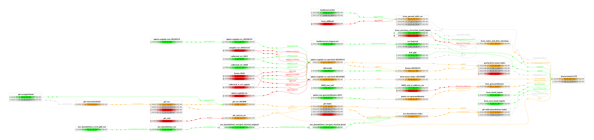

### The Editor Gives You One Week
You need to:

1. Address reviewer concerns about source data
2. Redo analysis with new data
3. Recreate Figure 1
4. Submit within one week

### But the Submission Was Months Ago

- Research submitted months ago
- Team has been improving data cleaning since then
    - Some team members left
- Different statistical methods now
- **First question**: How _exactly_ was Figure 1 produced?

### Luckily, You Worked Reproducibly

:::{.center}
`Figure 1 = code(data)`
:::

- Results depend on both algorithms and data
- Code under version control (Git) ✓
- Tagged commit at submission ✓
- **But what about the data?**

### Data is Also a the Result of a Computation

:::{.center}
`data₁ = code₂(data₂)`
:::

- Data transformed by wrangling/cleaning steps
    - countries dropped
    - transformations applied
    - feature engineering details
- **Chain of data provenance**

### A Real-World Data Pipeline

## The Data Provenance Problem

### Why It Is Complex:

|   |   |
|---|---|
| **Frequent changes** | Code and data both evolve |
| **Complex pipelines** | Many steps, multiple datasets |
| **Tool heterogeneity** | Python, R, SQL, DuckDB all in one project |
| **Team dynamics** | People join, leave, change roles |

### Existing Solutions

|   |   |
|---|---|
| Version Control (Git) | Not suitable for large binary data. |
| Data Version Control (DVC) | Only versions data. |
| Orchestration Tools (Airflow, dbt, KNIME) | Language specific and too complex. |

### bead

> A command-line tool that packages code and data together in immutable snapshots, with all data dependencies declared explicitly.

# Demo Time

